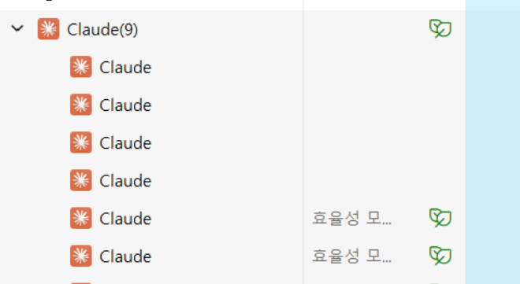

# Claude를 활용한 서비스 기획, 설계, 개발, 배포 가이드  

- [Claude를 활용한 서비스 기획, 설계, 개발, 배포 가이드](#claude를-활용한-서비스-기획-설계-개발-배포-가이드)
  - [사전준비](#사전준비)
  - [사전지식](#사전지식)
    - [역할과 작업 약어 이해](#역할과-작업-약어-이해)
    - [작업과 약어 사용 프롬프트 예시](#작업과-약어-사용-프롬프트-예시)
    - [프로젝트 단계별 사용 프롬프트](#프로젝트-단계별-사용-프롬프트)
    - [기타 중요한 지침](#기타-중요한-지침)
  - [프로젝트 단계별 Claude Code 이용](#프로젝트-단계별-claude-code-이용)
    - [시작하기](#시작하기)
    - [서비스 기획 하기](#서비스-기획-하기)
    - [설계하기](#설계하기)
    - [개발하기](#개발하기)
    - [배포하기](#배포하기)
    - [단계별 작업 방법 Tip](#단계별-작업-방법-tip)
      - [유용한 공통 Tip](#유용한-공통-tip)
      - [프로토타입 개발](#프로토타입-개발)
      - [시퀀스 설계](#시퀀스-설계)
      - [API 설계](#api-설계)
      - [클래스 설계](#클래스-설계)

---

**경고) 이 가이드는 토큰을 매우 많이 사용합니다. Max Plan(최소 5배 Plan)으로 업그레이드 할 것을 권고합니다.**

## 사전준비 
- [Claude Code와 SuperClaude 설치](https://github.com/cna-bootcamp/clauding-guide/blob/main/guides/setup/01.Claude%20Desktop_Code_SuperClaude%20%EC%84%A4%EC%B9%98%20%EA%B0%80%EC%9D%B4%EB%93%9C.md)
- MCP 설치: 'Claude Code와 SuperClaude 설치' 가이드의 'MCP설치'섹션에서 수행  
- [Claude Code 설정](https://github.com/cna-bootcamp/clauding-guide/blob/main/guides/setup/02.Claude%20code%20setup.md)
- IDE와 통합: 'Claude Code 설정'의 'IDE와 통합'섹션에서 수행  
- Claude Instruction 생성. 
  - YOLO모드 전환: YOLO모드는 사용자에게 중간 중간 확인받지 않고 Claude Code가 바로 수행하는 옵션입니다.   
    ```
    claude-yolo
    ```
    'claude-normal'이나 'claude-safe'로 다른 모드로 전환할 수 있습니다.  
    'claude-help'로 다른 명령을 볼 수 있습니다.   

  - 프로젝트 디렉토리로 이동하여 claude 또는 cy 명령으로 Claude Code 실행 
  - [프로젝트 설정 프롬프트](https://github.com/cna-bootcamp/clauding-guide/blob/main/guides/prompt/01.setup-prompt.md)를 참조하여 수행  
  - Project 루트 디렉토리에 CLAUDE.md 생성 확인  
  - Claude Code를 종료하고 다시 시작 
    ```
    /exit 
    ```
    ```
    cy 또는 claude 
    ```

**Tip) IDE 통합 안될 때**: 
작업관리자에서 Claude 프로세스 모두 종료하고 다시 시도 합니다.   
   
  
가끔 오래 쓰다보면 IDE와의 연결이 끊깁니다. 
이땐 모든 IDE를 종료하고 다시 시작하면 해결됩니다.  

---

## 사전지식  
### 역할과 작업 약어 이해 
SuperClaude 명령어와 파라미터가 복잡하기 때문에 기획, 설계, 개발, 배포에서 사용하는 작업들을   
약어로 만들어서 CLAUDE.md에 만들었습니다.    
위 'Claude Instruction 생성'작업을 하면 생성됩니다.    
프로젝트 루트의 CLAUDE.md 맨 아래에 있습니다.   
작업 뿐 아니라 역할에 대한 약어도 있습니다.    
약어에 대한 의미는 아래 'SuperClaude 명령어 및 파라미터 목록' 문서를 참고하면 됩니다.  
아래 링크의 마지막 부분을 참고하세요.  

[역할과 작업 약어](https://github.com/cna-bootcamp/clauding-guide/blob/main/guides/GUIDE.md)

### 작업과 약어 사용 프롬프트 예시   
vscode나 IntelliJ와 통합된 Claude Code에서 수행하면 편합니다.  

**1.웹브라우저 연동**     
'프로토타입'의 위치가 CLAUDE.md에 정의되어 있으므로 그 하위에서 '대시보드'가 포함된 html파일을   
웹브라우저에 자동으로 열어 내용을 분석합니다.  
'--play'는 프론트엔드 테스트를 해주는 playwrite라는 MCP를 사용하라는 옵션입니다.  
```
@analyze as @front --play 프로토타입의 대시보드 화면을 브라우저에서 열어 분석
```

아래와 같이 복합적으로 사용도 가능합니다. 
- 프론트엔드 역할로 웹브라우저에서 '여행지 설정'화면을 띄워 분석  
- 현재 열린 파일에서 유저스토리 ID로 찾아 내용을 이해 
- 화면 분석 결과를 바탕으로 해당되는 유저스토리 ID를 직접 수정  
```
@analyze as @front --play 프로토타입의 여행지설정 화면을 브라우저에서 열어 분석하고,  
@improve as @scribe 유저스토리 'UFR-TRIP-040'을 수정해 줘요.
```

테스트까지 한꺼번에 요청하는 예입니다.  
```
@improve as @front 'UFR-LOC-030'에 명시된 대로 프로토타입 '장소상세정보'화면의 리뷰 및 평점을 수정해 주세요.
@analyze as @front --play 먼저 장소상세정보 화면을 웹브라우에서 열어 리뷰 부분을 분석한 후 수정 바랍니다.
@test-front 수정 후에는 웹브라우저에서 테스트 까지 해주세요.
```

모바일 화면 크기로 변환하여 여러 페이지를 테스트 할 수도 있습니다. 
```
@test-front 프로토타입을 웹브라우저의 모바일 화면크기로 테스트 해주십시오. 대시보드 화면부터 시작하십시오.    
```

**2.평가요청**   
'@estimate'명령 약어와 역할 약어를 이용하여 어떤 평가를 하게 할 수 있음 

백엔드 개발자와 프론트엔드 개발자가 현재 열린 파일의 유저스토리를 검토하여 스코어를 평가  
```
@estimate as @back and @front 모든 유저스토리에 대해 스코어를 재평가해 주세요
```

Product Owner로서 현재 열린 파일의 유저스토리를 검토하여 비즈니스 중요도를 평가  
역할 약어에 없어도 'PO'라는 말이 CLAUDE.md의 팀 멤버에 있기 때문에 잘 수행됩니다.   
```
@estimate as PO 모든 유저스토리의 비즈니스 중요도를 재평가해 주세요
```

**3.분석요청**   

백엔드 개발자와 프론트엔드 개발자로서 열린 파일의 유저스토리의 기술검토를 수행합니다.  
```
@analyze as @back and @front 모든 유저스토리의 기술적 실현 가능성을 검토해 주세요
```

**4.설명요청**   
아키텍트에게 GIN 인덱스에 대한 설명을 요청합니다.   
```
@explain as @archi GIN인덱스에 대한 설명해줘요.
```

참고) ClaudeCode/SuperClaude 명령과 파라미터
- [Claude Code 명령어 및 파라미터](https://github.com/cna-bootcamp/clauding-guide/blob/main/references/Claude%20Code%20%EB%AA%85%EB%A0%B9%EC%96%B4%20%EB%B0%8F%20%ED%8C%8C%EB%9D%BC%EB%AF%B8%ED%84%B0.md)
- [SuperClaude 명령어 및 파라미터 목록](https://github.com/cna-bootcamp/clauding-guide/blob/main/references/SuperClaude%20%EB%AA%85%EB%A0%B9%EC%96%B4%20%EB%B0%8F%20%ED%8C%8C%EB%9D%BC%EB%AF%B8%ED%84%B0%20%EB%AA%A9%EB%A1%9D.md)

### 프로젝트 단계별 사용 프롬프트 
이 약어들을 이용하여 각 단계별로 작업하는 프롬프트는 아래에 있습니다.  
- [기획 프롬프트](https://github.com/cna-bootcamp/clauding-guide/blob/main/guides/prompt/02.think-prompt.md)
- [설계 프롬프트](https://github.com/cna-bootcamp/clauding-guide/blob/main/guides/prompt/03.design-prompt.md)
- [개발 프롬프트](https://github.com/cna-bootcamp/clauding-guide/blob/main/guides/prompt/04.build-prompt.md)
- [배포 프롬프트]()

**1.프로젝트 단계별 가이드**.   
CLAUDE.md에는 각 프로젝트 단계별로 사용되는 가이드의 URL이 정의되어 있습니다.   
프롬젝트 단계별 사용하는 프롬프트는 이 가이드를 참조하도록 되어 있습니다.   
예를 들어 아래와 같이 'UI/UX설계가이드'의 URL이 정의되어 있기 때문에   
프롬프트에 'UI/UX설계가이드'를 참조하라고 하면 이 URL이 claude/uiux-design.md 디렉토리에 다운로드 되어  
Claude Code가 사용하게 됩니다.  
```
- UI/UX설계가이드
  - 설명: UI/UX 설계 방법 안내 
  - URL: https://raw.githubusercontent.com/cna-bootcamp/clauding-guide/refs/heads/main/guides/design/uiux-design.md
  - 파일명: uiux-design.md
```

**2.산출물 디렉토리 약어 이해**.   
CLAUDE.md에는 각 단계별 산출물의 위치가 정의되어 있습니다.   
프롬프트에서 산춤물 이름만 입력하면 Claude Code는 그 위치를 알 수 있게 됩니다. 

### 기타 중요한 지침
CLAUDE.md에는 중요한 지침들이 더 있습니다.     
- Git연동: '[Git 연동]' 섹션 참조   
  Claude Code에 아래 명령을 사용하여 Git과 연동 합니다. 
  - pull: 원격 Git Repo에서 pull을 수행하고 충돌 시 최신 파일로 자동 병합합니다.   
  - push 또는 푸시: 변경사항을 비교하여 자동으로 commit message를 만들고 원격 Git Repo에 푸시합니다.  
- URL링크 처리: '[URL링크 참조]' 섹션 참조   
  Claude는 URL링크가 있으면 기본적으로 WebFetch라는 툴로 다운로드 합니다.   
  문제는 **원본 그대로 다운로드 하지 않고** 자기가 요약 또는 변형한다는 것입니다.  
  그래서 이 지침을 제공하여 curl명령으로 파일을 다운로드 해서 사용하도록 가이드 하는 것입니다.   
- 핵심원칙: '[핵심 원칙]' 섹션 참조   
  - 서브 에이젼트를 만들어 병렬 처리하게 함으로써 처리 속도를 높이도록 합니다.  
  - PlantUML 스크립트와 OpenAPI swagger 파일을 만들면 반드시 검사까지 하도록 합니다.  
- 가이드 로딩: '[가이드 로딩]' 섹션 참조  
  - CLAUDE.md에 있는 가이드('[가이드] 섹션 하위에 있음')를 갱신하는 지침입니다.   
  - 가이드를 표준화하여 공통으로 사용하기 위한 지침입니다.  
  - 프롬프트에 '가이드 로딩'이라고 입력하면 원격 Repository의 가이드를 다시 다운로드 하여 CLAUDE.md를 갱신합니다.    
  
---

## 프로젝트 단계별 Claude Code 이용  
### 시작하기 
- Claude 로그인: Claude Code 를 실행하고 '/login'명령으로 수행 
- Claude Model 선택: '/model'명령 수행하여 선택. 설계 시에는 opus가 더 나으나 토큰이 빨리 소모됨  
  
'프로젝트 단계별 사용 프롬프트'를 이용하여 순서대로 작업하면 됩니다.   
중간 중간 자주 '/clear'명령을 사용해 주세요. 이전 대화 기록을 삭제하므로 토큰 절약에 약간(?) 도움 됩니다.   
- 프롬프트 로딩: 
  - 프롬프트 창에 '프롬프트 로딩'이라고 입력하여 기획, 설게, 개발, 배포 명령어를 로딩합니다. 이 작업은 한번반 수행하면 됩니다.
  - 완료 후 프롬프트 창에 '/think:help', '/design:help', '/build:hep', 'deploy:help'를 입력하여 작업 순서와 각 작업의 명령어를 확인 합니다.    
- 가이드 갱신: 
  - [Claudeing Guide](https://github.com/cna-bootcamp/clauding-guide/blob/main/guides/GUIDE.md)의 '최종 수정일시'값과 CLAUDE.md의 '[가이드]'섹션 아래에 있는 '최종 수정일시'가 다르면 갱신이 필요 합니다.  
  - 프롬프트 창에 '가이드 로딩'이라고 입력하면 갱신됩니다.  

### 서비스 기획 하기
- [서비스 기획 가이드](https://github.com/cna-bootcamp/clauding-guide/blob/main/guides/think/think-guide.md)  
- [유저스토리 작성하기](https://github.com/cna-bootcamp/clauding-guide/blob/main/guides/prompt/02.think-prompt.md) 
  
### 설계하기 
[설계 프롬프트](https://github.com/cna-bootcamp/clauding-guide/blob/main/guides/prompt/03.design-prompt.md)

### 개발하기
[개발 프롬프트](https://github.com/cna-bootcamp/clauding-guide/blob/main/guides/prompt/04.build-prompt.md)

### 배포하기
[배포 프롬프트]()

### 단계별 작업 방법 Tip
#### 유용한 공통 Tip
- 작업 중단 시키기: 
  - 작업 중 ESC를 누르면 진행중인 작업이 중단됩니다.
  - 다시 시작하려면 '계속'이라고 입력. 또는 특정 단계명을 입력하여 계속하게 함.
    예) 아래와 같은 단계로 구성되어 있었고 5번째 단계에서 ESC로 취소한 경우  
    '외부 시퀀스 다이어그램 작성 (주요 플로우별)'의 처음부터 시작   
    ```
    Update Todos
    ⎿  ☒ 공통설계원칙 가이드 다운로드 및 분석       
      ☒ 외부시퀀스설계가이드 다운로드 및 분석
      ☒ 유저스토리 분석 및 주요 플로우 도출
      ☒ API 설계서 확인 및 연계
      ☐ 외부 시퀀스 다이어그램 작성 (주요 플로우별)
      ☐ 회원가입/로그인 플로우 다이어그램 작성
      ☐ 여행 일정 생성 플로우 다이어그램 작성
      ☐ 주변 장소 검색 플로우 다이어그램 작성
      ☐ PlantUML 문법 검증
      ☐ 일정 재생성 플로우 다이어그램 작성
      ☐ 일정 내보내기 플로우 다이어그램 작성
    ```
  - 완전히 중단하려면 '/clear'를 수행    
- 병렬 작업 시키기:
  - CLAUDE.md의 '[핵심원칙]'섹션에 병렬 처리 전략이 있으므로 병렬 처리가 됨  
  - 만약 병렬처리를 안하면 '서브 에이젼트로 병렬처리'라는 프롬프트를 추가하면 됨   
    
#### 프로토타입 개발
- 수동 테스트 요청 
  가이드에는 프로토타입 개발 완료 후 자동으로 웹브라우저에서 테스트하라고 되어 있는데, 안할 수 있음.  
  아래 프롬프트로 수행 요청을 합니다.  
  ```
  @test-front 웹브라우저에서 테스트 해주세요.
  ```
  시간이 조금 걸리는 데 한참 멈춘것 같으면 아래 프롬프트로 진행상황 문의할 수 있습니다.  
  ```
  테스트가 아직 진행중인가요? 
  ```
- 수정 요청 
  수정 사항을 요청하고 바로 테스트까지 수행하도록 요청할 수 있습니다.  
  계속 수정할 수 있으니 브라우저를 종료하지 말라고 합니다. 
  ```
  각 화면간 전환이 되도록 개발해 줘요. @test-front 개발 완료 후 웹브라우저에서 테스트까지 해주세요. 
  계속 수정할 수 있으니 브라우저는 종료하지 말아요.
  ```

  모든 수정이 완료되면 브라우저를 종료 요청합니다. 
  ```
  모두 잘 수정 되었네요. 고생 했어요. 이제 브라우저를 종료해요. 
  ```

#### 시퀀스 설계
- 프로토타입을 먼저 보여주고 설계를 하는것도 좋습니다. 현재 가이드에는 그렇게 되어 있습니다.  
- 시퀀스 설계 결과 검토 시 
관련된 프로토타입 화면을 보고 개선하라고 하는게 좋습니다.  
예)
```
프로토타입 기본설정 화면을 웹브라우저로 띄워서 확인한 후 계속 해 주세요.
```

- 설계서 리뷰와 수정이 끝나면 설계간의 일관성 검사를 요청함 
```
@analyze @archi @back @front --ultrathink 외부/내부 시퀀스 설계를 꼼꼼히 리뷰하여 설계간의 일관성과 충돌 여부를 검사해 주세요.
```
- 분석결과에서 적용이 필요한 부분 수정 요청
예)
```
긴급개선사항 API 엔드포인트 통일, 캐싱 TTL 표준화, 상태 값 통일만 적용 바랍니다.
```

#### API 설계

설계서 리뷰와 수정이 끝나면 시퀀스설계서와의 일관성 검사를 요청합니다.  
```
@analyze as @archi @back @front --untrathink 외부시퀀스설계서와 내부시퀀스설계서의 설계 결과와 일관성 검사를 해주세요.
```

#### 클래스 설계
클래스간의 Dependency와 Association 관계가 제대로 표현 안된 경우 개선 요청합니다. 
```
@improve as @back 클래스 관계 Dependency와 Association이 제대로 표현 안되어 있으니 개선 바랍니다. 
서브 에이젼트를 병렬로 수행하여 동시에 수행하세요.
```

간단 클래스설계서({서비스명}-simple.puml)가 가이드대로 잘 생성이 안된 경우, 수정 요청합니다. 
```
클래스설계가이드의 간단 클래스설계서 규칙을 다시 읽고 잘못된것을 고쳐줘요.
서브 에이젼트를 병렬로 수행하여 동시에 수행하세요.
```
