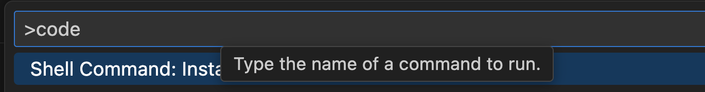

# 로컬 개발 환경 구성(1)

## 목차
- [로컬 개발 환경 구성(1)](#로컬-개발-환경-구성1)
  - [목차](#목차)
  - [작업 디렉토리 생성](#작업-디렉토리-생성)
  - [NotePad++ 설치(Windows Only)](#notepad-설치windows-only)
  - [Git Client 설치](#git-client-설치)
  - [Git 설정](#git-설정)
  - [Window Terminal 설치(Windows Only)](#window-terminal-설치windows-only)
  - [MobaXTerm 설치(Windows Only)](#mobaxterm-설치windows-only)
  - [Microsoft Visual Studio Code 설치](#microsoft-visual-studio-code-설치)
  - [Visual Studio Code 설정](#visual-studio-code-설정)
  - [Node.js 설치](#nodejs-설치)
---

## 작업 디렉토리 생성
{사용자 홈}하위에 'home/workspace'로 만듭니다.    
Windows는 Power Shell에서 만듭니다.  
  

Mac은 Terminal에서 아래 명령으로 만듭니다.  
```
mkdir -p ~/home/workspace
```

## NotePad++ 설치(Windows Only) 
**Notepad++** 은 편집기 프로그램입니다.  

설치 목적은 로컬에서 문서를 작성하거나 편집하기 위해서입니다.  
또한 MobaXTerm이라는 터미널 프로그램으로 서버에 접속한 후 서버의 파일을   
이 프로그램을 이용하여 마치 로컬인것처럼 편하게 편집할 수 있습니다.   
- 설치 사이트 접근: [Notepad++ 설치 페이지](https://notepad-plus-plus.org/downloads/)로 접근합니다.  
- 제일 위에 있는 최신 버전을 클릭합니다.  
- 'Download Notepad++ x64'의 'Installer'를 클릭합니다.  
- 설치 실행파일(exe)을 다운로드 합니다.  
- 다운로드한 설치파일을 실행하여 설치합니다.  
> **💡 Tip**   
> 설치 시 바꾸지 말고 기본값을 그대로 사용해 주세요. 
> - 설치위치: 바꾸셔도 되는데 디폴트값을 그대로 쓰세요. 
> - 구성요소 선택: 기본값 그대로 두고 '다음'누르세요. 

| [Top](#목차) |

---

## Git Client 설치
Git은 Git 서버 저장소와 Git Local 저장소 사이에서 소스를 올리고 내리는 등의   
작업을 하는 데 사용하는 CLI툴입니다.  

**1.기존 설치 여부 확인**    
```
git -v
```
이미 설치되어 있으면 Skip합니다.  

**2.설치**    
1)Windows 사용자:   
[Git Client 설치하기](https://git-scm.com/downloads)에 접속하여 설치파일을 다운로드 받아 설치합니다.   

2)Mac사용자는 아래 명령으로 설치할 수 있습니다.   
```
brew install git
```

| [Top](#목차) |

---

## Git 설정
Git을 쓰는 클라이언트(PC, Local ubuntu, VM등)에서 최초에 아래 설정을 해주셔야 합니다.  
먼저 로컬 Git repository로 이동 합니다.  
아직 없으면 아무 디렉토리에서 아래 명령으로 만듭니다.  
```
mkdir -p ~/home/workspace/test
cd ~/home/workspace/test
git config --global init.defaultBranch main
git init 
```

**1.username, email 셋팅**     
```
git config --global user.name "{이름}"
git config --global user.email "{email}"
```
예시)
```
git config --global user.name "ondal"
git config --global user.email "hiondal@gmail.com"
```

**2.credentail 설정**     
원격 Git에서 pull/push할 때 매번 비밀번호를 입력하는것은 매우 번거롭습니다.  
아래 명령으로 영구 설정 하십시오.  
최초 한번만 물어보고 로컬에 저장되어 다시 묻지 않게 됩니다.  
```
git config credential.helper store --global
```
만약, 보안상 일정 기간만 저장하고 싶으면 아래와 같이 하십시오.   
```
git config credential.helper 'cache --timeout={초}'
``` 
예시) 10시간 동안만 저장
```
git config credential.helper 'cache --timeout=36000'
``` 

> 참고: Git 사용법  
> https://happycloud-lee.tistory.com/93

> 참고: 기존 credentials 삭제
> ```
> git credential-cache exit
> git credential reject  
> ```

Window 사용자는 자격증명 관리자에서 삭제하는게 제일 확실합니다.   
```
Windows 자격 증명 관리자에서 Git credential 삭제
1. 자격 증명 관리자 열기
Win + R → control /name Microsoft.CredentialManager
또는 제어판 → 사용자 계정 → 자격 증명 관리자

2. Windows 자격 증명 탭에서 찾기
Git 관련 항목들을 찾아보세요:

git:https://github.com
git:https://gitlab.com
LegacyGeneric:target=git:https://github.com

3. 삭제
해당 항목 클릭 → 제거 버튼
```

| [Top](#목차) |

---

## Window Terminal 설치(Windows Only)
**1.설치**   
Window 사용자는 터미널 프로그램을 설치하는것이 좋습니다.   
1)Microsoft Store 실행    
하단 작업표시줄에서 돋보기 아이콘 클릭 후 'store'입력하여 'Microsoft Store' 실행   
2)Window Terminal 찾기    
   
3)설치    
자동으로 설치가 실행됩니다.      

**2.Git Bash 추가**    
최근 제품/서비스들은 Linux 위주로 가이드하는 것들이 많습니다.        
Git Bash 터미널에선 Linux의 명령을 사용할 수 있어 매우 유용합니다.        

- Window Terminal 설정 클릭    
  
- Git Bash 프로필 추가   
  좌측에서 '새 프로필 추가'를 클릭하고 아래와 같이 입력한 후 저장합니다.   
  
- 기본 프로필 지정    
  좌측에서 '시작' 메뉴 클릭 후, 기본 프로필을 'Git Bash'로 변경합니다.   
    

**3.확인**  
설정 후 Window Terminal에서 새창열기에 'Git Bash'가 보여야 합니다.  


새 창을 열면 기본이 Git Bash로 나오면 됩니다.  


| [Top](#목차) |

---

## MobaXTerm 설치(Windows Only)
**MobaXTerm**은 Putty와 같은 터미널 프로그램입니다.  
MobaXTerm을 쓰는 이유는 VM 서버 접속 후 서버의 파일을 쉽게 편집하기 위해서입니다.  

**1)설치하기** 
- 사이트 접근  
[다운로드 페이지](http://mobaxterm.mobatek.net/download.html)를 접근합니다.  
- 설치파일 다운로드
Home Edition 아래에 있는 [Download now]를 클릭합니다.   
그 다음 페이지에서 'Installer edition'을 클릭합니다.    

> **💡 Tip**   
> - Installer edition: 설치파일을 다운로드하여 설치할 때 선택   
> - Portable edition:  압축파일을 다운로드하여 해지한 후 바로 사용할 때 선택   
   
- 압축된 설치파일을 아무 디렉토리나 풉니다.   
- 설치파일을 실행하여 설치 합니다. 

> **💡 Tip** 
> 설치할 디렉토리는 바꾸셔도 되는데 기본 위치에 설치하세요. 

- MobaXTerm 실행
설치가 된 디렉토리(예:C:\Program Files (x86)\Mobatek) 하위의  
'MobaXterm'디렉토리로 이동한 후, MobaXterm.exe파일을 실행 합니다.   
  
- 작업표시줄에 고정 
자주 사용할 프로그램이므로 작업표시줄에 고정시킵니다.   


**2)설정하기** 
  
- 영구저장 디렉토리 설정  
MobaXTerm은 저장소로 임시공간을 사용합니다.  
즉, 종료를 하면 데이터가 전부 사라집니다.  
따라서, 반드시 이 설정을 해서 소중한 데이터가 없어지지 않게 하세요.  


> **설정**   
> - Persistent home directory: 'C:\home' 선택   
> - Persistent root (/) directory: 'C:\home' 선택. 선택 후 뒤에 'slash'붙는건 정상임  
> - Default text editor program: 'C:\Program Files\Notepad++\notepad++.exe' 선택  


| [Top](#목차) |

---

## Microsoft Visual Studio Code 설치 
**1.설치**   
Microsoft Visual Studio Code(vscode라고 많이 부름)는 주로 Javascript, Python과 같은   
Interpreter 언어를 개발할 때 사용하는 IDE(Integrated Development Environment)입니다.  
> **Interpreter 언어**: 통역가라는 직역처럼 별도의 실행파일을 만들지 않고 소스를 바로 실행하는 언어   


다운로드 페이지에 접속하여 설치파일을 다운로드하여 설치: [vscode설치](https://code.visualstudio.com/download) 

**2.Code 명령어 테스트**     
code 명령은 자동으로 vscode를 실행하고 특정 디렉토리나 파일을 오픈 시켜주는 명령입니다.  
터미널을 열고 아무 디렉토리에서나 'code .'을 입력해 봅니다.  
vscode가 실행되지 않으면 아래를 참고하여 조치 하십시오.  
- vscode를 실행  
- view(보기) > command palette(명령팔레트) 실행 
- 'code'라고 입력하고 PATH에 code 명령어 추가를 실행 
   
- vscode를 종료 
- 'code .'명령어 실행 시 vscode가 실행되는지 확인  


| [Top](#목차) |

---

## Visual Studio Code 설정 

- Window는 기본 터미널을 Powershell로 변경합니다.(Window Only)   
  이미 되어 있으면 하실 필요 없습니다.  
  vscode를 실행하고 '보기 > 터미털'을 실행합니다.  
  '+'오른쪽의 화살표를 클릭하고 '기본 프로필 선택'을 실행합니다.  
  
  
  'PowerShell'을 선택합니다.  
  
     
- 디렉토리 중첩 표시를 해제 합니다.  
    

- Markdown Preview Enhanced 플러그인 설치 
   

  맥에서는 cmd-shift-v, Windows에서는 ctrl-shift-v로 마크다운 파일을 미리보기 할 수 있습니다.   

| [Top](#목차) |

---

## Node.js 설치
Node.js는 서버 프로그램을 만들수 있는 Javascript 기반 언어입니다.  
Node.js Runtime엔진을 설치합니다.   

- Node.js 설치  
  [Node.js 설치하기](https://nodejs.org/en/)페이지로 접속하여  
  설치파일을 다운로드 받아 설치합니다.   

- 전역모듈 설치 디렉토리 설정    
  라이브러리를 전역으로 설치할 때 디렉토리를 지정합니다.    
  이걸 해야 하는 이유는 전역모듈 설치의 기본 경로가      
  파일 권한 때문에 에러가 날 수도 있기 때문입니다.   
  
  ```
  mkdir ~/.npm-global 
  npm config set prefix "~/.npm-global"
  npm config set cache "~/.npm-global"  
  ```

- 전역모듈 PATH에 추가(Window만 수행)   
  1)'.bashrc'에 추가      
  ```
  code ~/.bashrc
  ```
  아래 경로 설정을 추가합니다.  
  ```
  export PATH=~/.npm-global:$PATH
  ```

  2)Window 환경설정의 PATH추가   
  '%USERPROFILE%\.npm-global'을 PATH에 추가합니다.   
    

    

    
 
    

    

- 테스트 
  ```
  npm -v
  ```

| [Top](#목차) |

