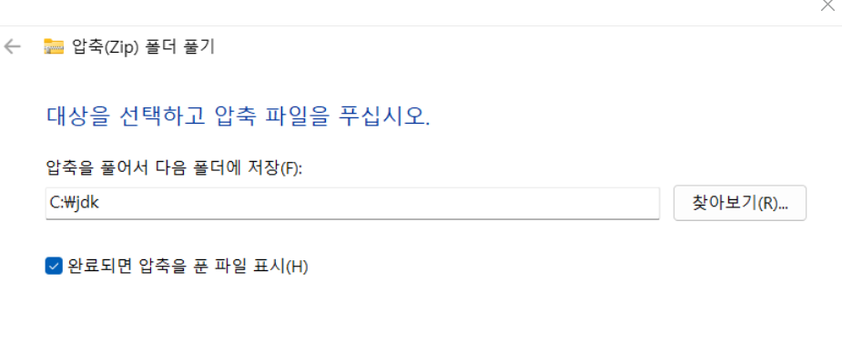
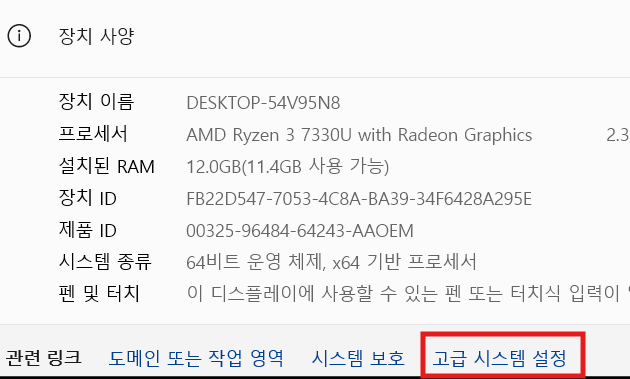
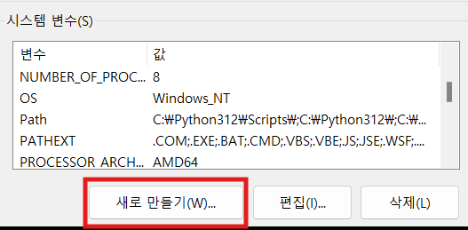
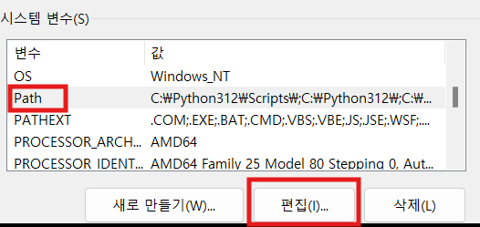
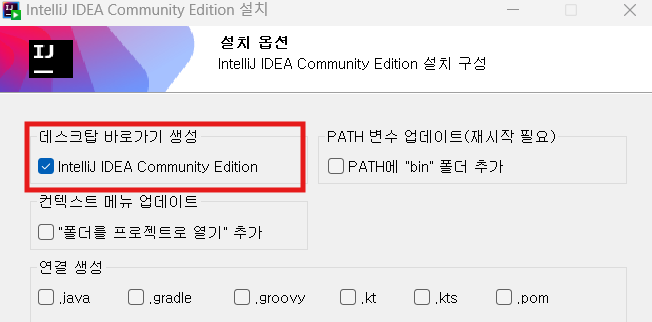
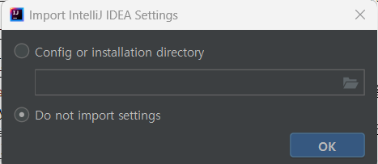
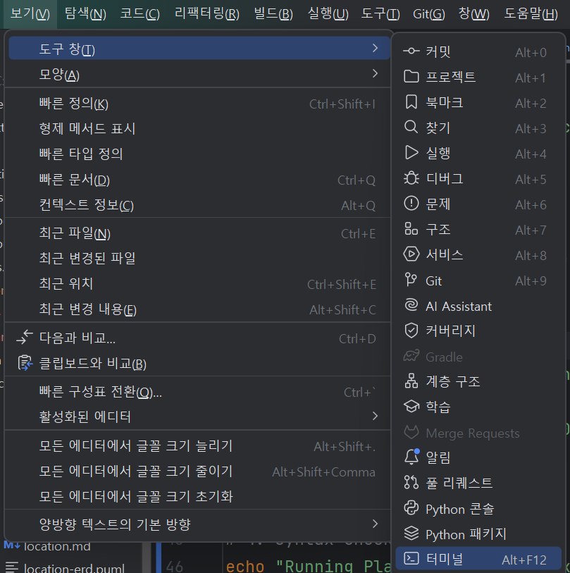
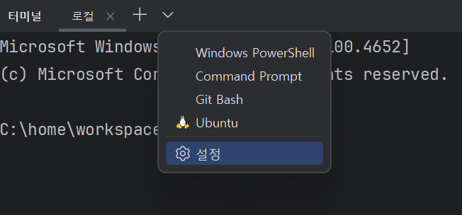
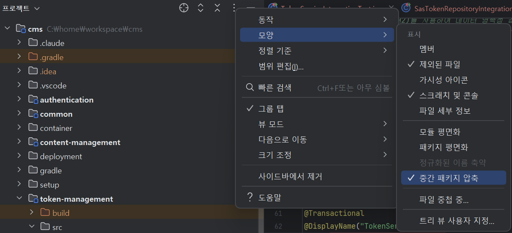
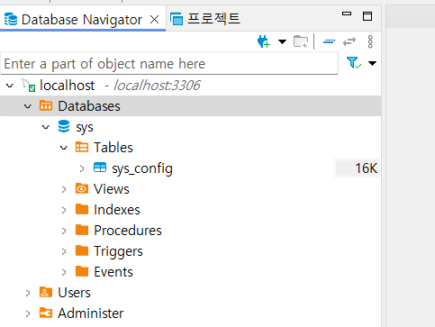

# 로컬 개발 환경 구성(2)

## 목차
- [로컬 개발 환경 구성(2)](#로컬-개발-환경-구성2)
  - [목차](#목차)
  - [JDK 설치](#jdk-설치)
  - [IntelliJ 설치](#intellij-설치)
  - [IntelliJ 환경 설정](#intellij-환경-설정)
  - [Docker 설치](#docker-설치)
  - [DBeaver 설치](#dbeaver-설치)
  - [GitHub 회원가입 및 토큰 생성](#github-회원가입-및-토큰-생성)
  - [Docker HUB 회원가입](#docker-hub-회원가입)
  - [kubectl 설치](#kubectl-설치)
  - [kubens/kubectx 설치](#kubenskubectx-설치)
  - [helm 설치](#helm-설치)
  - [Azure CLI 설치](#azure-cli-설치)
---

## JDK 설치
1. Mac 사용자
OpenJDK 24 이상 설치합니다.  
[Mac JDK설치](https://happycloud-lee.tistory.com/186)

2. Windows 사용자  
- JDK 설치 페이지로 접근하여 JDK24 이상 선택: [JDK 설치 다운로드](https://jdk.java.net/24/)
- 자신의 OS에 맞는 파일을 다운로드: sha256이 아니라 그 옆의 tar.gz 또는 zip클릭   
    
- 압축해제: 'C:\jdk' 하위에 압축 해제  
  'c:\jdk' 디렉토리 하위에 생성하는 이유는 버전별로 jdk를 관리하기 위해서입니다.    
  
- JDK 설정  
  - 탐색기를 열고 '내PC'에서 우측마우스 버튼을 눌러 '속성'을 선택    
      

  - '고급 시스템 설정' 선택   
      

  - JAVA_HOME 환경변수 추가  
      
    

  - 'Path'환경변수에 Java 실행 디렉토리 경로 추가  
      
      
      

- 설치 확인  
  ```
  java -version 
  ```

| [Top](#목차) |

---

## IntelliJ 설치
IntelliJ는 통합개발환경(IDE:Integrated Development Environment) 도구의 하나입니다.   
유사한 IDE에는 Eclipse, STS(Spring Tool Suite), Microsoft Visual Studio Code(vscode라고 줄여 부름)등이 있습니다.  
제 경험 상 Java개발에는 IntelliJ가 가장 편했습니다.   
Eclipse와 STS는 Eclipse계열인데 라이브러리 관리가 잘 안되서 이유없이 실행이 안되는 경우가 종종 발생했습니다.  
그래서 실습에서는 IntelliJ를 사용합니다.   
IntelliJ는 유료 버전인 IntelliJ IDEA Ultimate와 
커뮤니티 버전(공짜^^)인 IntelliJ IDEA Community Edition이 있습니다.   
저희는 당연히 Community Edition을 사용합니다.  
- 설치 파일 다운로드
  - [JetBrain의 IDE페이지](https://www.jetbrains.com/idea/download/?section=windows)를 열고 상단 우측에 '다운로드'버튼 클릭   
  - **두번째**에 있는 Community Edition을 다운로드    
      

- 설치:다운로드 받은 파일을 실행하여 설치: 기본 옵션 그대로 설치(아이콘 생성은 체크)      
    

- 실행: 실행 시 IntelliJ 환경설정을 불러들일 위치를 묻는데 그냥 OK클릭   
    


| [Top](#목차) |

---

## IntelliJ 환경 설정
- Lombok설치
  Lombok은 클래스의 생성자, Getter(프라퍼티값을 읽는 메소드), Setter(프라퍼티값을 변경하는 메소드)등을    
  자동으로 작성해 주는 라이브러리입니다.    
  Lombok을 사용하면 어노테이션만 지정하면 이러한 메소드들을    
  자동으로 만들어 주기 때문에 편하고 코드도 깔끔해집니다.    

- Lombok plugin을 설치합니다. 
  

- Annotation Processor를 활성화 합니다.    
  IDE에서 Lombok을 사용하려면 반드시 아래 셋팅을 해야 합니다. 
  이 설정은 영구설정이 아니므로 새로운 프로젝트를 만들때마다 해줘야 합니다.   
  멀티프로젝트는 최상위 프로젝트 생성하고 한번 하면 됩니다.    
    

- 라이브러리 자동 import 옵션    
  첫번째 옵션은 코드 작성 중 필요한 라이브러리를 자동 import해 주는 것이고,   
  두번째 옵션은 불필요한 라이브러리 import를 자동으로 제거해 주는 옵션입니다.   
    

- 오타 검사 옵션 비활성화  
  코드나 주석에 오타를 체크해 주는 옵션입니다.   
  활성화 되어 있으면 컴파일 Warning갯수가 자꾸 보여서 눈에 거슬립니다.   
    

  
- Window는 기본 Shell을 Powershell로 변경(Window Only)  
  
  
    

    
  
- '중간 패키지 압축' 옵션    
  

  패키지의 표시 형태를 조정합니다.    
  
| [Top](#목차) |

---

## Docker 설치
Docker는 컨테이너 이미지를 만들고 실행하는 툴입니다.  

**1.설치**      

**1)Mac**       
  ```
  brew install --cask docker
  open -a docker
  ```

**2)Window**   
Windows 설치시에는 아래 가이드대로 설치합니다.  
- 설치파일 다운로드: [Docker Desktop 설치](https://docs.docker.com/desktop/install/windows-install/)로 접근하여 다운로드    
    
- 다운로드한 파일을 실행하여 설치: 기본 옵션 그대로 설치   

**3)Ubuntu**   
  Ubuntu 설치는 아래와 같이 하세요.   
  ```
  # 이전 버전 제거 (이전에 설치된 경우)
  sudo apt-get remove docker docker-engine docker.io containerd runc

  # 필요한 패키지 설치
  sudo apt-get update
  sudo apt-get install -y ca-certificates curl gnupg lsb-release

  # Docker의 공식 GPG 키 추가
  sudo mkdir -p /etc/apt/keyrings
  curl -fsSL https://download.docker.com/linux/ubuntu/gpg | sudo gpg --dearmor -o /etc/apt/keyrings/docker.gpg

  # 저장소 설정
  echo "deb [arch=$(dpkg --print-architecture) signed-by=/etc/apt/keyrings/docker.gpg] https://download.docker.com/linux/ubuntu $(lsb_release -cs) stable" | sudo tee /etc/apt/sources.list.d/docker.list > /dev/null

  # 패키지 목록 업데이트
  sudo apt-get update

  # Docker 설치
  sudo apt-get install -y docker-ce docker-ce-cli containerd.io docker-compose-plugin

  # 현재 사용자를 docker 그룹에 추가
  sudo usermod -aG docker $USER

  # 변경사항 적용을 위해 로그아웃 후 다시 로그인하거나 다음 명령어 실행
  newgrp docker
  ```
    
**2.테스트 하기**   
- Linux/Mac사용자는 터미널을 열고 Windows사용자는 Window Terminal에서 확인     
- Docker version 확인    
  ```
  docker version 
  ```    
  
**3.buildx 설치**   
Linux 사용자는 buildx까지 설치 합니다.  
```
# 최신 Buildx 릴리스 버전 확인
BUILDX_VERSION=$(curl -s https://api.github.com/repos/docker/buildx/releases/latest | grep '"tag_name":' | sed -E 's/.*"v([^"]+)".*/\1/')

# Buildx 바이너리 다운로드
curl -sSL "https://github.com/docker/buildx/releases/download/v${BUILDX_VERSION}/buildx-v${BUILDX_VERSION}.linux-amd64" -o docker-buildx

# 실행 권한 부여
chmod +x docker-buildx

# Docker CLI 플러그인 경로에 복사
mkdir -p ~/.docker/cli-plugins
mv docker-buildx ~/.docker/cli-plugins/docker-buildx

# 설치 확인
docker buildx version
```

| [Top](#목차) |

---

## DBeaver 설치 
DBeaver는 SQL Client 프로그램의 하나입니다.   
Database를 관리하고 SQL로 테이블과 데이터를 처리할 수 있습니다.    

- 설치하기 
  - 설치파일 다운로드: [설치파일 다운로드](https://dbeaver.io/download/) 링크를 열어 OS에 맞는 파일을 다운로드    
  - 파일을 실행하여 설치합니다. 기본 옵션 그대로 설치합니다.   
- 테스트   
  - DBeaver를 실행합니다.  최초 실행 시 Connection생성 창은 닫으세요.   
      
          

  - 테스트로 MySQL Database를 컨테이너로 실행합니다.  
    Windows 사용자는 MobaXTerm, Mac사용자는 터미널에서 실행     
    ```
    docker run -d --name mysql -p 3306:3306 -e MYSQL_ROOT_PASSWORD=P@ssw0rd$ mysql
    ```     

  - 아래와 같이 DB를 연결 합니다.: Root암호는 P@ssw0rd$임(MySQL 컨테이너 실행 시 옵션으로 지정)  
      
      
        
  
  - Driver파일을 다운로드 한 후 아래와 같이 경고가 나오면  아래를 수행합니다.  
      
      

  - 아래와 같이 DB가 연결되면 성공!   
      
   
  - SQL편집기를 테스트 해 봅니다.   
      
        

| [Top](#목차) |

---

## GitHub 회원가입 및 토큰 생성  
https://github.com을 여시고 회원 가입을 하십시오.   
Git Repository에 소스를 업로드할 때 사용할 토큰을 생성 하십시오. 
토큰은 잊어 버리지 않게 잘 보관해 놓으십시오.   
[토큰 생성](https://github.com/cna-bootcamp/cna-handson/blob/main/backend/tip.md#github-%EC%9D%B8%EC%A6%9D-%ED%86%A0%ED%81%B0-%EC%83%9D%EC%84%B1) 페이지를 참고하여 만드세요.   

| [Top](#목차) |

---

## Docker HUB 회원가입   
Docker Hub는 컨테이너 이미지를 내려받고 저장할 공개된 이미지 저장소입니다.   
https://hub.docker.com 으로 접근하여 회원가입을 하십시오.   

| [Top](#목차) |

---

## kubectl 설치 
kubectl은 Kubernetes 객체에 대한 어떤 처리를 요청하는 CLI입니다.   

**1.설치**    
**1)Windows**    
```
# 1. 최신 버전 다운로드
curl -LO "https://dl.k8s.io/release/$(curl -L -s https://dl.k8s.io/release/stable.txt)/bin/windows/amd64/kubectl.exe"

# 2. kubectl을 PATH에 있는 디렉토리로 이동 (예: /usr/local/bin)
mkdir -p ~/.local/bin
mv kubectl.exe ~/.local/bin

# 3. 실행 권한 부여
chmod +x ~/.local/bin/kubectl.exe
```

PATH 추가  
```
code ~/.bashrc
```

아래 추가
```
export PATH=~/.local/bin:$PATH
```

설정 적용
```
source ~/.bashrc
```

**2)Mac**     
```
brew install kubectl

kubectl version --client
```

**3)Linux(Ubuntu)**        
```
sudo snap install kubectl --classic
```

만약 잘 안되면 아래 명령으로 설치합니다.  
```
sudo apt-get update
sudo apt-get install -y apt-transport-https ca-certificates curl
curl -fsSL https://packages.cloud.google.com/apt/doc/apt-key.gpg | sudo gpg --dearmor -o /etc/apt/keyrings/kubernetes-archive-keyring.gpg
echo "deb [signed-by=/etc/apt/keyrings/kubernetes-archive-keyring.gpg] https://apt.kubernetes.io/ kubernetes-xenial main" | sudo tee /etc/apt/sources.list.d/kubernetes.list
sudo apt-get update
sudo apt-get install -y kubectl
```

**2.Alias등록**     
아래와 같이 설정 파일을 오픈하고 맨 끝에 alias k=kubectl 추가 
  

1)Window/Mac   
```
code ~/.bashrc
```
저장 후 아래 명령으로 적용   
```
source ~/.bashrc
```

2)Max    
```
code ~/.zshrc
```

저장 후 아래 명령으로 적용   
```
source ~/.zshrc
```

아래 명령으로 적용 확인   
```
k version 
```

| [Top](#목차) |

---

## kubens/kubectx 설치
kubens는 Kubernetes namespace 변경을 쉽게 해주는 유틸리티입니다.   
kubectx는 Kubernetes Cluster 변경을 쉽게 해주는 유틸리티입니다.  

**1.설치**    
```
# Git 클론 방식
git clone https://github.com/ahmetb/kubectx.git ~/.kubectx
sudo ln -sf ~/.kubectx/kubectx /usr/local/bin/kubectx
sudo ln -sf ~/.kubectx/kubens /usr/local/bin/kubens
```

Linux/Window는 ~/.bashrc 파일, Mac은 ~/.zshrc파일을 오픈하여 아래 내용을 추가합니다.  
```
export PATH=$PATH:~/.kubectx 
```

Linux/Window는 아래 명령어로 적용합니다.  
```
source ~/.bashrc
```

Mac은 아래 명령어로 적용합니다.  
```
source ~/.zshrc
```

**2.확인**   
```
kubens --help
kubectx --help
```

| [Top](#목차) |

---

## helm 설치  
**1.설치**     
1)Windows    
```
mkdir -p ~/.local/bin
# 최신 버전 다운로드
curl -LO https://get.helm.sh/helm-v3.12.0-windows-amd64.zip
unzip helm-v3.12.0-windows-amd64.zip
mv windows-amd64/helm.exe ~/.local/bin/
```

**2)Mac**    
```
brew install helm
```

**3)Linux**   
```
mkdir -p ~/install/helm && cd ~/install/helm
wget https://get.helm.sh/helm-v3.16.4-linux-amd64.tar.gz

tar xvf helm-v3.16.4-linux-amd64.tar.gz
cd linux-amd64
sudo cp helm /usr/local/bin

helm version
```

**2.확인**    
```
helm version 
```

| [Top](#목차) |

---

##  Azure CLI 설치    
Azure Cloud 사용 시 설치합니다.   

**1.설치**   
**1)Windows**   
```
winget install --exact --id Microsoft.AzureCLI
```

**2)Mac**    
```
brew update && brew install azure-cli
```

**3)Linux**   
```
# 1. Microsoft 서명 키 추가
curl -sL https://packages.microsoft.com/keys/microsoft.asc | gpg --dearmor | sudo tee /etc/apt/trusted.gpg.d/microsoft.gpg > /dev/null

# 2. Azure CLI 저장소 추가
AZ_REPO=$(lsb_release -cs)
echo "deb [arch=amd64] https://packages.microsoft.com/repos/azure-cli/ $AZ_REPO main" | sudo tee /etc/apt/sources.list.d/azure-cli.list

# 3. 패키지 리스트 업데이트 및 설치
sudo apt-get update
sudo apt-get install azure-cli
```

**2.Azure Login**       
**1)Mac/Windows**
```
az login
```

**2)Linux**
아래 명령 수행 후 나오는 URL을 브라우저에서 접근하여 URL옆에 있는 코드를 입력하여 로그인 합니다.  
로그인 후 콘솔로 돌아오면 Subscription선택하는 화면이 나옵니다.  
Subscription 번호를 입력하여 로그인을 완료 합니다.     
```
az login --use-device-code
```

**3)Trouble shooting**    
만약, 인증 실패 시 이전 인증 정보를 삭제하고 다시 합니다.   
```
az logout
az account clear
az cache purge
```

**3.Azure 전역 설정**    
명령어에서 반복적으로 사용할 Resource Group과 Location값을 기본 설정에 셋팅합니다.   
Azure resource group을 확인합니다.  
```
az group list -o table
```

```
az configure -d group={리소스그룹} location={Location}
```
예시)
```
az configure -d group=tiu-dgga-rg location=koreacentral
```

설정된 값을 확인합니다.
```
az configure -l -o table
```

| [Top](#목차) |

