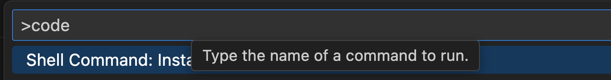

# Claude Code 설치 가이드

- [Claude Code 설치 가이드](#claude-code-설치-가이드)
  - [Overview](#overview)
  - [🚀 Claude Code 설치 가이드](#-claude-code-설치-가이드)
    - [사전 요구사항 확인](#사전-요구사항-확인)
    - [Claude Code 설치](#claude-code-설치)
  - [SuperClaude 설치](#superclaude-설치)
    - [사전준비](#사전준비)
    - [설치 확인](#설치-확인)
    - [설정 실행](#설정-실행)
  - [다음 단계: Claude Code 설정](#다음-단계-claude-code-설정)

---

## Overview
이 설치 가이드는 Linux/Max에 Claude Code와 SuperClaude설치를 안내 합니다. 
- Claude Code: Vibe 코딩 툴   
- SuperClaude: Claude Code의 기능 확장 툴   

## 🚀 Claude Code 설치 가이드

### 사전 요구사항 확인
먼저 터미널에서 다음을 확인하세요.  
윈도우는 Powershell, Linux/Mac은 기본 터미널에서 수행 

**1.Python 설치 확인(3.8 이상)**  
**Linux/Mac**  
```bash
python3 --version
```
**Window**  
```
python --version
```

만약 설치가 안되어 있거나 버전이 낮으면 아래 사이트에서 재설치합니다.  
https://python.org/downloads/

**2.Node.js 설치 확인(18이상)**  
```
node --version
```

만약 설치 안되어 있거나 버전이 낮으면 아래 사이트에서 재설치합니다.  
https://nodejs.org/ko

**3.Git 설치 확인**   
```
git -v
```

미설치 시 설치합니다.  
1)Linux  
Ubuntu.  
```
# 패키지 목록 업데이트
sudo apt update

# Git 설치
sudo apt install git

# 버전 확인
git --version
```

CentOS/RHEL/Fedora.   
```
# CentOS/RHEL (yum)
sudo yum install git

# Fedora (dnf)
sudo dnf install git

# 버전 확인
git --version
```

2)Mac   
```
# Homebrew가 없다면 먼저 설치
/bin/bash -c "$(curl -fsSL https://raw.githubusercontent.com/Homebrew/install/HEAD/install.sh)"

# Git 설치
brew install git

# 버전 확인
git --version
```

3)Window
아래 사이트에서 설치 파일을 다운로드하여 설치  
https://git-scm.com/downloads/win

**4.Window Terminal 설치**   
Window 사용자는 터미널 프로그램을 설치하는것이 좋습니다.
설치 가이드: https://learn.microsoft.com/ko-kr/windows/terminal/install

설치 후 아래 링크를 참조하여 Git Bash를 추가합니다.
최근 제품/서비스들은 Linux 위주로 가이드하는 것들이 많습니다.        
Git Bash 터미널에선 Linux의 명령을 사용할 수 있어 매우 유용합니다.       
https://tolovefeels.tistory.com/entry/Windows-Terminal%EC%97%90-Git-Bash-%EB%93%B1%EB%A1%9D%ED%95%98%EA%B8%B0

**5.Code 명령어 테스트**     
code 명령은 자동으로 vscode를 실행하고 특정 디렉토리나 파일을 오픈 시켜주는 명령입니다.  
터미널을 열고 아무 디렉토리에서나 'code .'을 입력해 봅니다.  
vscode가 실행되지 않으면 아래를 참고하여 조치 하십시오.  
- vscode를 실행  
- view(보기) > command palette(명령팔레트) 실행 
- 'code'라고 입력하고 PATH에 code 명령어 추가를 실행 
 
- vscode를 종료 
- 'code .'명령어 실행 시 vscode가 실행되는지 확인  

---

### Claude Code 설치
Claude Code는 "{사용자홈}/.claude/local" 디렉토리에 Local로 설치하는 것이 좋습니다.  
Local로 설치하면 현재 OS사용자만 사용할 수 있고 Global로 설치하면 모든 OS사용자가 사용할 수 있습니다.  
PC에서는 현재 OS사용자만 사용하면 되므로 Local로 설치해도 문제 없습니다.   
Local로 설치를 권장하는 이유는 Claude Code의 버전업을 자동으로 하기 위해서입니다.  
로컬로 설치하면 Claude Code 실행 시 새 버전으로 자동 업그레이드가 됩니다.    

Linux/Mac 사용자는 기본 터미널을 열어 설치하고,   
Windows 사용자는 Window Terminal을 실행하고 **Git bash 터미널**을 열어 설치 하십시오.   

**1.최초 설치**    
1)홈으로 이동  
```
cd ~
```

2)설치  
```
curl -fsSL https://claude.ai/install.sh | sh
```

3)경로 추가 및 Alias 등록   
각 OS별로 터미널 시작 시 자동 실행 파일에 아래 내용을 추가합니다.  
그 파일을 여는 방법은 아래와 같습니다.      
- Linux: code ~/.bashrc
- Mac: code ~/.zshrc
- Window: code ~/.bashrc

실행 후 아래 내용을 추가합니다.  
```
export PATH=~/.local/bin:$PATH
```
저장 후 창을 닫고 새창을 엽니다.  

4)확인  
아래 명령으로 Claude Code 설치 완료를 확인 합니다. 
```
claude -v
```

수동 업그레이드가 잘되는지도 확인 합니다. 
```
claude update
```

**2.글로벌 버전만 설치된 경우**   
1)설치 상황 진단    
아래와 같이 'claude -p doctor' 명령으로 글로벌로만 Claude Code가 설치되어 있는지 확인  
```
 % claude -p doctor

 Claude CLI Diagnostic
 Currently running: unknown (1.0.67)
 Path: /usr/local/bin/node
 Invoked: /Users/dreamondal/.npm-global/bin/claude
 Config install method: native
 Auto-updates enabled: true
```

2)Global 버전 삭제    
```
npm remove -g @anthropic-ai/claude-code
```

3)설치 확인   
위 '1.최초 설치'를 참고하여 로컬에 Claude Code를 설치 합니다.  


**3.글로벌/로컬 버전 모두 설치된 경우**   
1)현재 설치 상태 진단   
아래와 같이 'claude -p doctor' 명령으로 글로벌과 로컬로 Claude Code가 설치되어 있는지 확인 
```
% claude -p doctor

 Claude CLI Diagnostic
 Currently running: native (1.0.67)
 Path: /Users/dreamondal/.local/bin/claude
 Invoked: /$bunfs/root/claude
 Config install method: native
 Auto-updates enabled: true
 Warning: Multiple installations found
 - npm-global at /Users/dreamondal/.npm-global/bin/claude
 - native at /Users/dreamondal/.local/bin/claude
```

2)글로벌 버전 삭제   
```
npm remove -g @anthropic-ai/claude-code
```

3)설치 확인   
위 '1.최초 설치'의 순서대로 로컬에 Claude Code를 설치 합니다.  

---

## SuperClaude 설치
Linux/Mac 사용자는 기본 터미널을 열어 설치하고,   
Windows 사용자는 Window Terminal을 실행하고 **Git bash 터미널**을 열어 설치 하십시오.  

### 사전준비

uv 설치 (빠르고 현대적인 패키지 매니저):

```bash
curl -LsSf https://astral.sh/uv/install.sh | sh
```

기본 이름으로 가상환경 생성
```bash
uv venv
```

가상환경 활성화
```bash
source .venv/bin/activate
```

SuperClaude 설치
가상환경이 활성화된 상태에서:
```bash
uv pip install SuperClaude
```

### 설치 확인

```bash
SuperClaude --help
```

### 설정 실행

```
SuperClaude install --quick
```

---

## 다음 단계: [Claude Code 설정](https://github.com/cna-bootcamp/clauding-guide/blob/main/guides/setup/02.setup-claude-code.md)

