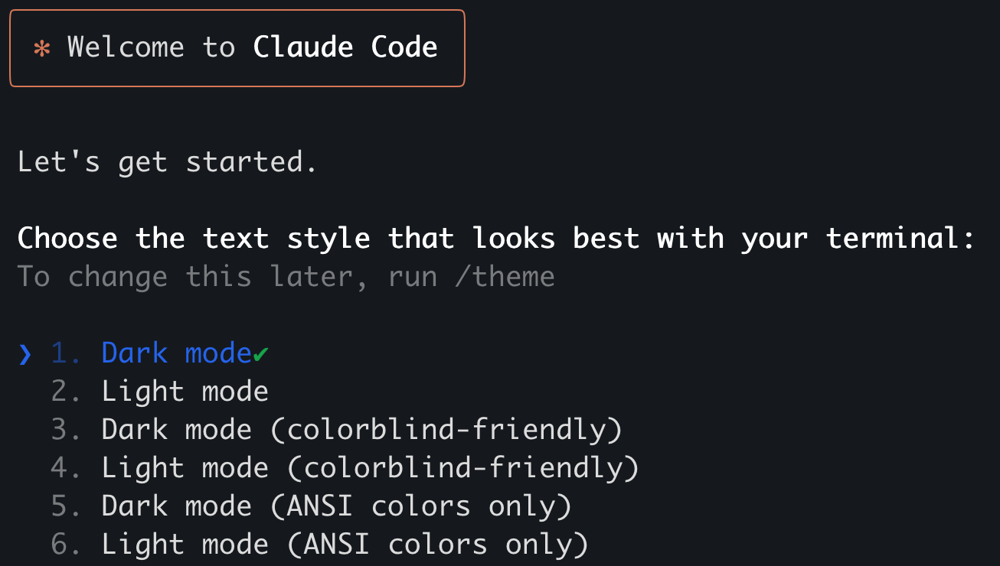
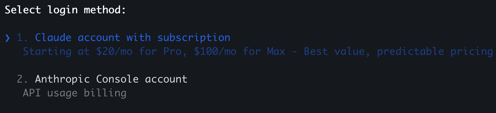
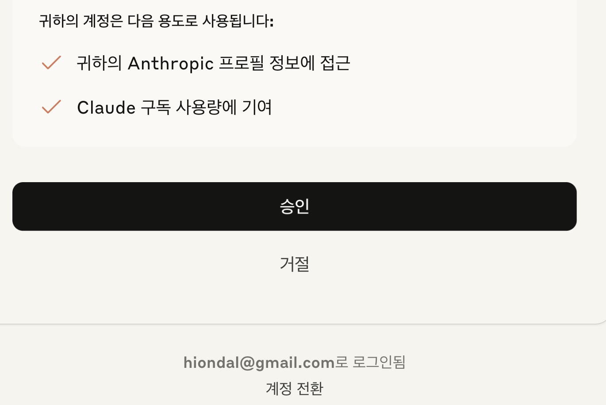
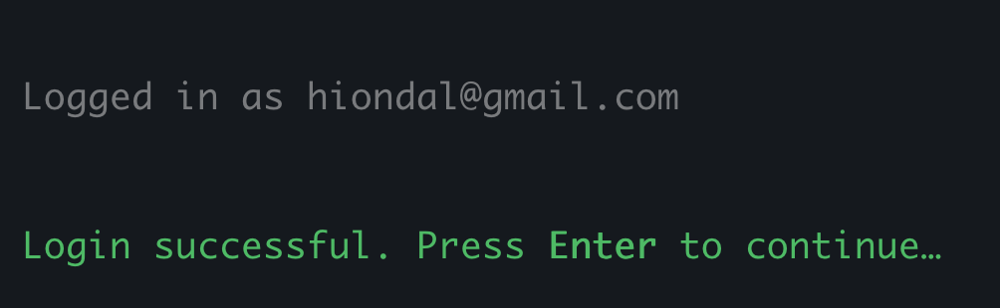
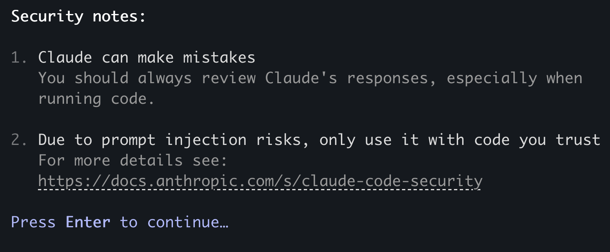
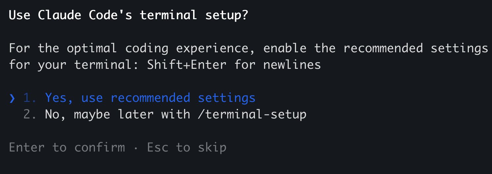
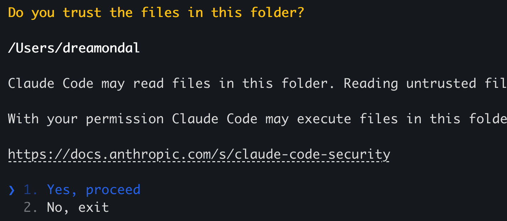
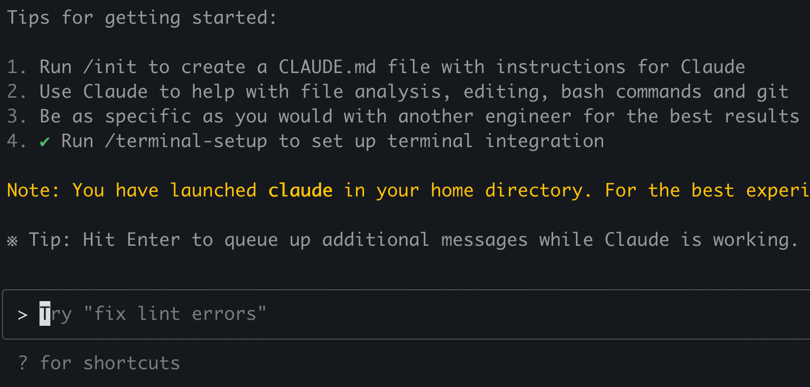
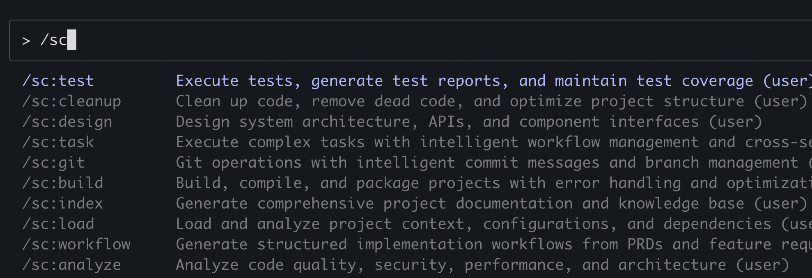

# Claude Code 설치 가이드

- [Claude Code 설치 가이드](#claude-code-설치-가이드)
  - [Overview](#overview)
  - [Claude Code](#claude-code)
    - [Claude Code 설치](#claude-code-설치)
    - [Claude Code 업그레이드](#claude-code-업그레이드)
  - [SuperClaude](#superclaude)
    - [사전준비](#사전준비)
    - [설치 확인](#설치-확인)
    - [설정 실행](#설정-실행)
    - [확인](#확인)
  - [참고사항/Tip](#참고사항tip)
  - [다음 단계:](#다음-단계)

---

## Overview
이 설치 가이드는 Linux/Max에 Claude Code와 SuperClaude설치를 안내 합니다. 
- Claude Code: Vibe 코딩 툴   
- SuperClaude: Claude Code의 기능 확장 툴   

## Claude Code

### Claude Code 설치
Claude Code는 **Local로 설치**하는 것이 좋습니다.  
Local로 설치하면 현재 OS사용자만 사용할 수 있고 Global로 설치하면 모든 OS사용자가 사용할 수 있습니다.  
PC에서는 현재 OS사용자만 사용하면 되므로 Local로 설치해도 문제 없습니다.   
Local로 설치를 권장하는 이유는 Claude Code의 버전업을 자동으로 하기 위해서입니다.  
로컬로 설치하면 Claude Code 실행 시 새 버전으로 자동 업그레이드가 됩니다.    

Linux/Mac 사용자는 기본 터미널을 열어 설치하고,   
Windows 사용자는 Window Terminal을 실행하고 **Git bash 터미널**을 열어 설치 하십시오.   

**1.최초 설치**    
1)홈으로 이동  
```
cd ~
```

2)설치  
Linux/Mac: 
```
curl -fsSL https://claude.ai/install.sh | sh
```
'~/.local' 디렉토리에 설치됩니다.  

Window:  
먼저 글로벌로 설치  
```
npm install -g @anthropic-ai/claude-code 
```
로컬설치로 변경 
```
$HOME/AppData/Roaming/npm/claude migrate-installer  
```
글로벌 설치 제거  
```
npm remove -g @anthropic-ai/claude-code
```

3)경로 추가 및 Alias 등록   
각 OS별로 터미널 시작 시 자동 실행 파일에 아래 내용을 추가합니다.  
그 파일을 여는 방법은 아래와 같습니다.      
- Linux: code ~/.bashrc
- Mac: code ~/.zshrc
- Window: code ~/.bashrc

실행 후 아래 내용을 추가합니다.  
Linux/Mac:
```
export PATH=~/.local/bin:$PATH
```

Window:
```
export PATH=~/.claude/local:$PATH
```
아래와 같은 Alias설정을 찾아 제거합니다.  
```
#alias claude="C:\Users\hiond\.claude\local\claude"
```

**저장 후 창을 닫고 새창**을 엽니다.  

4)확인  
아래 명령으로 Claude Code 설치 완료를 확인 합니다. 
```
claude -v
```

수동 업그레이드가 잘되는지도 확인 합니다. 
```
claude update
```

5)시작하기    
인터랙티브(대화) 모드로 시작합니다.  
```
claude
```

- 텍스트 스타일을 지정합니다.  


- 로그인 방법을 선택합니다.   
Claude 구독 플랜을 이용할 지 API Key를 사용할 지 선택하는데,   
보통 구독 플랜을 이용하는게 더 경제적입니다.   
  

자동으로 웹브라우저가 실행됩니다.   
이미 웹에서 Claude를 로그인 했으면 아래 화면처럼 나옵니다.   
맨 아래에 현재 로그인한 계정이 보입니다.   
그 계정이 아니라면 '계정전환'버튼을 눌러 올바른 계정으로 로그인 하세요.    
  

웹에 이미 로그인이 안되어 있으면 아래와 같이 로그인 화면이 나옵니다. 
로그인을 수행하십시오.    
  

웹에서 로그인 후에 다시 터미널로 돌아오면 아래와 같이 로그인 성공 메시지가 나옵니다.    
엔터를 쳐서 다음으로 진행하세요.   


- 보안 경고   
  아래와 같이 보안 경고가 나오는 데 그냥 엔터 치면 됩니다.   
    

- 사용셋팅 
  아래와 같이 사용 셋팅을 물어보면 그냥 엔터 쳐서 추천 하는 셋팅을 이용하십시오.  
  

- 파일 접근 허용  
  Claude Code가 로컬 파일을 접근할 수 있도록 허용합니다.  
  

- 실행 완료  
  아래와 같이 프롬프트창이 나오면 성공입니다.  
     

- 종료  
  프롬프트 창에 '/exit'를 입력하고 엔터를 치면 됩니다.  

**2.글로벌 버전만 설치된 경우**   
1)설치 상황 진단    
아래와 같이 'claude -p doctor' 명령으로 글로벌로만 Claude Code가 설치되어 있는지 확인  
```
 % claude -p doctor

 Claude CLI Diagnostic
 Currently running: unknown (1.0.67)
 Path: /usr/local/bin/node
 Invoked: /Users/dreamondal/.npm-global/bin/claude
 Config install method: native
 Auto-updates enabled: true
```

2)Global 버전 삭제    
```
npm remove -g @anthropic-ai/claude-code
```

3)설치 확인   
위 '1.최초 설치'를 참고하여 로컬에 Claude Code를 설치 합니다.  
설치 후 아래 명령 수행 시 아무런 경고나 에러 없이 수행되면 성공입니다.  
```
claude update 
```

**3.글로벌/로컬 버전 모두 설치된 경우**   
1)현재 설치 상태 진단   
아래와 같이 'claude -p doctor' 명령으로 글로벌과 로컬로 Claude Code가 설치되어 있는지 확인 
```
% claude -p doctor

 Claude CLI Diagnostic
 Currently running: native (1.0.67)
 Path: /Users/dreamondal/.local/bin/claude
 Invoked: /$bunfs/root/claude
 Config install method: native
 Auto-updates enabled: true
 Warning: Multiple installations found
 - npm-global at /Users/dreamondal/.npm-global/bin/claude
 - native at /Users/dreamondal/.local/bin/claude
```

2)글로벌 버전 삭제   
```
npm remove -g @anthropic-ai/claude-code
```

3)설치 확인   
위 '1.최초 설치'의 순서대로 로컬에 Claude Code를 재설치 합니다.  
이미 설치되어 있어도 재설치한다고 문제가 생기지 않습니다.   
설치 후 아래 명령 수행 시 아무런 경고나 에러 없이 수행되면 성공입니다.  
```
claude update 
```

### Claude Code 업그레이드
현재 버전 확인 
```
claude -v 
```

업그레이드 
```
claude update 
```

참고) Release note
https://docs.anthropic.com/en/release-notes/claude-code

---

## SuperClaude
Linux/Mac 사용자는 기본 터미널을 열어 설치하고,   
Windows 사용자는 Window Terminal을 실행하고 **Git bash 터미널**을 열어 설치 하십시오.  

### 사전준비

uv 설치 (빠르고 현대적인 패키지 매니저):

```bash
curl -LsSf https://astral.sh/uv/install.sh | sh
```

기본 이름으로 가상환경 생성
```bash
uv venv
```

가상환경 활성화
Linux/Mac: 
```
source .venv/bin/activate
```
Window:
```
source .venv/Scripts/activate
```

SuperClaude 설치
가상환경이 활성화된 상태에서:
```bash
uv pip install SuperClaude
```

### 설치 확인

```bash
SuperClaude --help
```

### 설정 실행

```
SuperClaude install --quick
```

### 확인  
맨 마지막 메시지대로 SuperClaude의 모든 설정은 ~/.claude 디렉토리에 생성됩니다.  
```
Next steps:
1. Restart your Claude Code session
2. Framework files are now available in /Users/dreamondal/.claude
3. Use SuperClaude commands and features in Claude Code
```
Claude Code를 인터랙티브 모드로 실행 합니다.   
```
claude
```

프롬프트 창에 '/sc'라고 입력 시 아래와 같이 여러 명령이 나오면 잘 설치된겁니다.  


이 명령들에 대한 가이드는 '~/.claude/commands' 디렉토리에 있습니다.   

---

## 참고사항/Tip

공식 Git Repository:

- **Claude Code**: https://github.com/anthropics/claude-code
- **SuperClaude**: https://github.com/SuperClaude-Org/SuperClaude_Framework

**※ 위 Git Repo를 본인것으로 Fork 한 후 클로드 Project에 본인 Git Repo를 추가. 학습이나 문제해결 시 클로딩함.**

---

## 다음 단계: 
Claude 사용 설정을 진행 합니다.   
[Claude Code 설정](https://github.com/cna-bootcamp/clauding-guide/blob/main/guides/setup/02.setup-claude-code.md)

