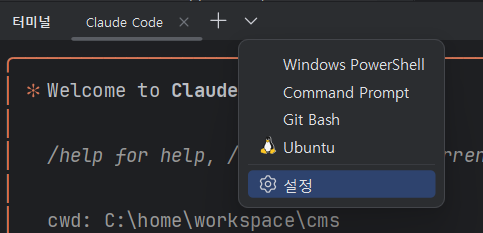
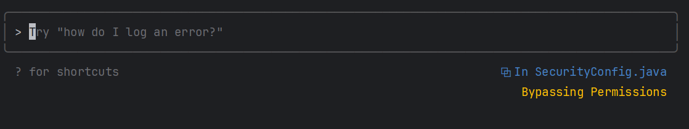

# Claude Code 설정 가이드

Claude Alias를 `cy`로 설정하고 YOLO 모드 제어 기능을 설정합니다. 각 OS에 맞게 수행하고 터미널을 다시 열면 됩니다.

- [Claude Code 설정 가이드](#claude-code-설정-가이드)
  - [Windows PowerShell 설정](#windows-powershell-설정)
    - [설정 스크립트 생성](#설정-스크립트-생성)
    - [설정 스크립트 수행](#설정-스크립트-수행)
  - [Linux/Mac 설정](#linuxmac-설정)
    - [설정 스크립트 생성](#설정-스크립트-생성-1)
    - [설정 스크립트 실행](#설정-스크립트-실행)
  - [사용방법](#사용방법)
    - [명령어](#명령어)
    - [Usecases](#usecases)
    - [사용량 통계 보기](#사용량-통계-보기)
    - [IDE와 통합](#ide와-통합)

---

## Windows PowerShell 설정

### 설정 스크립트 생성
아래 내용으로 'claude-setup.ps1'으로 스크립트 파일 생성    

https://github.com/cna-bootcamp/clauding-guide/blob/main/guides/tools/claude-setup.ps1


### 설정 스크립트 수행
PowerShell에서 수행  
```
./claude-setup.ps1
```
터미널을 닫고 새 터미널을 열어 아래 명령으로 확인합니다. 
```
claude-help
```

## Linux/Mac 설정

### 설정 스크립트 생성

아래 내용으로 `claude-setup.sh` 파일을 생성하세요:

https://github.com/cna-bootcamp/clauding-guide/blob/main/guides/tools/claude-setup.sh


### 설정 스크립트 실행 
스크립트를 만든 디렉토리에서 아래 명령 수행
```
chmod +x claude-setup.sh
./claude-setup.sh
```

터미널을 닫고 새 터미널을 열어 아래 명령으로 확인합니다. 
```
claude-help
```

---

## 사용방법
### 명령어 
🎯 Claude PowerShell Commands:
```
  ════════════════════════════════════════════════════════════════  
  🚀 claude          - Run Claude in current mode  
  🛡️ claude-safe     - Run Claude in safe mode (one-time)  
  🎚️ claude-yolo     - Switch to YOLO mode (persistent)  
  🎚️ claude-normal   - Switch to SAFE mode (persistent)  
  📊 claude-status   - Show detailed status report   
  🔄 claude-reset    - Reset to default configuration
  📁 claude-path     - Show executable path info
  ❓ claude-help     - Show this help message
  ⚡ cy             - Alias for claude command
  ════════════════════════════════════════════════════════════════
  💡 Tip: Use 'claude-status' to check current configuration
```

### Usecases 
- YOLO Mode 전환: claude-yolo로 셋팅한후 cy로 인터랙티브 Claude Code 실행 
- Safe Mode 전환: claude-normal로 셋팅한후 cy로 인터랙티브 Claude Code 실행 


---

### 사용량 통계 보기 
일별/월별/실시간 사용량 통계를 볼 수 있습니다.  

https://github.com/cna-bootcamp/clauding-guide/blob/main/references/Claude%20Code%20%EC%82%AC%EC%9A%A9%ED%86%B5%EA%B3%84.md


### IDE와 통합  
Claude Code는 vscode와 IntelliJ와 플러그인을 통해 통합할 수 있습니다.  
IDE와 통합하면 Claude Code가 열린 파일을 인지하여 읽거나 쓸 수 있으므로 편리합니다.   

  

1) MicroSoft Visual Code 
- 'Claude Code for VSCode' 플러그인을 설치 
- '보기 -> 명령 팔레트' 실행하고 명령어 창에 'claude code' 입력 후 'Run Claude Code' 실행  

1) IntelliJ 
- 기본 Shell을 PowerShell로 변경합니다.  
    
- 플러그인 'Claude Code' 설치하고 IntelliJ를 재시작    
- 우측 상단에 클로드 아이콘을 누릅니다.    
    
- 프로젝트의 아무 문서나 열고 조금 기다리면 열린 파일을 인식합니다.  
    

활용예시)
  


