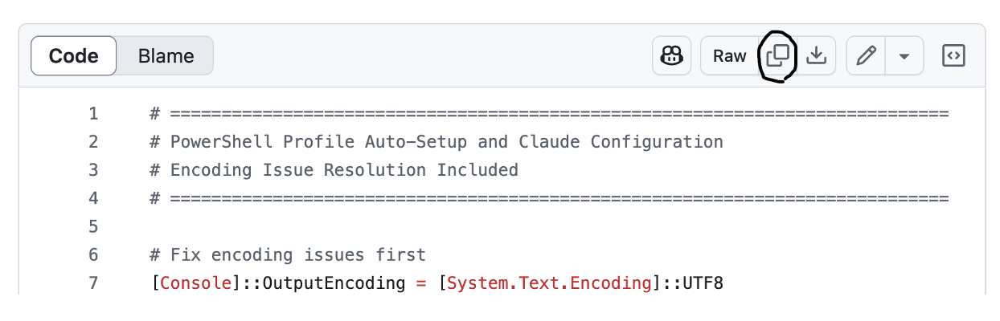
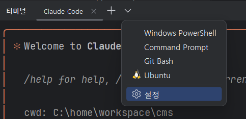
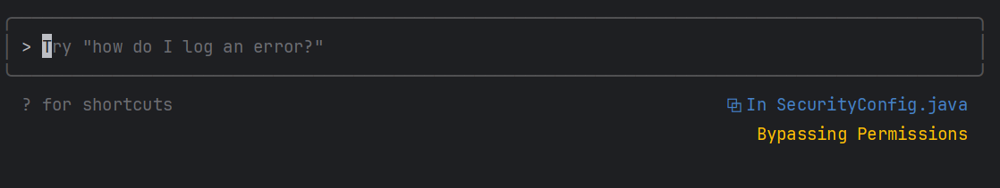
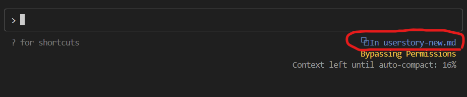

# Claude Code 사용 설정 가이드

아래와 같은 사용 설정을 합니다.  
- 편의 명령어 설치: YOLO모드(사용자 확인 없이 Claude 작업 진행)/Safe 모드 전환  
- IDE 통합: vscode와 IntelliJ에 Claude Code 통합    
- MCP 서버 연결: AI와 외부 서비스의 통신 표준인 MCP(Model Context Protocol)를 지원하는 유용한 외부 서비스 등록    
- 사용량 통계툴 설치: Claude Code 사용 현황 보기    

- [Claude Code 사용 설정 가이드](#claude-code-사용-설정-가이드)
  - [Windows PowerShell 설정](#windows-powershell-설정)
    - [설정 스크립트 생성](#설정-스크립트-생성)
    - [설정 스크립트 수행](#설정-스크립트-수행)
  - [Linux/Mac 설정](#linuxmac-설정)
    - [설정 스크립트 생성](#설정-스크립트-생성-1)
    - [설정 스크립트 실행](#설정-스크립트-실행)
  - [사용방법](#사용방법)
    - [명령어](#명령어)
    - [Usecases](#usecases)
    - [사용량 통계 보기](#사용량-통계-보기)
    - [IDE와 통합](#ide와-통합)
    - [Claude Code 업그레이드](#claude-code-업그레이드)
  - [MCP 설치](#mcp-설치)

---

## 편의 명령어 설치  

### Windows에 설치  
Powershell을 실행하고 사용자 홈으로 이동 후 아래 단계대로 수행합니다.  

**1.사용자 홈 이동**   
```
cd 
```

**2.설정 스크립트 생성**  
아래 링크를 브라우저에서 엽니다. 
https://github.com/cna-bootcamp/clauding-guide/blob/main/guides/tools/claude-setup.ps1

내용을 복사합니다.  
 

code 명령으로 생성할 파일을 열고 내용을 붙여 넣은 후 저장합니다.  
```
code claude-setup.ps1
```

**3.설정 스크립트 수행**    
```
./claude-setup.ps1
```

터미널을 닫고 **새 터미널을 열어** 아래 명령으로 확인합니다. 
```
claude-help
```

### Linux/Mac에 설치  
**1.사용자 홈 이동**   
```
cd 
```

**2.설정 스크립트 생성**  
아래 링크를 브라우저에서 엽니다. 
https://github.com/cna-bootcamp/clauding-guide/blob/main/guides/tools/claude-setup.sh

내용을 복사합니다.  
 

code명령으로 생성할 파일을 열고 내용을 붙여 넣은 후 저장합니다.  
```
code claude-setup.sh
```

**3.설정 스크립트 수행**    
```
chmod +x claude-setup.sh
./claude-setup.sh
```

터미널을 닫고 **새 터미널을 열어** 아래 명령으로 확인합니다. 
```
claude-help
```

---

### 사용방법
이제 아래 명령들을 사용할 수 있습니다.  
```
  ════════════════════════════════════════════════════════════════  
  🚀 claude          - Run Claude in current mode  
  🛡️ claude-safe     - Run Claude in safe mode (one-time)  
  🎚️ claude-yolo     - Switch to YOLO mode (persistent)  
  🎚️ claude-normal   - Switch to SAFE mode (persistent)  
  📊 claude-status   - Show detailed status report   
  🔄 claude-reset    - Reset to default configuration
  📁 claude-path     - Show executable path info
  ❓ claude-help     - Show this help message
  ⚡ cy             - Alias for claude command
  ════════════════════════════════════════════════════════════════
  💡 Tip: Use 'claude-status' to check current configuration
```

가장 많이 사용할 명령은 'cy'와 'claude-yolo'입니다.    
- YOLO Mode 전환: claude-yolo로 셋팅한후 cy로 인터랙티브 Claude Code 실행 
- Safe Mode 전환: claude-normal로 셋팅한후 cy로 인터랙티브 Claude Code 실행 

### 확인  
YOLO모드로 전환 합니다.  
```
claude-yolo
```

Claude Code를 'cy'명령으로 실행하니다.  
```
cy
```

정상 실행되면 '/exit'로 종료합니다.  


---

## IDE와 통합  
Claude Code는 vscode와 IntelliJ와 플러그인을 통해 통합할 수 있습니다.  
IDE와 통합하면 Claude Code가 열린 파일을 인지하여 읽거나 쓸 수 있으므로 편리합니다.   

### MicroSoft Visual Code 
**1.테스트 디렉토리 생성**  
사용자 홈 하위에 temp 디렉토리를 생성합니다.  
```
cd ~
mkdir-p test
cd test
```

code 명령으로 vscode를 실행합니다.  
```
code .
```

**2.플러그인 설치**   
vscode를 실행한 후 좌측 'Extensions' 아이콘을 클릭 합니다.   
  

'Claude Code for VSCode'를 찾아 설치 합니다.   

**3.Claude Code창 실행**   
'보기 -> 명령 팔레트' 실행하고 명령어 창에 'claude code' 입력 후 'Run Claude Code' 실행합니다.  

**4.확인**   
'temp'파일을 생성하고 아무 내용이나 입력 합니다.   
Claude Code 창에 아래와 같이 열린 파일이 인식되면 성공입니다.   


### IntelliJ 
- 기본 Shell을 PowerShell로 변경합니다.  
    
- 플러그인 'Claude Code' 설치하고 IntelliJ를 재시작    
- 우측 상단에 클로드 아이콘을 누릅니다.    
    
- 프로젝트의 아무 문서나 열고 조금 기다리면 열린 파일을 인식합니다.  
    


  

활용예시)
  


### 사용량 통계 보기 
일별/월별/실시간 사용량 통계를 볼 수 있습니다.  

https://github.com/cna-bootcamp/clauding-guide/blob/main/references/Claude%20Code%20%EC%82%AC%EC%9A%A9%ED%86%B5%EA%B3%84.md


### Claude Code 업그레이드
현재 버전 확인 
```
claude -v 
```

업그레이드 
```
claude migrate-installer 
```

창을 모두 닫고 IDE도 닫고 다시 시작합니다. 
다시 버전을 확인 해 봅니다.  

참고) Release note
https://docs.anthropic.com/en/release-notes/claude-code


---

## MCP 설치

https://github.com/cna-bootcamp/clauding-guide/blob/main/references/MCP%EC%84%A4%EC%B9%98%EA%B5%AC%EC%84%B1.md
