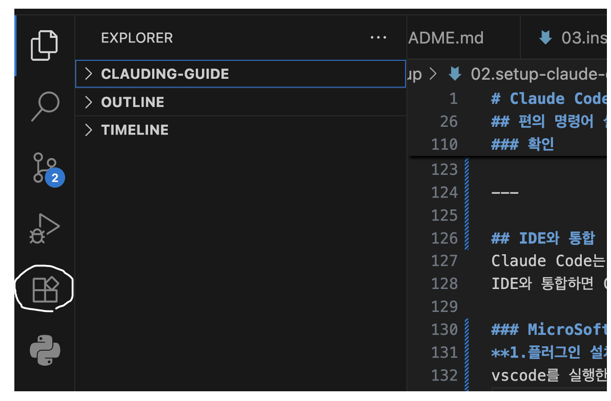
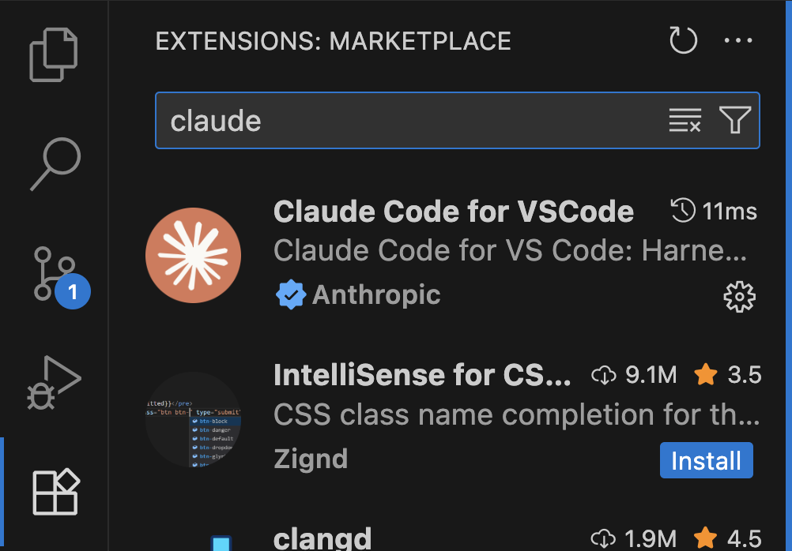
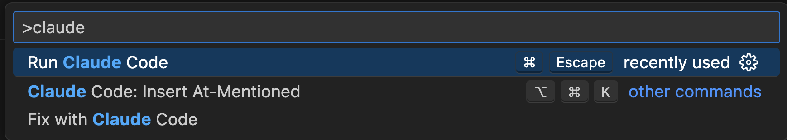
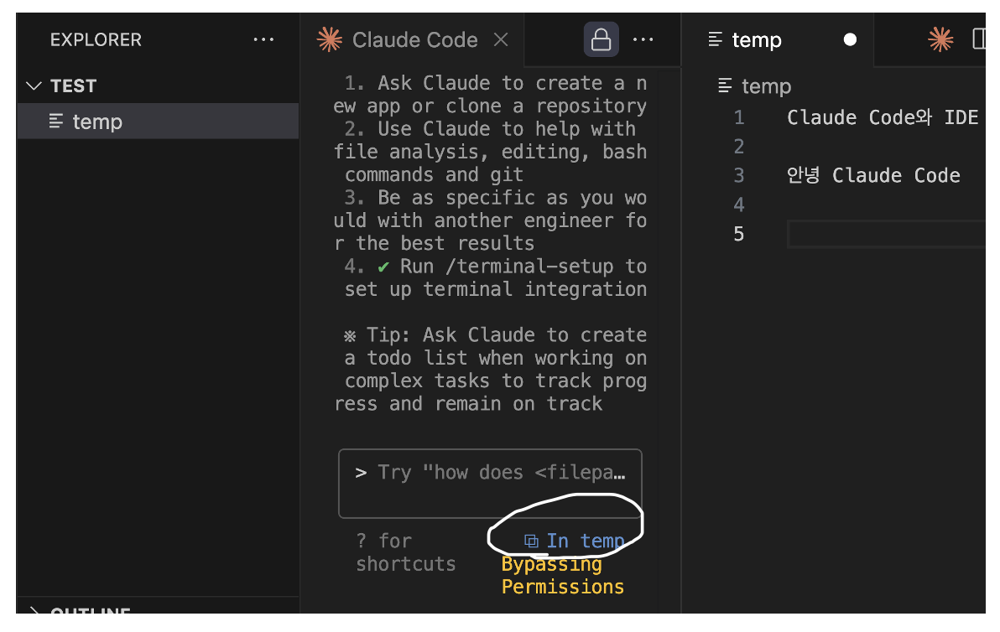
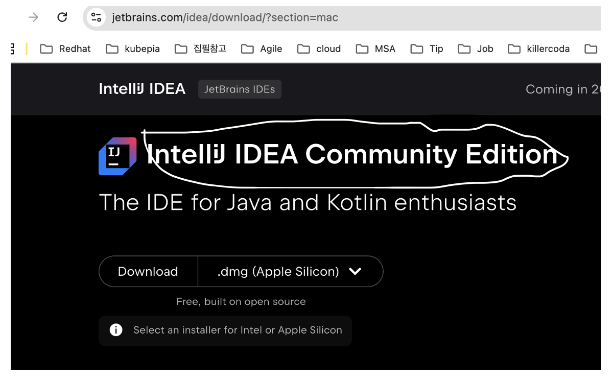
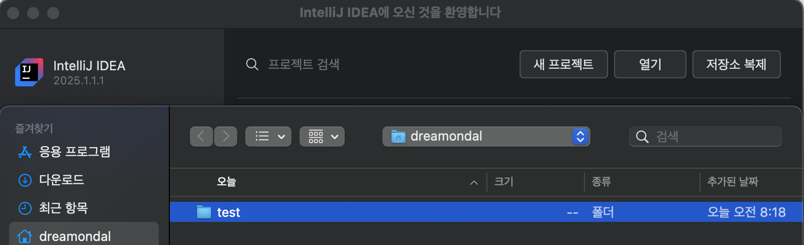
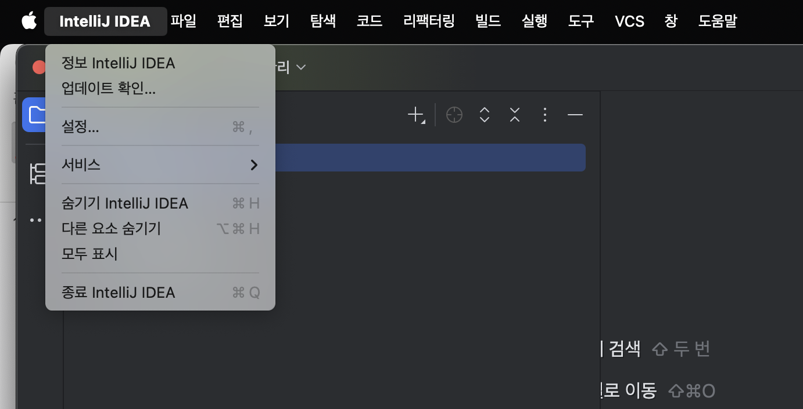
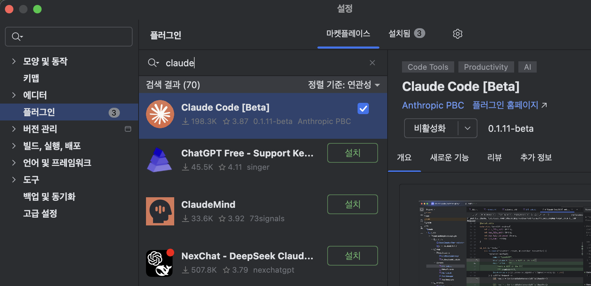
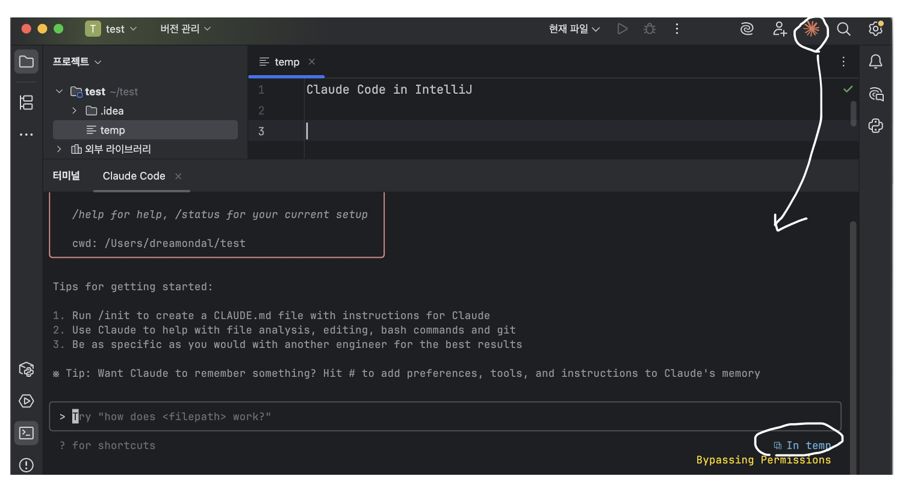
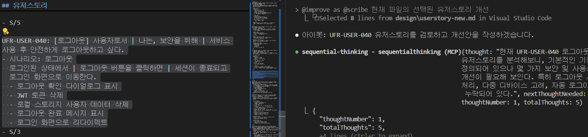

# Claude Code 사용 설정 가이드

아래와 같은 사용 설정을 합니다.  
- 편의 명령어 설치: YOLO모드(사용자 확인 없이 Claude 작업 진행)/Safe 모드 전환  
- IDE 통합: vscode와 IntelliJ에 Claude Code 통합    
- MCP 서버 연결: AI와 외부 서비스의 통신 표준인 MCP(Model Context Protocol)를 지원하는 유용한 외부 서비스 등록    
- 사용량 통계툴 설치: Claude Code 사용 현황 보기    

- [Claude Code 사용 설정 가이드](#claude-code-사용-설정-가이드)
  - [편의 명령어 설치](#편의-명령어-설치)
    - [사용방법](#사용방법)
    - [확인](#확인)
  - [IDE와 통합](#ide와-통합)
    - [MicroSoft Visual Code](#microsoft-visual-code)
    - [IntelliJ](#intellij)
    - [IDE와 통합된 Claude Code 활용예시](#ide와-통합된-claude-code-활용예시)
  - [사용량 통계 보기](#사용량-통계-보기)
  - [MCP 설치 및 구성](#mcp-설치-및-구성)


---

## 편의 명령어 설정    
Linux/Mac사용자는 기본 터미널에서 수행하고, Window사용자는 Window Terminal의 Git Bash에서 수행합니다.   
 
**1.시작 스크립트 파일 열기**      
Linux/Window   
```
code ~/.bashrc
```

Mac   
```
code ~/.zshrc
```

**2.Alias 등록**  
맨 아래에 아래 Alias를 등록합니다.    
```
alias cy-yolo='claude --dangerously-skip-permissions'
alias cy-safe='claude'
alias cy='cy-yolo'
```

Window 사용자는 Powershell에서도 사용할 수 있도록 아래 작업을 더 합니다.    
Window Terminal에서 Powershell창을 열고 아래를 수행하세요.   

```
code $PROFILE
```

아래와 같이 Alias를 등록합니다.   
```
function cy-yolo { claude --dangerously-skip-permissions @args }
function cy-safe { claude @args }
function cy { cy-yolo @args }
```

---

### 사용방법
- cy-yolo: YOLO Mode로 Claude Code 실행 
- cy-safe: Safe Mode로 Claude Code 실행
- cy: cy-yolo와 동일함. 기본값을 바꾸고 싶으면 alias설정을 변경하면 됨      

편의 명령을 설정한 터미널을 모두 닫고 새 터미널을 열어 명령이 동작하는지 확인합니다.   

---

## IDE와 통합  
IDE(Integrated Development Environment)는 개발을 위한 툴입니다.   
프론트엔드는 vscode를 많이 사용하고 백엔드는 IntelliJ를 많이 사용합니다.  
Claude Code는 vscode와 IntelliJ와 플러그인을 통해 통합할 수 있습니다.  
IDE와 통합하면 Claude Code가 열린 파일을 인지하여 읽거나 쓸 수 있으므로 편리합니다.   
**Window는 Powershell을 이용**해야 제대로 IDE와 연결됩니다.  

### MicroSoft Visual Code 
**1.테스트 프로젝트 디렉토리 생성**  
사용자 홈 하위에 test 디렉토리를 생성합니다.  
```
cd ~
mkdir -p test
cd test
```

code 명령으로 vscode를 실행합니다.  
```
code .
```

**2.플러그인 설치**   
vscode를 실행한 후 좌측 'Extensions' 아이콘을 클릭 합니다.   
  

'Claude Code for VSCode'를 찾아 설치 합니다.   
 

**3.Claude Code창 실행**   
'보기 -> 명령 팔레트' 실행하고 명령어 창에 'claude code' 입력 후 'Run Claude Code' 실행합니다.  
. 

**4.확인**   
'temp'파일을 생성하고 아무 내용이나 입력 합니다.   
Claude Code 창에 아래와 같이 열린 파일이 인식되면 성공입니다.   



### IntelliJ 
**1.테스트 프로젝트 디렉토리 생성**  
사용자 홈 하위에 test 디렉토리를 생성합니다.  
```
cd ~
mkdir -p test
cd test
```

**2.IntelliJ 실행**  
IntelliJ를 실행합니다.    
IntelliJ를 아직 설치 안했으면 아래 사이트에서 설치 파일을 내려 받아 설치 합니다.   
https://www.jetbrains.com/idea/download

무료 버전을 설치하려면 스크롤을 내려 아래 **Community Edition을 설치**해야 합니다.   


'[열기]'버튼을 클릭하고 'test'디렉토리를 선택하여 엽니다.  


**3.플러그인 설치**   
설정을 클릭 합니다.  


좌측에서 '플로그인' 메뉴를 선택하고 검색바에 'claude'를 입력하여 플러그인을 찾습니다.  
 

플러그인 'Claude Code' 설치합니다.      

**4.확인**  
우측 상단의 클로드 아이콘을 누릅니다.    
아무 파일이나 생성하여 오픈한 후 Claude Code 창에서 인식되는지 확인 합니다.  
  


### IDE와 통합된 Claude Code 활용예시
열린 파일을 인식할 뿐 아니라 선택된 영역도 인식하여 어떤 작업을 요청할 수 있습니다.  
  

**Tip) IDE 통합 안될 때**: 
작업관리자에서 Claude 프로세스 모두 종료하고 다시 시도 합니다.   
   

가끔 오래 쓰다보면 IDE와의 연결이 끊깁니다. 
이땐 모든 IDE를 종료하고 다시 시작하면 해결됩니다.  

---

## 사용량 통계 보기 
일별/월별/실시간 사용량 통계를 볼 수 있습니다.  

https://github.com/cna-bootcamp/clauding-guide/blob/main/references/Claude%20Code%20%EC%82%AC%EC%9A%A9%ED%86%B5%EA%B3%84.md


---

## MCP 설치 및 구성 
아래 가이드에서 Claude Code에 주요 MCP를 연결하는 방법을 참조하여 수행합니다.  

https://github.com/cna-bootcamp/clauding-guide/blob/main/references/MCP%EC%84%A4%EC%B9%98%EA%B5%AC%EC%84%B1.md


