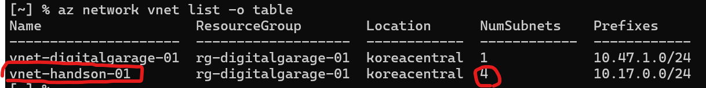
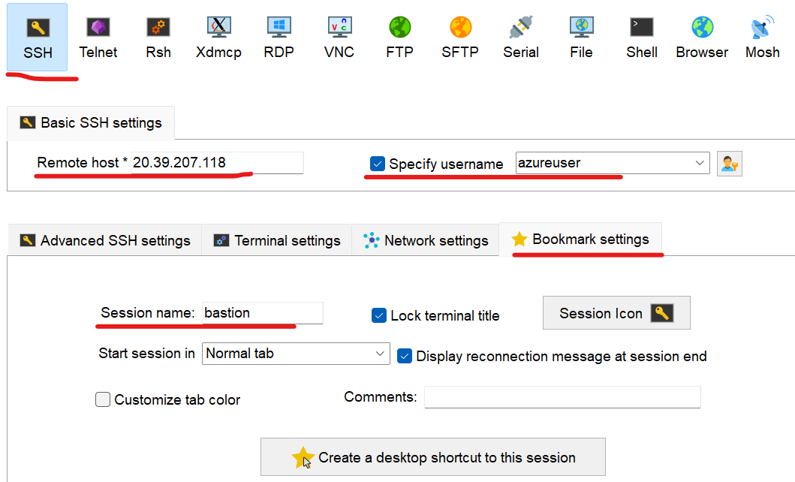
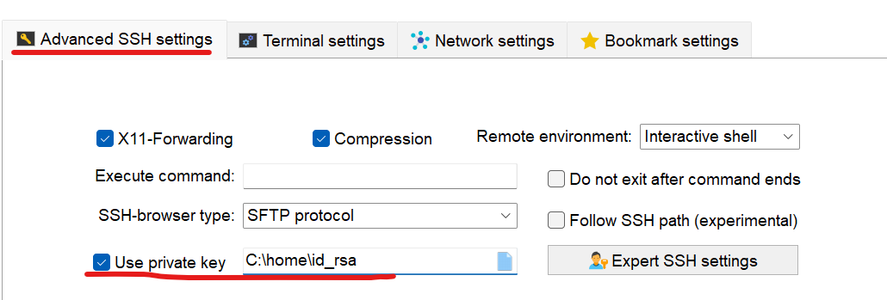
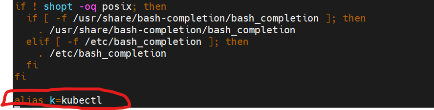

# VM 생성 및 필요툴 설치 

## VM 생성
AKS 접근을 위한 bastion서버와 nginx 서버 설치를 위해 VM을 생성합니다.  
bastion(베스티언)서버는 AKS를 kubectl이나 nginx와 같은 WAS를 통해 접근하기 위한 Gateway역할 서버입니다.  
Window 사용자는 Window Terminal에서 Git bash터미널을 띄우고 작업하고 Mac 사용자는 기본 터미널에서 작업합니다.   

- VNET과 Subnet을 확인  
  아래 명령으로 VNET값을 확인하고 VNET과 Subnet변수에 지정    
  ```
  az network vnet list -o table
  ```   

  위 명령으로 구한 값중 vnet-handson으로 시작하는 Virtual Network를 VNET변수에 지정함   
  
  ```
  export VNET={VNET}
  ```

- Subnet 확인 
  ```
  az network vnet subnet list --vnet-name $VNET -o table
  ``` 
  위 결과에서 끝에 pub-snet으로 끝나는 subnet을 SNET변수에 지정   
  만약 없는 경우는 존재하는 Subnet으로 지정   
  ```
  export ID={본인ID}
  export SNET={Subnet}
  ```

- VM 생성 
  Size는 2Core/4GB의 사양인 'Standard_B2s'로 지정합니다.  
  NSG를 널로 지정하여 NIC NSG가 생성되지 않게 함. Subnet의 NSG만 사용하게 함   
  ```
  az vm create \
    -n bastion-${ID} \
    --image Ubuntu2204 \
    --admin-username azureuser \
    --generate-ssh-keys \
    --vnet-name ${VNET} \
    --subnet ${SNET} \
    --size Standard_B2s \
    --nsg ""
  ```

- PORT 오픈   
  Subnet에 연결된 NSG를 확인합니다.   
  ```
  az network vnet subnet show -n ${SNET} --vnet-name $VNET
  ```
  
  결과값에서 "networkSecurityGroup.id"의 값의 마지막 'nsg'로 시작하는 것이 Network Security Group입니다.   
  예를 들어 'nsg-digitalgarage-01'와 같은 값입니다.   
  환경변수값을 셋팅합니다.   
  ```
  export NSG={NSG}
  ```

  NSG에 포트를 오픈 합니다.  
  이미 되어 있는지 확인합니다.   
  ```
  az network nsg rule list --nsg-name ${NSG} -o table
  ```

  80,443 포트 오픈이 안되어 있으면 추가합니다.   
  'priority'는 100~4096사이의 값으로 중복되지 않게 지정합니다.  
  
  ```
  # 80 포트 오픈
  export PORT=80  
  az network nsg rule create \
  --nsg-name ${NSG} \
  --name Allow-HTTP-$PORT \
  --priority 100 \
  --access Allow \
  --direction Inbound \
  --protocol Tcp \
  --source-port-ranges '*' \
  --destination-port-ranges $PORT
  ```

  ```
  # 443 포트 오픈
  export PORT=443  
  az network nsg rule create \
  --nsg-name ${NSG} \
  --name Allow-HTTPS-$PORT \
  --priority 200 \
  --access Allow \
  --direction Inbound \
  --protocol Tcp \
  --source-port-ranges '*' \
  --destination-port-ranges $PORT
  ```
  
  rule 확인  
  ```
  az network nsg rule list --nsg-name ${NSG} -o table
  ```

---

## VM 접근   
VM의 IP를 구합니다.  
```
az vm show -d -n bastion-${ID} --query publicIps -o tsv
```

VM 생성 시 자동으로 ~/.ssh 디렉토리에 ssh key가 생성됩니다.  
그 파일을 {사용자홈}/home 디렉토리로 복사합니다.      
```
cd ~/.ssh
cp id_rsa ~/home/bastion-${ID}
```

SSH 세션을 작성합니다.  
  
  
위에서 복사한 id_rsa파일을 지정합니다.  
  


VM 접속이 되는지 테스트 합니다.  
VM에 접속하여 아래 툴들을 설치합니다.  

## Azure CLI 설치    
```
# 1. Microsoft 서명 키 추가
curl -sL https://packages.microsoft.com/keys/microsoft.asc | gpg --dearmor | sudo tee /etc/apt/trusted.gpg.d/microsoft.gpg > /dev/null

# 2. Azure CLI 저장소 추가
AZ_REPO=$(lsb_release -cs)
echo "deb [arch=amd64] https://packages.microsoft.com/repos/azure-cli/ $AZ_REPO main" | sudo tee /etc/apt/sources.list.d/azure-cli.list

# 3. 패키지 리스트 업데이트 및 설치
sudo apt-get update
sudo apt-get install azure-cli
```

## Azure Login   
아래 명령 수행 후 나오는 URL을 브라우저에서 접근하여 URL옆에 있는 코드를 입력하여 로그인 합니다.  
로그인 후 콘솔로 돌아오면 Subscription선택하는 화면이 나옵니다.  
Subscription 번호를 입력하여 로그인을 완료 합니다.     
```
az login --use-device-code
```

만약, 인증 실패 시 이전 인증 정보를 삭제하고 다시 합니다.   
```
az logout
az account clear
az cache purge
```
  
## Azure 전역 설정    
명령어에서 반복적으로 사용할 Resource Group과 Location값을 기본 설정에 셋팅합니다.   
Azure resource group을 확인합니다.  
```
az group list -o table
```

```
az configure -d group={리소스그룹} location={Location}
```
예시)
```
az configure -d group=tiu-dgga-rg location=koreacentral
```

설정된 값을 확인합니다.
```
az configure -l -o table
```

## kubectl 설치 
```
sudo snap install kubectl --classic
```

만약 잘 안되면 아래 명령으로 설치합니다.  
```
sudo apt-get update
sudo apt-get install -y apt-transport-https ca-certificates curl
curl -fsSL https://packages.cloud.google.com/apt/doc/apt-key.gpg | sudo gpg --dearmor -o /etc/apt/keyrings/kubernetes-archive-keyring.gpg
echo "deb [signed-by=/etc/apt/keyrings/kubernetes-archive-keyring.gpg] https://apt.kubernetes.io/ kubernetes-xenial main" | sudo tee /etc/apt/sources.list.d/kubernetes.list
sudo apt-get update
sudo apt-get install -y kubectl
```

Alias등록 
```
vi ~/.bashrc
```

맨 끝에 alias k=kubectl 추가  
  

## kubens/kubectx 설치
kubens는 Kubernetes namespace 변경을 쉽게 해주는 유틸리티입니다.   
kubectx는 Kubernetes Cluster 변경을 쉽게 해주는 유틸리티입니다.  

**1.설치**    
```
# Git 클론 방식
git clone https://github.com/ahmetb/kubectx.git ~/.kubectx
sudo ln -sf ~/.kubectx/kubectx /usr/local/bin/kubectx
sudo ln -sf ~/.kubectx/kubens /usr/local/bin/kubens
```

~/.bashrc 파일을 오픈하여 아래 내용을 추가합니다.  
```
export PATH=$PATH:~/.kubectx 
```

아래 명령어로 적용합니다.  
```
source ~/.bashrc
```

**2.확인**   
```
kubens --help
kubectx --help
```

## Docker설치   
필요한 패키지 설치
```
sudo apt-get update
sudo apt-get install -y \
    ca-certificates \
    curl \
    gnupg \
    lsb-release
```

Docker GPG key 추가
```
sudo mkdir -p /etc/apt/keyrings
curl -fsSL https://download.docker.com/linux/ubuntu/gpg | sudo gpg --dearmor -o /etc/apt/keyrings/docker.gpg
```

Docker repository 설정
```
echo \
"deb [arch=$(dpkg --print-architecture) signed-by=/etc/apt/keyrings/docker.gpg] https://download.docker.com/linux/ubuntu \
$(lsb_release -cs) stable" | sudo tee /etc/apt/sources.list.d/docker.list > /dev/null
```

Docker 엔진 설치
```
sudo apt-get update
sudo apt-get install -y docker-ce docker-ce-cli containerd.io docker-compose-plugin
```

현재 사용자를 docker 그룹에 추가 (sudo 없이 docker 명령어 사용 가능)
```
sudo usermod -aG docker $USER
```

Docker 서비스 시작
```
sudo service docker start
```

터미널을 닫고 새 터미널에서 version확인 
```
docker version 
```

## buildx 설치   
buildx는 Docker CLI의 플러그인으로, 컨테이너 이미지 빌드 기능을 확장합니다.  
설치 안해도 되지만 안하면 Image build 시 경고 메시지가 나와 설치하는게 좋습니다.  

```
wget https://github.com/docker/buildx/releases/download/v0.12.1/buildx-v0.12.1.linux-amd64
```

plugins 디렉토리 생성 및 buildx 설치
```bash
mkdir -p ~/.docker/cli-plugins
mv buildx-v0.12.1.linux-* ~/.docker/cli-plugins/docker-buildx
chmod +x ~/.docker/cli-plugins/docker-buildx
```

설치 확인
```bash
docker buildx version
```

## helm 설치  
```
mkdir -p ~/install/helm && cd ~/install/helm
wget https://get.helm.sh/helm-v3.16.4-linux-amd64.tar.gz

tar xvf helm-v3.16.4-linux-amd64.tar.gz
cd linux-amd64
sudo cp helm /usr/local/bin

helm version
```

