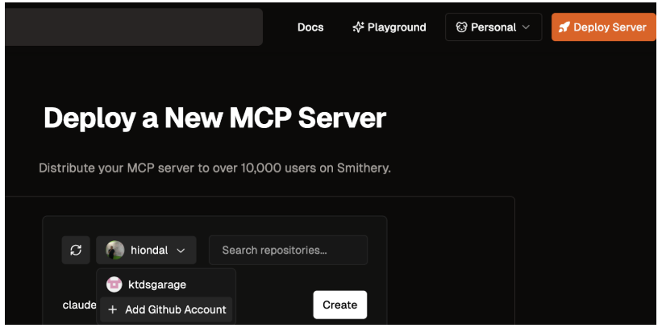
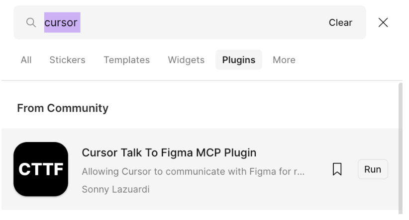
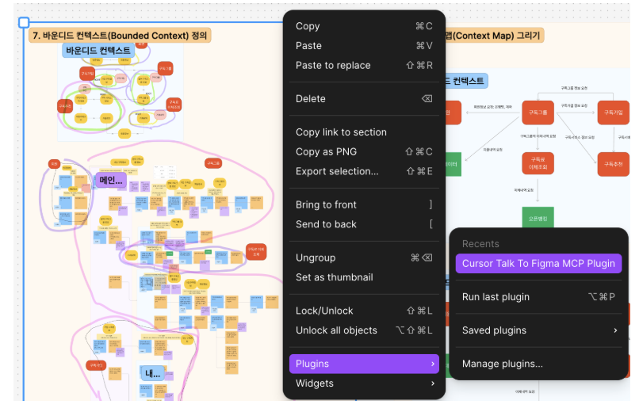
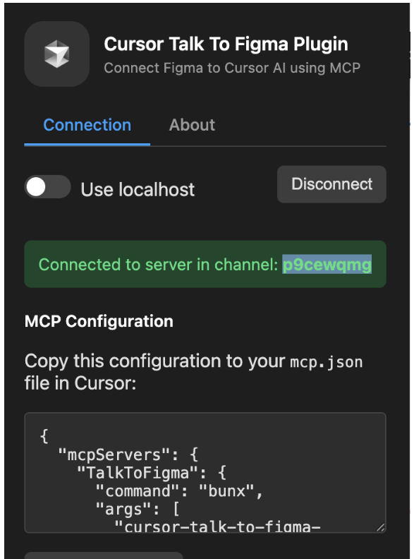
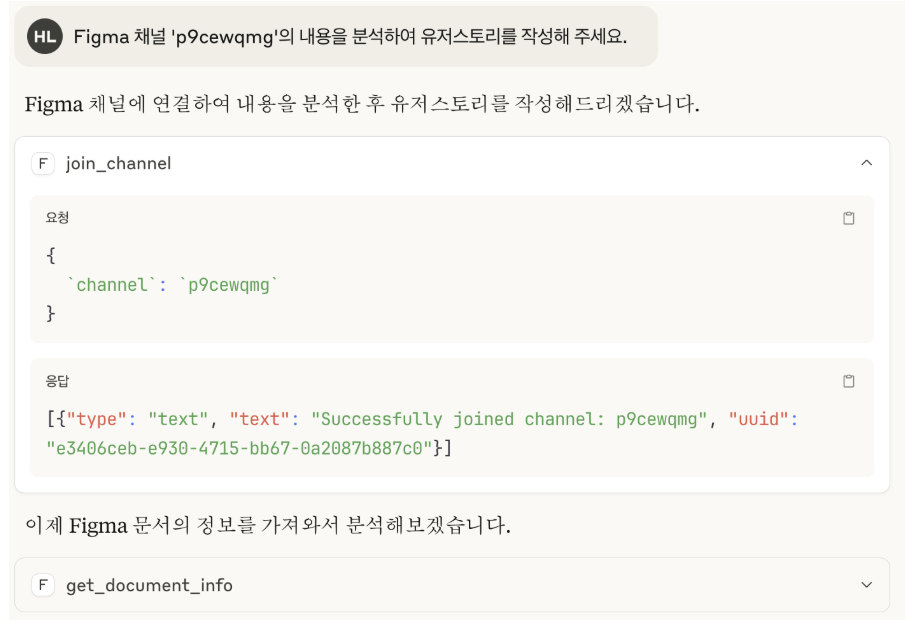
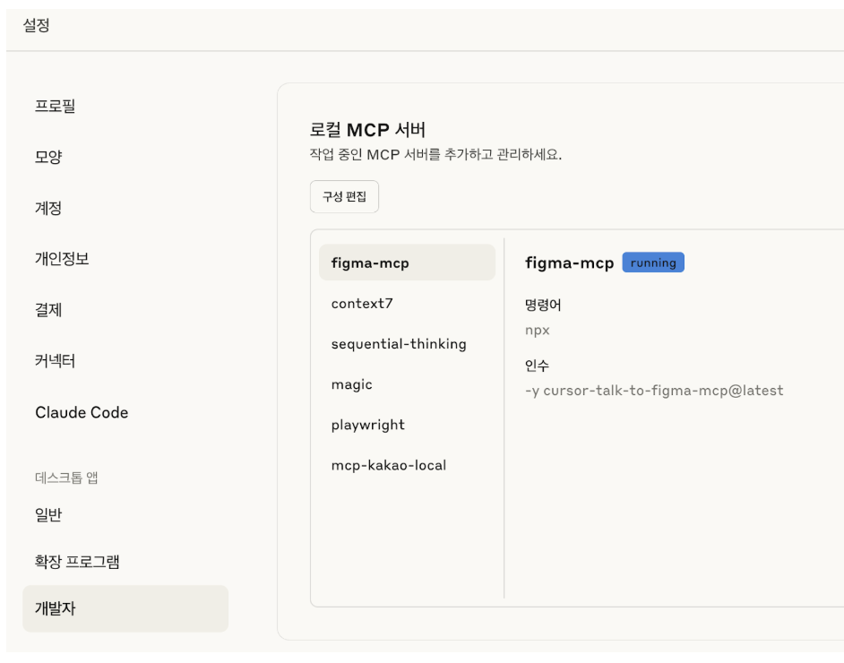

# Claude Desktop/Code/SuperClaude 설치 가이드

## Overview
- Claude Desktop: Local 설치하여 Claude 사용  
- Claude Code: Vibe 코딩툴   
- SuperClaude: Claude Code의 기능 확장 툴   

## 🚀 Claude Code 설치 가이드

### 사전 요구사항 확인
먼저 터미널에서 다음을 확인하세요:

**Linux/Mac**  
```bash
# Python 버전 확인 (3.8 이상 필요)
python3 --version

# Node.js 확인 (선택사항, MCP 서버용)
node --version
```

**Window**  
```
# Python 버전 확인 (3.8 이상 필요)
python --version

# Node.js 확인 (선택사항, MCP 서버용)
node --version
```

### 필수 도구 설치
- Python이 없다면 공식 웹사이트에서 다운로드  
  https://python.org/downloads/

- Node.js 설치  

### Claude Desktop 설치 
https://claude.ai/download

### Claude Code 설치
https://claude.ai/code

Node Version Manager 사용
- nvm 설치   
  Linux/Mac  
  ```bash
  # nvm이 없다면 설치
  curl -o- https://raw.githubusercontent.com/nvm-sh/nvm/v0.39.0/install.sh | bash
  ```

  window
  ```
  1. 브라우저에서 이동: https://github.com/coreybutler/nvm-windows/releases
  2. 최신 릴리스에서 'nvm-setup.exe' 다운로드
  3. 다운로드한 설치 파일 실행
  4. 설치 마법사 따라서 진행
  ```

- 설치 
  ```
  # 터미널 재시작 후
  nvm install node
  nvm use node

  # 이제 권한 문제 없이 설치
  npm install -g @anthropic-ai/claude-code
  ```

## Claude Code 편의 기능 설정

guides/setup/Claude code setup.md를 참조하여 수행합니다.  

---

## SuperClaude 설치

### 사전준비

uv 설치 (빠르고 현대적인 패키지 매니저):

1)Linux/Mac  
```bash
curl -LsSf https://astral.sh/uv/install.sh | sh
```

기본 이름으로 가상환경 생성

```bash
uv venv
```

가상환경 활성화 (올바른 방법)

```bash
source .venv/bin/activate
```

SuperClaude 설치
가상환경이 활성화된 상태에서:
```bash
uv pip install SuperClaude
```

2)Wiondow
```
# PowerShell에서 실행
powershell -ExecutionPolicy ByPass -c "irm https://astral.sh/uv/install.ps1 | iex"
```
```bash
pip install SuperClaude
```


### 설치 확인

```bash
SuperClaude --help
```

### 설정 실행

```bash
SuperClaude install --quick
```

---

## MCP 설치

### 사전작업

bun 설치:

Linux/Mac
```bash
curl -fsSL https://bun.sh/install | bash
```
설정 적용: Mac은 ~/.zshrc, Linux는 ~/.bashrc에 추가 
```
export PATH="$HOME/.bun/bin:$PATH"
```


Window
```
powershell -c "irm bun.sh/install.ps1|iex"
```

참고) MCP 설정 파일

- **Linux**: `~/.config/Claude/claude_desktop_config.json`
- **Mac**: `/Users/{user}/Library/Application Support/Claude/claude_desktop_config.json`
- **Windows**: `{user home}\AppData\Roaming\Claude\claude_desktop_config.json`

### 주요 MCP 설치

#### Context7 MCP

```bash
# GitHub 링크: https://github.com/upstash/context7
# 설치는 MCP 설정 파일에 추가
```

#### Sequential Thinking MCP

```bash
# GitHub 링크: https://mcp.so/server/sequentialthinking/modelcontextprotocol
# 설치는 MCP 설정 파일에 추가
```

#### Magic MCP

```bash
# GitHub 링크: https://github.com/21st-dev/magic-mcp
# API Key 생성 필요: https://21st.dev/magic/console 에서 'Setup Magic MCP' 버튼 클릭
# IDE를 Cursor로 선택하면 생성됨
```

#### Playwright MCP

```bash
# GitHub 링크: https://github.com/microsoft/playwright-mcp
# 설치는 MCP 설정 파일에 추가
```

#### GitHub MCP 설치

https://smithery.ai/ 에서 'GitHub'로 찾아 추가:

```json
"github": {
  "command": "npx",
  "args": [
    "-y",
    "@smithery/cli@latest",
    "run",
    "@smithery-ai/github",
    "--key",
    "6bf03d02-65a9-4a0d-ac05-6d4a5b0d4343",
    "--profile",
    "motionless-flamingo-aj9dsM"
  ]
}
```

**※ 접근할 Organization에 'Smithery AI'를 추가해야 함**
- '[Deploy Server]' 클릭 후 GitHub 로그인
- 'Add Github Account' 선택하여 접근할 Organization 추가


#### Figma MCP 설치

**claude_desktop_config.json에 아래와 같이 추가:**

```json
"figma-mcp": {
  "command": "npx",
  "args": [
    "-y",
    "cursor-talk-to-figma-mcp@latest",
    "--server=vps.sonnylab.com"
  ]
}
```

**Figma MCP 사용법**

1. Figma에서 'Cursor Talk To Figma MCP Plugin' 설치
 
2. Claude Desktop이나 Claude Code에서 연동할 Figma 객체 선택 후 플러그인 실행
  
3. 플러그인 창에서 채널 ID 복사. 이 플러그인 창을 닫지 않고 그대로 둠
 
4. Claude Desktop 또는 Claude Code에서 프롬프팅
  

#### 설치 확인

Claude Desktop의 '설정' 메뉴에서 확인.
  

**※ 설정 파일 수정 후 메인메뉴에서 클로드를 종료 후 다시 시작해야 적용됨**

#### MCP 설정 파일 예시

```json
{
  "mcpServers": {
    "github": {
      "command": "npx",
      "args": [
        "-y",
        "@smithery/cli@latest",
        "run",
        "@smithery-ai/github",
        "--key",
        "6bf03d02-65a9-4a0d-ac05-6d4a5b0d4343",
        "--profile",
        "motionless-flamingo-aj9dsM"
      ]
    },
    "figma-mcp": {
      "command": "npx",
      "args": [
        "-y",
        "cursor-talk-to-figma-mcp@latest",
        "--server=vps.sonnylab.com"
      ]
    },
    "context7": {
      "command": "npx",
      "args": [
        "-y",
        "@upstash/context7-mcp"
      ]
    },
    "sequential-thinking": {
      "command": "npx",
      "args": [
        "-y",
        "@modelcontextprotocol/server-sequential-thinking"
      ]
    },
    "magic": {
      "command": "npx",
      "args": [
        "-y",
        "@21st-dev/magic@latest"
      ],
      "env": {
        "API_KEY": "5ec762189bd67fb2e4b3d3832cc35b80d4ff067418a6f0c872a3724d1283ab43"
      }
    },
    "playwright": {
      "command": "npx",
      "args": [
        "-y",
        "@playwright/mcp@latest"
      ]
    },
    "mcp-kakao-local": {
      "command": "npx",
      "args": [
        "-y",
        "@smithery/cli@latest",
        "run",
        "@yunkee-lee/mcp-kakao-local",
        "--key",
        "6bf03d02-65a9-4a0d-ac05-6d4a5b0d4343",
        "--profile",
        "motionless-flamingo-aj9dsM"
      ]
    }
  }
}
```

---

## Claude Code에 MCP 동기화   
**Linux/Mac**

```bash
claude mcp add-from-claude-desktop -s user
```

**Window**
Claude Code를 실행하고 아래 프롬프트로 동기화 batch파일을 만들어 실행니다.  
```
아래 가이드를 참조하여 Claude Code에 MCP 설정을 추가하는 방법을 가이드 해 주십시오.
- 가이드: https://cna-bootcamp.github.io/clauding-guide/guides/setup/sync_mcp.md
```

---

## 참고사항/Tip

### 공식 Git Repository

- **Claude Code**: https://github.com/anthropics/claude-code
- **SuperClaude**: https://github.com/SuperClaude-Org/SuperClaude_Framework

**※ 위 Git Repo를 본인것으로 Fork 한 후 클로드 Project에 본인 Git Repo를 추가. 학습이나 문제해결 시 클로딩함.**

