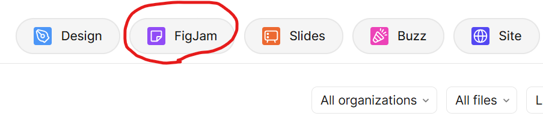
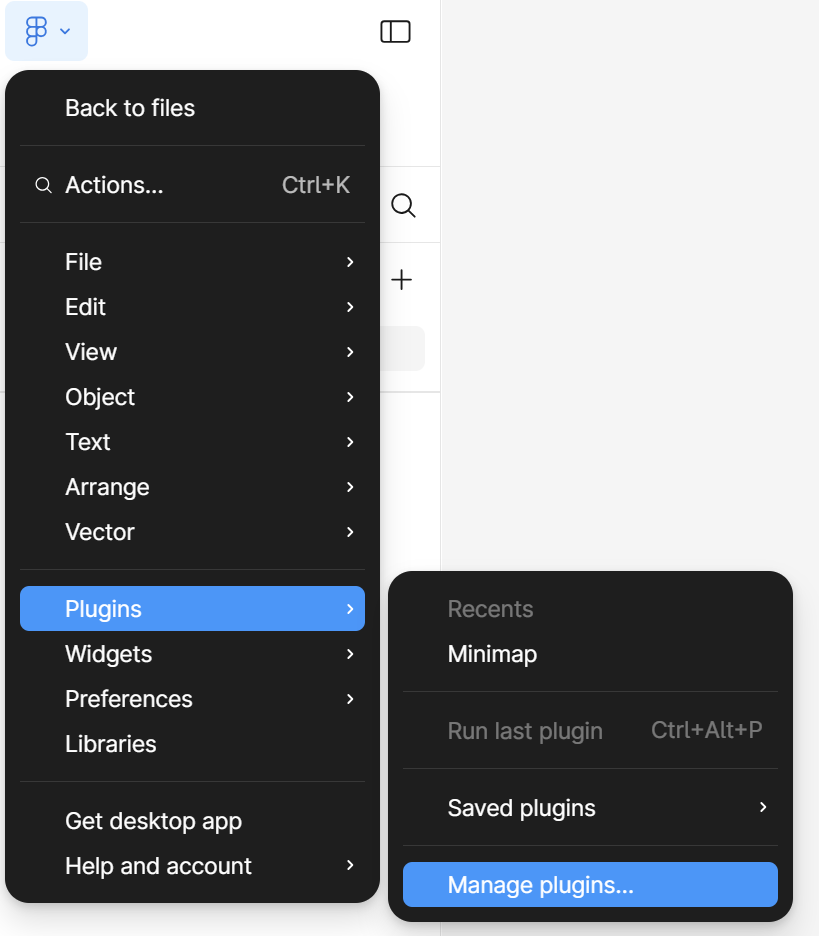
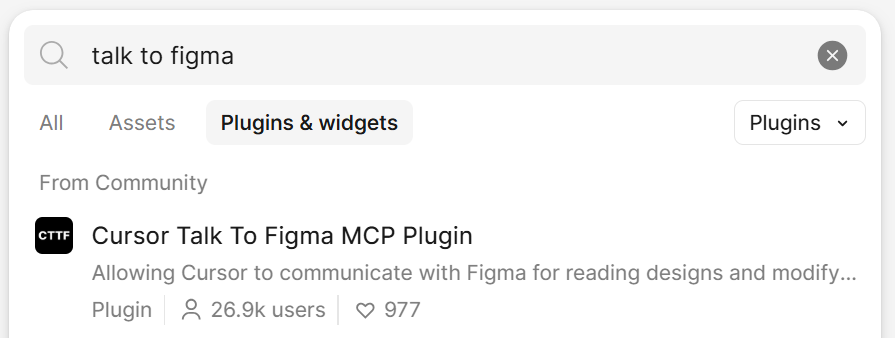

# 서비스 기획 가이드 

## 1. 문제정의와 솔루션 선정

**참고 링크**: [AI 활용 서비스 기획 가이드](https://github.com/cna-bootcamp/aiguide/blob/main/AI%ED%99%9C%EC%9A%A9%20%EC%84%9C%EB%B9%84%EC%8A%A4%20%EA%B8%B0%ED%9A%8D%20%EA%B0%80%EC%9D%B4%EB%93%9C.md)

## 2. 기획 구체화: Event Storming

Event Storming을 Figma의 FigJam을 이용하여 수행합니다. 
 

### Claude 활용한 보완  
Claude Desktop/Clade Code에서 MCP를 사용하여 Figma를 연동하여 수행합니다.  

**사전준비사항** 
- MCP 설치: Claude Desktop과 Claude Code에 Talk To Figma MCP 설치 -> [설치 가이드](https://github.com/cna-bootcamp/clauding-guide/blob/main/guides/setup/01.Claude%20Desktop_Code_SuperClaude%20%EC%84%A4%EC%B9%98%20%EA%B0%80%EC%9D%B4%EB%93%9C.md)  
- MCP Plugin 설치: Figma에 'Cursor Talk To Figma MCP Plugin' 설치 
   

    
  
```
1. Figma에서 'Cursor Talk To Figma MCP Plugin' 설치
2. Claude Desktop이나 Claude Code에서 연동할 Figma 객체 선택 후 플러그인 실행
3. 플러그인 창에서 채널 ID 복사. 이 플러그인 창을 닫지 않고 그대로 둠
4. Claude Desktop 또는 Claude Code에서 프롬프팅
```


```
Figma 채널'cgqs7jzi'에 대시보드 html을 이용하여 figma 객체를 만들어 주세요.                                                                                 │
  - 대시보드: C:\home\workspace\tripgen\design\uiux\prototype\01-대시보드.html                                                                        │
  - html을 읽어 변형하지 말고 객체를 생성                                                                                                             │
  - 모바일에 최적화하여 생성  
```