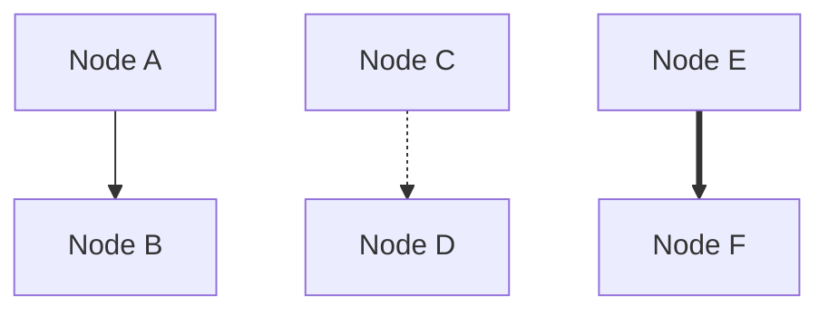
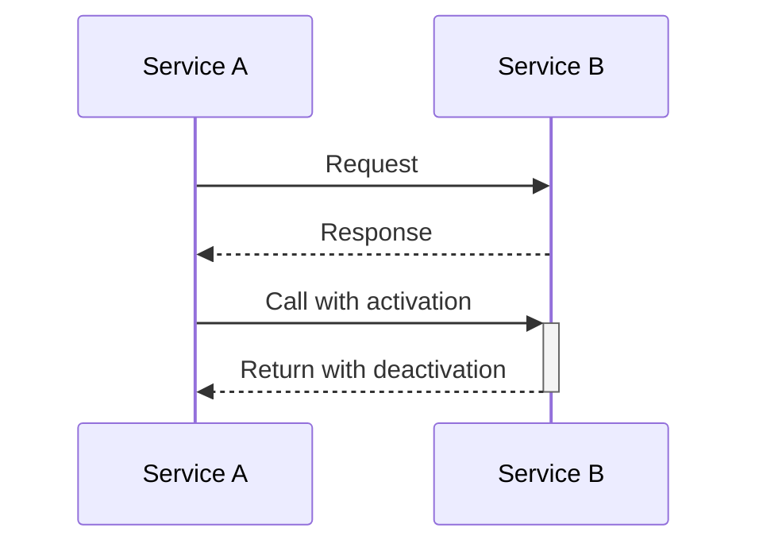
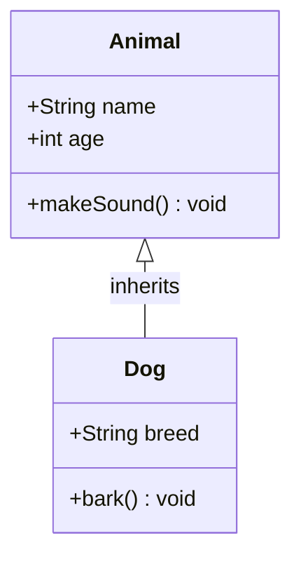
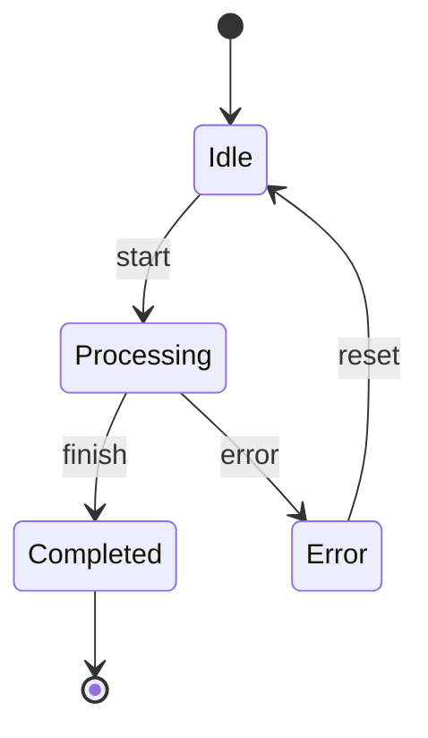

# Mermaid문법검사가이드

## 개요

Mermaid 다이어그램의 문법 오류를 사전에 검출하여 렌더링 실패를 방지하기 위한 가이드입니다. Docker 기반 Mermaid CLI를 활용하여 로컬에서 빠르게 문법을 검증할 수 있습니다.

## Mermaid CLI 서버 설치 및 검사

### Docker로 Mermaid CLI 컨테이너 실행

```bash
# Mermaid CLI 컨테이너가 실행 중인지 확인
docker ps | grep mermaid-cli

# Mermaid CLI 컨테이너가 없으면 설치 및 실행
docker run -d --rm --name mermaid-cli -p 48080:8080 --entrypoint sh minlag/mermaid-cli:latest -c "while true;do sleep 3600; done"

# 컨테이너 상태 확인
docker logs mermaid-cli
```

문법검사 후 Container를 중지하지 않고 계속 사용함 

## 문법 검사 방법
현재 OS에 맞게 수행

### Linux/macOS 버전
**스크립트 파일(tools/check-mermaid.sh)을 이용하여 수행**

1. tools/check-mermaid.sh 파일 존재 여부 확인 
2. 스크립트 파일이 없으면 "Mermaid문법검사기(Linux/Mac)"를 tools/check-mermaid.sh 파일로 다운로드하여 스크립트 파일을 만듦
3. 스크립트 파일이 있으면 그 스크립트 파일을 이용하여 검사

```bash
# 1. 스크립트 실행 권한 부여 (최초 1회)
chmod +x tools/check-mermaid.sh

# 2. 문법 검사 실행
./tools/check-mermaid.sh {검사할 파일}

# 예시
./tools/check-mermaid.sh design/backend/physical/physical-architecture.mmd
```

### Windows PowerShell 버전
**스크립트 파일(tools/check-mermaid.ps1)을 이용하여 수행**

1. tools/check-mermaid.ps1 파일 존재 여부 확인 
2. 스크립트 파일이 없으면 "Mermaid문법검사기(Window)"를 tools/check-mermaid.ps1 파일로 다운로드하여 스크립트 파일을 만듦
3. 스크립트 파일이 있으면 그 스크립트 파일을 이용하여 검사

```powershell
# 문법 검사 실행
.\tools\check-mermaid.ps1 {검사할 파일}

# 예시
.\tools\check-mermaid.ps1 design\backend\physical\physical-architecture.mmd
```

### 수동 검사 방법 (스크립트 없이)

```bash
# 1. 고유 파일명 생성 (충돌 방지)
TEMP_FILE="/tmp/mermaid_$(date +%s)_$$.mmd"

# 2. 파일 복사
docker cp {검사할 파일} mermaid-cli:${TEMP_FILE}

# 3. 문법 검사
docker exec mermaid-cli mmdc -i ${TEMP_FILE} -o /tmp/output.svg -e svg -q

# 4. 임시 파일 삭제
docker exec mermaid-cli rm -f ${TEMP_FILE} /tmp/output.svg
```

### 검사 결과 해석

| 출력 | 의미 | 대응 방법 |
|------|------|-----------|
| "Success: Mermaid syntax is valid!" | 문법 오류 없음 ✅ | 정상, 렌더링 가능 |
| "Parse error on line X" | X번째 줄 구문 오류 ❌ | 해당 라인 문법 확인 |
| "Expecting 'XXX'" | 예상 토큰 오류 ❌ | 누락된 문법 요소 추가 |
| "Syntax error" | 일반 문법 오류 ❌ | 전체 구조 재검토 |

## Mermaid 다이어그램 타입별 주의사항

### 1. Graph/Flowchart


### 2. Sequence Diagram


### 3. Class Diagram


### 4. State Diagram


## 일반적인 오류와 해결 방법

### 1. 괄호 불균형
```mermaid
%% 잘못된 예 ❌
graph TB
    A[Node (with parenthesis)]  %% 괄호 안에 괄호
    
%% 올바른 예 ✅
graph TB
    A[Node with parenthesis]
```

### 2. 특수 문자 이스케이프
```mermaid
%% 잘못된 예 ❌
graph TB
    A[Security & Management]  %% & 문자 직접 사용
    
%% 올바른 예 ✅
graph TB
    A[Security &amp; Management]  %% HTML 엔티티 사용
```

### 3. subgraph/end 불일치
```mermaid
%% 잘못된 예 ❌
graph TB
    subgraph One
        A --> B
        subgraph Two
            C --> D
    end  %% Two만 닫힘, One은 안 닫힘
    
%% 올바른 예 ✅
graph TB
    subgraph One
        A --> B
        subgraph Two
            C --> D
        end
    end  %% 모든 subgraph 닫기
```

### 4. 노드 참조 오류
```mermaid
%% 잘못된 예 ❌
graph TB
    A --> UnknownNode  %% 정의되지 않은 노드
    
%% 올바른 예 ✅
graph TB
    A[Node A] --> B[Node B]  %% 모든 노드 정의
```

## 컨테이너 관리

### 컨테이너 중지 및 삭제
```bash
# 컨테이너 중지
docker stop mermaid-cli

# 컨테이너 삭제
docker rm mermaid-cli

# 한 번에 중지 및 삭제
docker stop mermaid-cli && docker rm mermaid-cli
```

### 컨테이너 재시작
```bash
# 컨테이너 재시작
docker restart mermaid-cli
```

## 성능 최적화 팁

1. **컨테이너 유지**: 검사 후 컨테이너를 중지하지 않고 유지하여 다음 검사 시 빠르게 실행
2. **배치 검사**: 여러 파일을 연속으로 검사할 때 컨테이너 재시작 없이 진행
3. **로컬 파일 사용**: 네트워크 경로보다 로컬 파일 경로 사용 권장

## 문제 해결

### Docker 관련 오류
```bash
# Docker 데몬 실행 확인
docker ps

# Docker Desktop 시작 (Windows/Mac)
# Docker 서비스 시작 (Linux)
sudo systemctl start docker
```

### 권한 오류
```bash
# Linux/Mac에서 스크립트 실행 권한
chmod +x tools/check-mermaid.sh

# Docker 권한 (Linux)
sudo usermod -aG docker $USER
```

### 컨테이너 이미지 오류
```bash
# 이미지 재다운로드
docker pull minlag/mermaid-cli:latest

# 기존 컨테이너 삭제 후 재생성
docker stop mermaid-cli && docker rm mermaid-cli
```