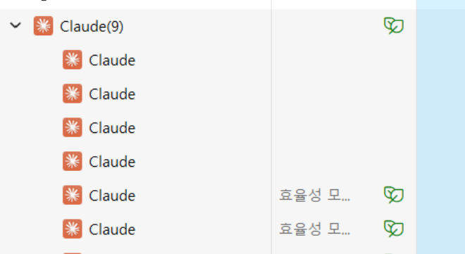

# Claude Code 100% 활용 방법 

이 문서는 Claude Code를 IDE(vscode, IntelliJ)와 통합하고 SuperClaude 명령을 활용하여 사용하는 방법을 안내합니다.  

- [Claude Code 100% 활용 방법](#claude-code-100-활용-방법)
  - [사전준비](#사전준비)
  - [사전지식 이해](#사전지식-이해)
    - [역할과 작업 약어 이해](#역할과-작업-약어-이해)
    - [프로젝트 단계별 사용 프롬프트](#프로젝트-단계별-사용-프롬프트)
    - [프로젝트 단계별 가이드](#프로젝트-단계별-가이드)
    - [산출물 디렉토리 약어 이해](#산출물-디렉토리-약어-이해)
    - [기타 중요한 지침](#기타-중요한-지침)
  - [프로젝트 단계별 Claude Code 이용](#프로젝트-단계별-claude-code-이용)
  - [유용한 프롬프트 예시](#유용한-프롬프트-예시)

---

## 사전준비 
- [Claude Code와 SuperClaude 설치](https://github.com/cna-bootcamp/clauding-guide/blob/main/guides/setup/01.Claude%20Desktop_Code_SuperClaude%20%EC%84%A4%EC%B9%98%20%EA%B0%80%EC%9D%B4%EB%93%9C.md)
- MCP 설치: 'Claude Code와 SuperClaude 설치' 가이드의 'MCP설치'섹션에서 수행  
- [Claude Code 설정](https://github.com/cna-bootcamp/clauding-guide/blob/main/guides/setup/02.Claude%20code%20setup.md)
- IDE와 통합: 'Claude Code 설정'의 'IDE와 통합'섹션에서 수행  
- [Claude Instruction 생성](https://github.com/cna-bootcamp/clauding-guide/blob/main/guides/prompt/01.setup-prompt.md)  
  - YOLO모드 전환: YOLO모드는 사용자에게 중간 중간 확인받지 않고 Claude Code가 바로 수행하는 옵션입니다.   
    ```
    claude-yolo
    ```
    'claude-normal'이나 'claude-safe'로 다른 모드로 전환할 수 있습니다.   ㄴㄴ
    'claude-help'로 다른 명령을 볼 수 있습니다.   

  - 프로젝트 디렉토리로 이동하여 claude 또는 cy 명령으로 Claude Code 실행 
  - [프로젝트 설정 프롬프트](https://github.com/cna-bootcamp/clauding-guide/blob/main/guides/prompt/01.setup-prompt.md)를 참조하여 수행  
  - Project 루트 디렉토리에 CLAUDE.md 생성 확인  
  - Claude Code를 종료하고 다시 시작 
    ```
    /exit 
    ```
    ```
    cy 또는 claude 
    ```

**Tip) IDE 통합 안될 때**: 작업관리자에서 Claude 프로세스 모두 종료하고 다시 시도  
 

---

## 사전지식 이해 
### 역할과 작업 약어 이해 
SuperClaude 명령어와 파라미터가 복잡하기 때문에 기획, 설계, 개발, 배포에서 사용하는 작업들을   
약어로 만들어서 CLAUDE.md에 만들었습니다.    
위 'Claude Instruction 생성'작업을 하면 생성됩니다.    
프로젝트 루트의 CLAUDE.md 맨 아래에 있습니다.   
작업 뿐 아니라 역할에 대한 약어도 있습니다.    
약어에 대한 의미는 아래 'SuperClaude 명령어 및 파라미터 목록' 문서를 참고하면 됩니다.  
```
## 프롬프트 약어 
## 역할 약어 
- "@archi": "--persona-architect"
- "@front": "--persona-front"
- "@back": "--persona-backend"
- "@secu": "--persona-security"
- "@qa": "--persona-qa"
- "@refact": "--persona-refactor" 
- "@devops": "--persona-devops"
- "@scribe": "--persona-scriber"

## 작업 약어 
- "@complex-flag": --seq --c7 --uc --wave-mode auto --wave-strategy systematic --delegate auto

- "@userstory": /sc:document @scribe @archi --think --wave-strategy systematic
- "@uiux": /sc:design --think @front --uc --wave-mode auto --wave-strategy systematic
- "@prototype": /sc:implement @front --answer-only 
- "@design-pattern": /sc:design @archi --think-hard @complex-flag
- "@architecture": /sc:design @archi @back @refact --think-hard  @complex-flag
- "@backing-service": /sc:implement @devops @back --think-hard  @complex-flag
- "@dev-backend": /sc:implement @back --think-hard @complex-flag
- "@dev-front": /sc:implement @front --think-hard @complex-flag
- "@dev-testcode": /sc:test @back @qa --think @complex-flag
- "@test-front": /sc:test @qa @front --play --think @complex-flag
- "@cicd": /sc:implement @devops @archi @back --think @complex-flag
- "@document": /sc:document --think @scribe @complex-flag
- "@fix": /sc:troubleshoot --think --seq 
- "@estimate": /sc:estimate --think-hard @complex-flag
- "@improve": /sc:improve --think @complex-flag
- "@analyze": /sc:analyze --think --seq 
- "@explain": /sc:explain --think --seq --answer-only 
```

참고) ClaudeCode/SuperClaude 명령과 파라미터
- [Claude Code 명령어 및 파라미터](https://github.com/cna-bootcamp/clauding-guide/blob/main/references/Claude%20Code%20%EB%AA%85%EB%A0%B9%EC%96%B4%20%EB%B0%8F%20%ED%8C%8C%EB%9D%BC%EB%AF%B8%ED%84%B0.md)
- [SuperClaude 명령어 및 파라미터 목록](https://github.com/cna-bootcamp/clauding-guide/blob/main/references/SuperClaude%20%EB%AA%85%EB%A0%B9%EC%96%B4%20%EB%B0%8F%20%ED%8C%8C%EB%9D%BC%EB%AF%B8%ED%84%B0%20%EB%AA%A9%EB%A1%9D.md)

### 프로젝트 단계별 사용 프롬프트 
이 약어들을 이용하여 각 단계별로 작업하는 프롬프트는 아래에 있습니다.  
- [기획 프롬프트](https://github.com/cna-bootcamp/clauding-guide/blob/main/guides/prompt/02.think-prompt.md)
- [설계 프롬프트](https://github.com/cna-bootcamp/clauding-guide/blob/main/guides/prompt/03.design-prompt.md)
- [개발 프롬프트](https://github.com/cna-bootcamp/clauding-guide/blob/main/guides/prompt/04.build-prompt.md)
- [배포 프롬프트]()

### 프로젝트 단계별 가이드  
CLAUDE.md에는 각 프로젝트 단계별로 사용되는 가이드의 URL이 정의되어 있습니다.   
프롬젝트 단계별 사용하는 프롬프트는 이 가이드를 참조하도록 되어 있습니다.   

### 산출물 디렉토리 약어 이해 
CLAUDE.md에는 각 단계별 산출물의 위치가 정의되어 있습니다.   
프롬프트에서 산춤물 이름만 입력하면 Claude Code는 그 위치를 알 수 있게 됩니다. 

### 기타 중요한 지침
CLAUDE.md에는 중요한 지침들이 더 있습니다.     
- Git연동: '[Git 연동]' 섹션 참조   
  Claude Code에 아래 명령을 사용하여 Git과 연동 합니다. 
  - pull: 원격 Git Repo에서 pull을 수행하고 충돌 시 최신 파일로 자동 병합합니다.   
  - push 또는 푸시: 변경사항을 비교하여 자동으로 commit message를 만들고 원격 Git Repo에 푸시합니다.  
- URL링크 처리: '[URL링크 참조]' 섹션 참조   
  Claude는 URL링크가 있으면 기본적으로 WebFetch라는 툴로 다운로드 합니다.   
  문제는 **원본 그대로 다운로드 하지 않고** 자기가 요약 또는 변형한다는 것입니다.  
  그래서 이 지침을 제공하여 curl명령으로 파일을 다운로드 해서 사용하도록 가이드 하는 것입니다.   
- 핵심원칙: '[핵심 원칙]' 섹션 참조   
  - 서브 에이젼트를 만들어 병렬 처리하게 함으로써 처리 속도를 높이도록 합니다.  
  - PlantUML 스크립트와 OpenAPI swagger 파일을 만들면 반드시 검사까지 하도록 합니다.  
- 가이드 로딩: '[가이드 로딩]' 섹션 참조  
  - CLAUDE.md에 있는 가이드('[가이드] 섹션 하위에 있음')를 갱신하는 지침입니다.   
  - 가이드를 표준화하여 공통으로 사용하기 위한 지침입니다.  
  - 프롬프트에 '가이드 로딩'이라고 입력하면 원격 Repository의 가이드를 다시 다운로드 하여 CLAUDE.md를 갱신합니다.    
  
---


## 프로젝트 단계별 Claude Code 이용  

'프로젝트 단계별 사용 프롬프트'를 이용하면 됩니다.   

---

## 유용한 프롬프트 예시   
vscode나 IntelliJ와 통합된 Claude Code에서 수행하면 편합니다.  

**1.웹브라우저 연동**   
'프로토타입'의 위치가 CLAUDE.md에 정의되어 있으므로 그 하위에서 '대시보드'가 포함된 html파일을   
웹브라우저에 자동으로 열어 내용을 분석합니다.  
'--play'는 프론트엔드 테스트를 해주는 playwrite라는 MCP를 사용하라는 옵션입니다.  
```
@analyze as @front --play 프로토타입의 대시보드 화면을 브라우저에서 열어 분석
```

아래와 같이 복합적으로 사용도 가능합니다. 
- 프론트엔드 역할로 웹브라우저에서 '여행지 설정'화면을 띄워 분석  
- 현재 열린 파일에서 유저스토리 ID로 찾아 내용을 이해 
- 화면 분석 결과를 바탕으로 해당되는 유저스토리 ID를 직접 수정  
```
@analyze as @front --play 프로토타입의 여행지설정 화면을 브라우저에서 열어 분석하고,  
@improve as @scribe 유저스토리 'UFR-TRIP-040'을 수정해 줘요.
```

**2.평가요청**   
'@estimate'명령 약어와 역할 약어를 이용하여 어떤 평가를 하게 할 수 있음 

백엔드 개발자와 프론트엔드 개발자가 현재 열린 파일의 유저스토리를 검토하여 스코어를 평가  
```
@estimate as @back and @front 모든 유저스토리에 대해 스코어를 재평가해 주세요
```

Product Owner로서 현재 열린 파일의 유저스토리를 검토하여 비즈니스 중요도를 평가  
역할 약어에 없어도 'PO'라는 말이 CLAUDE.md의 팀 멤버에 있기 때문에 잘 수행됩니다.   
```
@estimate as PO 모든 유저스토리의 비즈니스 중요도를 재평가해 주세요
```

**3.분석요청**  

백엔드 개발자와 프론트엔드 개발자로서 열린 파일의 유저스토리의 기술검토를 수행합니다.  
```
@analyze as @back and @front 모든 유저스토리의 기술적 실현 가능성을 검토해 주세요
```

