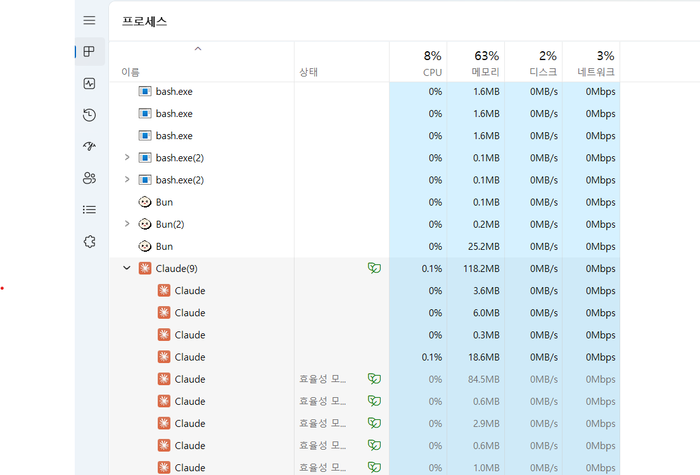

# Claude Code 100% 활용 방법 

이 문서는 Claude Code를 IDE(vscode, IntelliJ)와 통합하고 SuperClaude 명령을 활용하여 사용하는 방법을 안내합니다.  

## 사전준비 
- [Claude Code와 SuperClaude 설치](https://github.com/cna-bootcamp/clauding-guide/blob/main/guides/setup/01.Claude%20Desktop_Code_SuperClaude%20%EC%84%A4%EC%B9%98%20%EA%B0%80%EC%9D%B4%EB%93%9C.md)
- MCP 설치: 위 가이드의 마지막에 있는 링크 이용하여 수행  
- [Claude Code 설정](https://github.com/cna-bootcamp/clauding-guide/blob/main/guides/setup/02.Claude%20code%20setup.md)
- [Cluade Project Instruction 작성 가이드](https://github.com/cna-bootcamp/clauding-guide/blob/main/guides/setup/03.instruction-guide.md)

IDE 통합 안될 때 
 

```
@analyze as @front --play 대시보드 화면을 브라우저에서 열어 분석
```

```
@analyze as @front --play 여행지설정 화면을 브라우저에서 열어 분석하고,  
@improve as @scribe 유저스토리 'UFR-TRIP-040'을 수정해 줘요.
```


- **건강상태 반영 방법 추가**
  - 프롬프트: 멤버가 여러명이고 건강상태도 다 다른데 건강상태를 어떻게 반영하여 일정을 짜는게 좋을까요?
  - 수행: 그룹 최소 건강상태 기준 적용, 건강상태별 제약사항 정의

- **날씨 정보 기능 추가**
  - 프롬프트: 중요한것을 누락했네요. 날씨도 고려해야 해요
  - 수행: OpenWeatherMap API 통합, 날씨 기반 일정 조정 기능 추가

- **도보 이동 및 이동수단 개선**
  - 프롬프트: 경로탐색 시 도보 이동도 고려해야 겠네요
  - 수행: 500m 이내 도보 우선 안내, 이동수단별 상세 정보 추가

- **지도 경로 표시 기능 추가**
  - 프롬프트: 지도상에 각 장소의 이동 경로를 표시하는게 있으면 좋겠다는 생각이 들어요
  - 수행: UFR-TRIP-080 (지도경로표시) 생성, 일자별 색상 구분

- **생성된 일정 조회 화면 분석** (@analyze 사용)
  - 프롬프트: @analyze as @front --play 생성된 일정 조회 화면을 분석하고 좋은 방안을 알려줘요
  - 수행: Playwright를 사용하여 06-생성된일정조회.html 화면 분석, 건강상태별 일정 표시 방안 제시

- **Location 서비스 유저스토리 생성** (@analyze 사용)
  - 프롬프트: @analyze as @front --play 주변장소검색 화면을 브라우저에서 분석해 주세요. @document as @scribe 그리고 Location 서비스의 이 화면에 대한 유저스토리를 작성해줘요
  - 수행: Playwright를 사용하여 브라우저에서 화면 분석 후 UFR-LOC-010 (주변장소검색), UFR-LOC-020 (장소카드표시), UFR-LOC-030 (장소상세정보) 생성

- **장소 상세정보 화면 분석** (@improve, @analyze 사용)
  - 프롬프트: @improve as @scribe 'UFR-LOC-030'을 수정해 주세요. @analyze as @front 장소상세정보를 파악한 후에 수정 바랍니다
  - 수행: 07-장소상세정보.html 화면 분석 후 UFR-LOC-030 개선

- **스코어 재평가 (기술 복잡도)** (@estimate 사용)
  - 프롬프트: @estimate as @back and @front 모든 유저스토리에 대해 스코어를 재평가해 주세요
  - 수행: 백엔드/프론트엔드 복잡도를 고려하여 전체 유저스토리 스코어 조정
  - 주요 변경: UFR-TRIP-060 (10→34), UFR-AI-010 (8→34) 등 복잡도 높은 기능 상향

- **비즈니스 중요도 재평가** (@estimate 사용)
  - 프롬프트: @estimate as PO 모든 유저스토리의 비즈니스 중요도를 재평가해 주세요
  - 수행: Product Owner 관점에서 MVP 중심으로 MoSCoW 재분류
  - 주요 변경: UFR-TRIP-090 (S→M), UFR-AI-020 (S→M) 상향, UFR-USER-030 (S→C) 등 하향

- **기술적 실현 가능성 검토** (@analyze 사용)
  - 프롬프트: @analyze as @back and @front 모든 유저스토리를 기술적 실현 가능성을 검토해 주세요
  - 수행: 서비스별 기술적 실현 가능성 평가, 주요 리스크 식별 및 해결방안 제시
  - 결론: 전체적으로 기술적 실현 가능, AI 응답 시간이 주요 도전 과제
- 