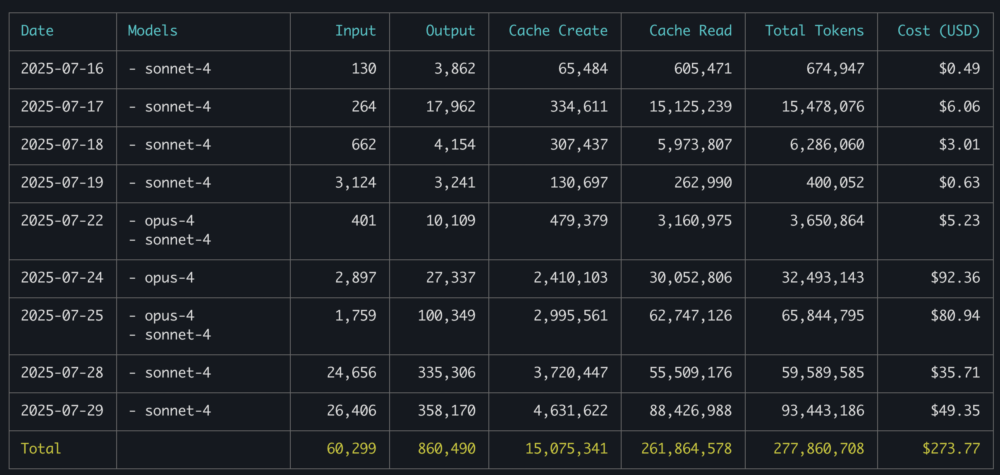
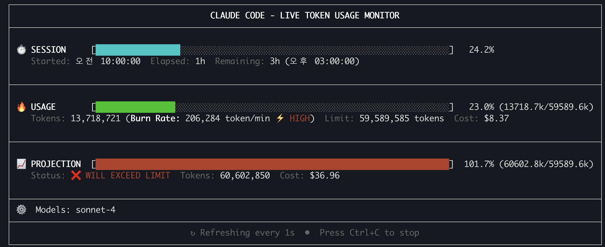

# Claude Code 사용 통계 보는 방법  
ccusage라는 유틸리티를 사용합니다. 

## 사전 작업 
### bun 설치:
**1.Linux/Mac**
```bash
curl -fsSL https://bun.sh/install | bash
```
설정 적용: Mac은 ~/.zshrc, Linux는 ~/.bashrc에 추가 
```
export PATH="$HOME/.bun/bin:$PATH"
```

**2.Window**
```
powershell -c "irm bun.sh/install.ps1|iex"
```

## 일별/월별 사용량 보기  

```
bunx ccusage daily/monthly [--since YYYYMMDD] [--until YYYYMMDD]   
```
Cost는 만약에 Claude API를 사용했다면 예상되는 비용입니다. 
Claude Plan(Pro, Max)이 쓰는게 좋을 지 API를 쓰는게 좋을 지 판단할 수 있습니다.  
자주 사용한다면 Claude Plan이 보통 더 좋습니다.   
결과예시) 


## 실시간 사용량 보기  

남은 세션 사용시간과 사용량 보기 
```
bunx ccusage blocks --live 
```
결과예시: 지금 세션 3시간 남았고 이 세션에서 23%사용했으며   
지금 사용량으로 예상하면 세션이 끝날때까지 101.7% 사용할 것 같다는 의미입니다.   
예상 사용율을 보고 본인의 Claude 사용 플랜을 정할 수 있습니다.  


이 창을 계속 띄워 놓으면 거의 실시간으로 사용량을 볼 수 있습니다  
