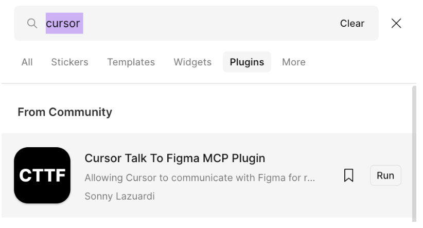
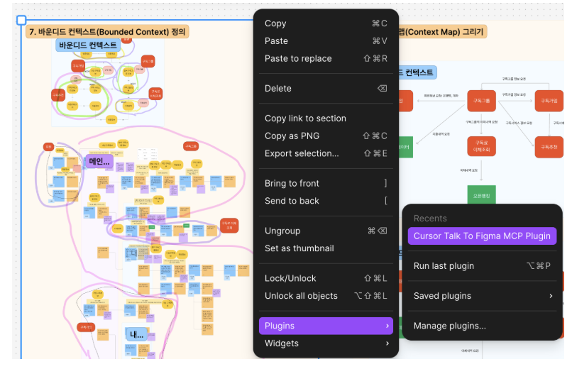
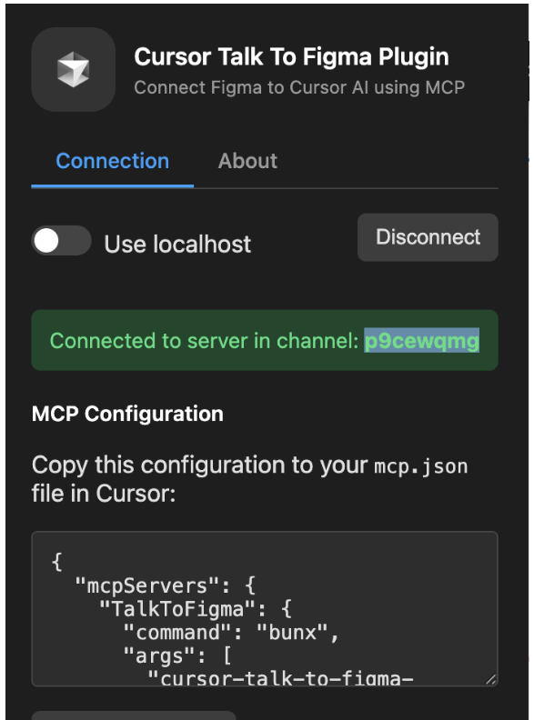
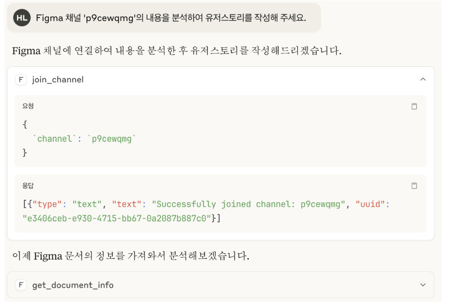

# MCP 설치 및 구성 방법 

- [MCP 설치 및 구성 방법](#mcp-설치-및-구성-방법)
  - [사전작업](#사전작업)
    - [bun 설치:](#bun-설치)
  - [주요 MCP 설치](#주요-mcp-설치)
    - [Context7 MCP](#context7-mcp)
    - [Sequential Thinking MCP](#sequential-thinking-mcp)
    - [Magic MCP](#magic-mcp)
    - [Playwright MCP](#playwright-mcp)
    - [GitHub MCP 설치](#github-mcp-설치)
    - [Figma MCP 설치](#figma-mcp-설치)
    - [설치 확인](#설치-확인)
  - [Claude Code에 MCP 동기화](#claude-code에-mcp-동기화)
  - [참고사항/Tip](#참고사항tip)
    - [공식 Git Repository](#공식-git-repository)

---
## 사전작업
### bun 설치:
**1.Linux/Mac**
```bash
curl -fsSL https://bun.sh/install | bash
```
설정 적용: Mac은 ~/.zshrc, Linux는 ~/.bashrc에 추가 
```
export PATH="$HOME/.bun/bin:$PATH"
```

**2.Window**
```
powershell -c "irm bun.sh/install.ps1|iex"
```

참고) MCP 설정 파일

- **Linux**: `~/.config/Claude/claude_desktop_config.json`
- **Mac**: `/Users/{user}/Library/Application Support/Claude/claude_desktop_config.json`
- **Windows**: `{user home}\AppData\Roaming\Claude\claude_desktop_config.json`

## 주요 MCP 설치
context7과 sequential MCP는 반드시 설치해야 SuperClaude를 원활하게 사용할 수 있습니다.   

### Context7 MCP

```bash
# GitHub 링크: https://github.com/upstash/context7
# 설치는 MCP 설정 파일에 추가
```

### Sequential Thinking MCP

```bash
# GitHub 링크: https://mcp.so/server/sequentialthinking/modelcontextprotocol
# 설치는 MCP 설정 파일에 추가
```

### Magic MCP

```bash
# GitHub 링크: https://github.com/21st-dev/magic-mcp
# API Key 생성 필요: https://21st.dev/magic/console 에서 'Setup Magic MCP' 버튼 클릭
# IDE를 Cursor로 선택하면 생성됨
```

### Playwright MCP

```bash
# GitHub 링크: https://github.com/microsoft/playwright-mcp
# 설치는 MCP 설정 파일에 추가
```

### GitHub MCP 설치

https://smithery.ai/ 에서 'GitHub'로 찾아 추가:

```json
"github": {
  "command": "npx",
  "args": [
    "-y",
    "@smithery/cli@latest",
    "run",
    "@smithery-ai/github",
    "--key",
    "6bf03d02-65a9-4a0d-ac05-6d4a5b0d4343",
    "--profile",
    "motionless-flamingo-aj9dsM"
  ]
}
```

**※ 접근할 Organization에 'Smithery AI'를 추가해야 함**
- '[Deploy Server]' 클릭 후 GitHub 로그인
- 'Add Github Account' 선택하여 접근할 Organization 추가


### Figma MCP 설치

**claude_desktop_config.json에 아래와 같이 추가:**

```json
"figma-mcp": {
  "command": "npx",
  "args": [
    "-y",
    "cursor-talk-to-figma-mcp@latest",
    "--server=vps.sonnylab.com"
  ]
}
```

**Figma MCP 사용법**

1. Figma에서 'Cursor Talk To Figma MCP Plugin' 설치
 
2. Claude Desktop이나 Claude Code에서 연동할 Figma 객체 선택 후 플러그인 실행
  
3. 플러그인 창에서 채널 ID 복사. 이 플러그인 창을 닫지 않고 그대로 둠
 
4. Claude Desktop 또는 Claude Code에서 프롬프팅
  

### 설치 확인

Claude Desktop의 '설정' 메뉴에서 확인.
  

**※ 설정 파일 수정 후 메인메뉴에서 클로드를 종료 후 다시 시작해야 적용됨**

**MCP 설정 파일 예시(Linux/Mac)**
```
{
  "mcpServers": {
    "github": {
      "command": "npx",
      "args": [
        "-y",
        "@smithery/cli@latest",
        "run",
        "@smithery-ai/github",
        "--key",
        "6bf03d02-65a9-4a0d-ac05-6d4a5b0d4343",
        "--profile",
        "motionless-flamingo-aj9dsM"
      ]
    },
    "figma-mcp": {
      "command": "npx",
      "args": [
        "-y",
        "cursor-talk-to-figma-mcp@latest",
        "--server=vps.sonnylab.com"
      ]
    },
    "context7": {
      "command": "npx",
      "args": [
        "-y",
        "@upstash/context7-mcp"
      ]
    },
    "sequential-thinking": {
      "command": "npx",
      "args": [
        "-y",
        "@modelcontextprotocol/server-sequential-thinking"
      ]
    },
    "magic": {
      "command": "npx",
      "args": [
        "-y",
        "@21st-dev/magic@latest"
      ],
      "env": {
        "API_KEY": "5ec762189bd67fb2e4b3d3832cc35b80d4ff067418a6f0c872a3724d1283ab43"
      }
    },
    "playwright": {
      "command": "npx",
      "args": [
        "-y",
        "@playwright/mcp@latest"
      ]
    },
    "mcp-kakao-local": {
      "command": "npx",
      "args": [
        "-y",
        "@smithery/cli@latest",
        "run",
        "@yunkee-lee/mcp-kakao-local",
        "--key",
        "6bf03d02-65a9-4a0d-ac05-6d4a5b0d4343",
        "--profile",
        "motionless-flamingo-aj9dsM"
      ]
    }
  }
}
```

**MCP 설정 파일 예시(Window)**

```json
{
  "mcpServers": {
    "TalkToFigma": {
      "command": "bunx",
      "args": [
        "cursor-talk-to-figma-mcp@latest",
        "--server=vps.sonnylab.com"
      ]
    },
    "context7": {
      "command": "cmd",
      "args": [
        "/c",
        "npx",
        "-y",
        "@upstash/context7-mcp@latest"
      ]
    },
    "sequential-thinking": {
      "command": "cmd",
      "args": [
        "/c",
        "npx",
        "-y",
        "@modelcontextprotocol/server-sequential-thinking"
      ]
    },
    "magic": {
      "command": "cmd",
      "args": [
        "/c",
        "npx",
        "-y",
        "@21st-dev/magic@latest"
      ],
      "env": {
        "API_KEY": "5ec762189bd67fb2e4b3d3832cc35b80d4ff067418a6f0c872a3724d1283ab43"
      }
    },
    "playwright": {
      "command": "cmd",
      "args": [
        "/c",
        "npx",
        "@playwright/mcp@latest"
      ]
    },
    "mcp-kakao-local": {
      "command": "cmd",
      "args": [
        "/c",
        "npx",
        "-y",
        "@smithery/cli@latest",
        "run",
        "@yunkee-lee/mcp-kakao-local",
        "--key",
        "6bf03d02-65a9-4a0d-ac05-6d4a5b0d4343",
        "--profile",
        "motionless-flamingo-aj9dsM"
      ]
    }
  }
}
```


---

## Claude Code에 MCP 동기화   
**Linux/Mac**

```bash
claude mcp add-from-claude-desktop -s user
```

**Window**
Claude Code를 실행하고 아래 프롬프트로 동기화 batch파일을 만들어 실행니다.  
```
아래 가이드를 참조하여 Claude Code에 MCP 설정을 추가하는 방법을 가이드 해 주십시오.
- 가이드: https://raw.githubusercontent.com/cna-bootcamp/clauding-guide/refs/heads/main/guides/tools/sync_mcp.md
```

---

## 참고사항/Tip

### 공식 Git Repository

- **Claude Code**: https://github.com/anthropics/claude-code
- **SuperClaude**: https://github.com/SuperClaude-Org/SuperClaude_Framework

**※ 위 Git Repo를 본인것으로 Fork 한 후 클로드 Project에 본인 Git Repo를 추가. 학습이나 문제해결 시 클로딩함.**

