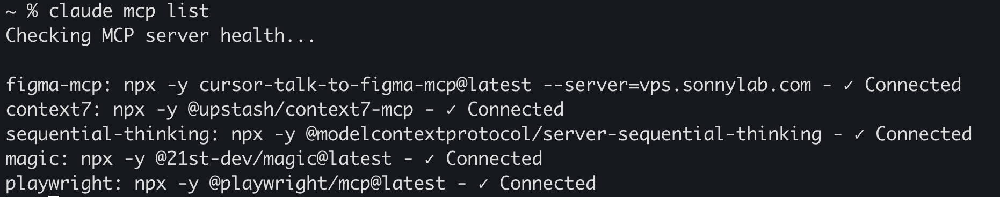
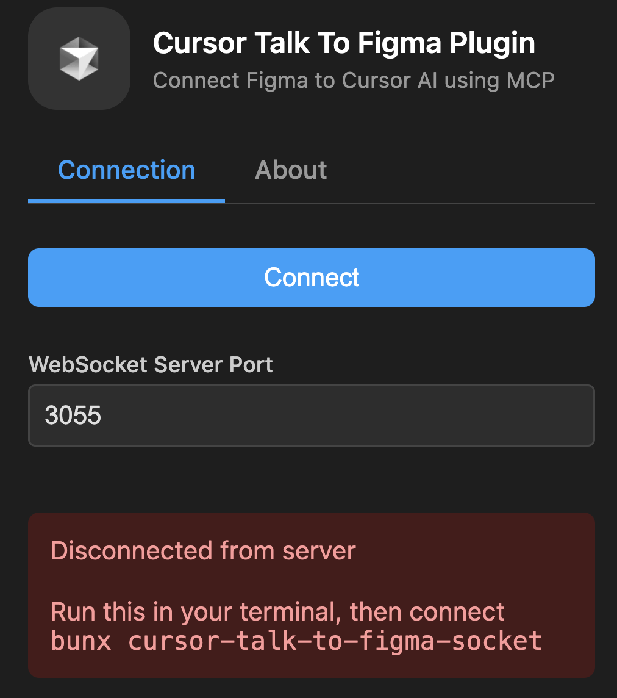

# MCP 설치 및 구성 방법 

- [MCP 설치 및 구성 방법](#mcp-설치-및-구성-방법)
  - [Overview](#overview)
  - [사전작업](#사전작업)
  - [주요 MCP 이해 및 준비 작업](#주요-mcp-이해-및-준비-작업)
  - [Claude Code에 주요 MCP서버 연결](#claude-code에-주요-mcp서버-연결)
    - [주요 MCP 연결](#주요-mcp-연결)
    - [확인](#확인)
  - [Claude Desktop에 주요 MCP서버 연결](#claude-desktop에-주요-mcp서버-연결)
  - [MCP포탈 이용 방법](#mcp포탈-이용-방법)
    - [GitHub MCP 설치](#github-mcp-설치)
    - [Google Map (옵션)](#google-map-옵션)
    - [온라인 Claude에 추가 (옵션)](#온라인-claude에-추가-옵션)
    - [주의사항](#주의사항)
  - [추가 MCP 설치](#추가-mcp-설치)
    - [Figma MCP 설치(필수)](#figma-mcp-설치필수)
  - [MCP서버 삭제](#mcp서버-삭제)

---

## Overview
MCP(Model Context Protocol)는 AI와 외부 서비스(예: Goole Drive, Kakao Map 등)가 통신하기 위한 표준입니다.  
Claude의 개발사인 Anthropic에서 제안하여 업계 표준이 되었습니다.   
Claude Code와 같은 AI툴들이 외부서비스와 연동하려면 외부서비스가 가이드하는 방법대로 MCP 서버 연결 설정을 해야 합니다.  
MCP서버는 'http'를 통해 연결할 수도 있고 PC에 설치하여 연결할 수도 있습니다.   
이 가이드에서는 아래와 같은 내용을 가이드 합니다. 
- Claude Code에 주요 MCP서버 연결  
- Claude Desktop에 주요 MCP서버 연결 
- MCP포탈 이용 방법 

---

## 사전작업
**1.bun 설치:**   
**1.Linux/Mac**
```bash
curl -fsSL https://bun.sh/install | bash
```
설정 적용: Mac은 ~/.zshrc, Linux는 ~/.bashrc에 아래 설정 추가 
```
export PATH="$HOME/.bun/bin:$PATH"
```

**2.Windows**
Powershell에서 아래 수행  
```
powershell -c "irm bun.sh/install.ps1|iex"
```

**2.Claude Desktop 설치**    
Claude Desktop에 MCP를 연결하려면 아래 사이트에서 Claude Desktop을 먼저 설치해야 합니다.   
Claude Desktop은 온라인 Claude와 동일한 기능을 로컬에서 사용하기 위한 로컬 Claude툴입니다.  
이 툴을 설치하면 온라인에서 할 수 없었던 로컬 파일 접근 이나 수정 작업도 할 수 있습니다.  
https://support.anthropic.com/ko/articles/10065433-claude-desktop-%EC%84%A4%EC%B9%98%ED%95%98%EA%B8%B0

---

## 주요 MCP 이해 및 준비 작업  
- Context7 MCP: 최신 개발 방식 제공하여 코드의 최신성 향상 
https://github.com/upstash/context7

- Sequential Thinking MCP: AI가 논리적 작업 순서를 설계하도록 지원  
https://mcp.so/server/sequentialthinking/modelcontextprotocol

- Magic MCP: UI 디자인을 지원 
  - https://github.com/21st-dev/magic-mcp
  - API Key 생성 필요: https://21st.dev/magic/console 에서 'Setup Magic MCP' 버튼 클릭

- Playwright MCP: UI테스트를 지원. 웹브라우저를 실행하여 스스로 테스트나 분석을 수행할 수 있음. 
https://github.com/microsoft/playwright-mcp

- GitHub MCP: GitHub Repository 연동 
  - **※ 접근할 Organization에 'Smithery AI'를 추가해야 함**
  - https://smithery.ai/ 접근하여 회원가입 후 로그인  
  - 우측 상단의 '[Deploy Server]' 클릭 후 GitHub 로그인
      
  - 'Add Github Account' 선택하여 접근할 Organization 추가
      

- Figma MCP: UI/UX 설계 툴인 Figma 연동 


---

## Claude Code에 주요 MCP서버 연결 

### 주요 MCP 연결    
Claude Code의 MCP설정은 '{사용자홈}/.claude.json'파일에 설정합니다.  

**1.MCP 설정값 복사**   
아래 링크를 열어 MCP설정값을 복사합니다. 
주의할 것은 **첫라인의 '{'와 마지막 라인의 '}'은 제외**하고 복사합니다.  

Linux/Mac:
https://github.com/cna-bootcamp/clauding-guide/blob/main/references/MCP-linuxmac.json

Windows:
https://github.com/cna-bootcamp/clauding-guide/blob/main/references/MCP-window.json

**2.MCP 설정값 추가**      
터미널을 열고 이 파일을 열어 MCP설정을 추가합니다.  
```
code ~/.claude.json
```
맨 아래줄 "}" 전 라이 끝에 콤마 추가   


위에서 복사한 설정값 붙여넣기   
 

파일을 저장합니다.  

만약 'mcpServers'항목이 이미 있다면 그 안의 각 MCP설정을 확인하여 잘 설정해야 합니다.  

### 확인 
터미널에서 설치된 MCP List를 확인합니다.  
```
claude mcp list 
```


---

## Claude Desktop에 주요 MCP서버 연결 
Claude Desktop의 MCP서버 설정은 OS별로 아래 파일에 설정 합니다.  
MCP 설정 파일:  
- **Linux**: "~/.config/Claude/claude_desktop_config.json"
- **Mac**: "$HOME/Library/Application Support/Claude/claude_desktop_config.json"
- **Windows**: "$env:USERPROFILE\AppData\Roaming\Claude\claude_desktop_config.json"

**1.설정파일 열기**    
위 파일을 code 명령으로 엽니다.  
Window는 Powershell에서 수행합니다.  
```
code "$HOME/Library/Application Support/Claude/claude_desktop_config.json"
```
참고) Claude Desktop에서 열기  
Claude Desktop을 열고 설정 페이지를 엽니다.  
설정 페이지는 좌측 하단에서 로그인 사용자명을 선택하고 '설정'을 클릭합니다.  
  

그리고 설정 메뉴 중 가장 하단에 있는 '개발자'를 선택합니다.   
'[구성편집]'버튼을 누르고 파일을 편집기에서 엽니다.  


**2.설정 추가**  
OS별로 설정값을 복사합니다.  
Linux/Mac:
https://github.com/cna-bootcamp/clauding-guide/blob/main/references/MCP-linuxmac.json

Windows:
https://github.com/cna-bootcamp/clauding-guide/blob/main/references/MCP-window.json

설정 파일에 붙여넣고 저장합니다.  

**3.확인**    
Claude Desktop이 실행 중이면 종료 합니다.   
단순히 창의 'X'버튼으로 닫지 말고 메인 메뉴에서 '종료'해야 합니다.   
예를 들어 Mac은 아래와 같이 종료합니다.  
  

Claude Desktop을 다시 시작하여 "설정"페이지의 "개발자"메뉴를 확인합니다.   
추가한 MCP서버 목록이 보이고 각 MCP서버를 선택하였을 때 'running'이라고 나와야 합니다.   


---

## MCP포탈 이용 방법 
여러 사이트가 있는데 그 중에 가장 많이 사용하는 곳은 Smithery(스미써리: 대장간)입니다.  
https://smithery.ai/

GitHub와 Figma MCP 추가를 이 사이트를 이용해서 추가해 보겠습니다.   

### GitHub MCP 설치
https://smithery.ai/ 에서 'GitHub'를 검색합니다.  


추가할 바이브 코딩툴을 선택합니다. Claude Code를 선택합니다.    
. 

본인의 GitHub Access Token을 입력하고 'Connect'를 클릭합니다.   
GitHub Access Token 만드는 방법은 [여기](https://github.com/cna-bootcamp/handson-azure/blob/main/prepare/setup-local.md#github-%ED%9A%8C%EC%9B%90%EA%B0%80%EC%9E%85-%EB%B0%8F-%ED%86%A0%ED%81%B0-%EC%83%9D%EC%84%B1)를 참고하세요.  


터미널을 열고 MCP 추가 명령을 수행합니다.  
  
중요) 마지막에 **Scope 옵션 '-s user'를 반드시 추가**   
MCP서버를 어느 범위까지 사용할지 지정하는 옵션입니다.   
- local: 특정 디렉토리에서만 특화된 MCP 추가 
- project: 특정 프로젝트 디렉토리에서만 특화된 MCP 추가
- user: 현재 OS 사용자 전체가 사용하는 MCP 추가  

Tip) MCP 이름 변경   
MCP 주소 앞에 있는 이름을 변경하면 됩니다.  
아래 예에서는 'smithery-ai-github'입니다. 

예시)
```
claude mcp add --transport http smithery-ai-github "https://server.smithery.ai/@smithery-ai/github/mcp?api_key=6bf03d02-65a9-4a0d-ac05-6d4a5b0d4343&profile=motionless-flamingo-aj9dsM" -s user
```

아래 명령으로 추가 되었는지 확인합니다.  
```
claude mcp list 
```

### Google Map (옵션)
위 GitHub MCP 추가와 동일한 방법으로 'google map' MCP를 찾아 추가합니다.  
사전에 아래 사이트에서 API Key를 생성하고 수행합니다.  
https://aistudio.google.com/apikey

예시)
```
claude mcp add --transport http smithery-ai-google-maps "https://server.smithery.ai/@smithery-ai/google-maps/mcp?api_key=6bf03d02-65a9-4a0d-ac05-6d4a5b0d4343&profile=motionless-flamingo-aj9dsM" -s user
```

### 온라인 Claude에 추가 (옵션)
Smithery 서버를 이용하면 온라인 Claude에 쉽게 MCP연결할 수 있습니다.  
'Generate URL'버튼을 클릭하여 MCP 주소값을 구합니다.  


예) 
https://server.smithery.ai/@smithery-ai/google-maps/mcp?api_key=6bf03d02-65a9-4a0d-ac05-6d4a5b0d4343&profile=motionless-flamingo-aj9dsM

온라인 Claude에 로그인 하여 설정 페이지로 이동한 후 '커넥터'메뉴를 선택합니다.  
그리고 '커스텀 커넥터' 버튼을 추가합니다.   
  

. 

참고) '커넥터 둘러보기'를 클릭하여 미리 구성된 MCP를 추가할 수도 있음   
  
프롬프트창에 추가된 MCP가 나오는 걸 확인할 수 있습니다.  


추가가 되면 프롬프트에서 그 MCP와 연동한 요청을 할 수 있습니다.   
  


### 주의사항
Smithery는 개인이 올리는 것도 매우 많으므로 동작하지 않는 것도 많습니다.   
Claude Code에 추가하고 연결이 되는지 확인하고 사용하세요.  
예를 들어 2025년 8월 2일 현재 Figma MCP는 연결이 되지 않습니다.  
```
% claude mcp add sonnylazuardi-cursor-talk-to-figma-mcp -- npx -y @smithery/cli@latest run @sonnylazuardi/cursor-talk-to-figma-mcp --profile motionless-flamingo-aj9dsM --key 6bf03d02-65a9-4a0d-ac05-6d4a5b0d4343 -s user
```

```
% cy mcp list
Checking MCP server health...
...
sonnylazuardi-cursor-talk-to-figma-mcp: npx -y @smithery/cli@latest run @sonnylazuardi/cursor-talk-to-figma-mcp --profile motionless-flamingo-aj9dsM --key 6bf03d02-65a9-4a0d-ac05-6d4a5b0d4343 -s user - ✗ Failed to connect
```

```
claude mcp remove sonnylazuardi-cursor-talk-to-figma-mcp -s user
```

---

## 추가 MCP 설치   

### Figma MCP 설치(필수)
Figma MCP는 여러 방법으로 연동을 할 수 있는데 가장 간단한 방법으로 연동하겠습니다.   

**설치**   
```
claude mcp add TalkToFigma -- bunx cursor-talk-to-figma-mcp@latest -s user
```

**연결 확인**      
```
claude mcp list 
```

**Figma MCP 사용법**   
- Figma에서 'Cursor Talk To Figma MCP Plugin' 설치
 
- 연동할 Figma 객체 선택 후 플러그인 실행
  
- 연동 서버 실행
  맨 아래에 있는 'bunx cursor-talk-to-figma-socket'을 터미널에서 실행   
    
  다시 연동할 Figma 객체를 선택한 후 플러그인을 실행합니다.  
- 플러그인 창에서 채널 ID 복사. 이 플러그인 창을 닫지 않고 그대로 둠
   
- Claude Desktop 또는 Claude Code에서 프롬프팅
    

---

## MCP서버 삭제  
추가된 MCP를 삭제하는 방법입니다.  
```
claude mcp remove {MCP이름} [-s {scope}]
```

예시)
```
claude mcp remove smithery-ai-github -s user
```


