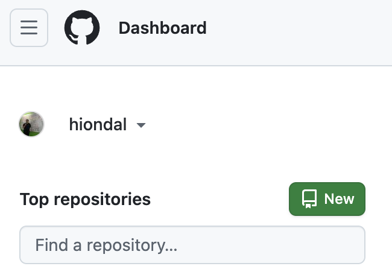
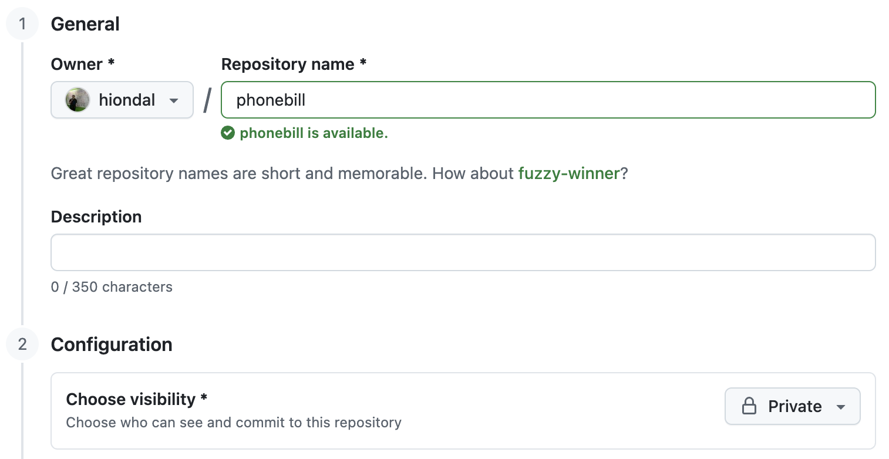

# Git 레포지토리 생성 및 푸시 가이드     

## GitHub에 원격 레포지토리 생성
원격 Git 레포지토리를 생성합니다.       
 

특별한 경우가 아니면 Private 레포지토리로 지정합니다.  
내용에 보안 정보가 있을 가능성이 높기 때문입니다.   


원격 레포지토리 주소를 복사합니다.   
주소 옆에 아이콘을 누르시면 클립보드에 복사됩니다.   
  

## 로컬 레포지토리 생성   
프로젝트 디렉토리로 이동 후 로컬 레포지토리를 생성합니다.    

로컬 레포지토리 디렉토리로 이동합니다.    
로컬 레포지토리 디렉토리는 위에서 만든 원격 레포지토리 명과 동일해야 합니다.    
```
cd ~/home/workspace/{로컬 레포지토리 디렉토리}
```
예)  
```
cd ~/home/workspace/phonebill
```
  
로컬 레포지토리가 아직 없는 경우 생성하고 이동합니다.    
```
mkdir -p ~/home/workspace/{로컬 레포지토리 디렉토리}
cd ~/home/workspace/{로컬 레포지토리 디렉토리}
```
예)  
```
mkdir -p ~/home/workspace/phonebill
cd ~/home/workspace/phonebill
```

작업하는 PC에서 최초로 Git 푸시하는 경우 Git 설정을 먼저 하세요.     
https://github.com/cna-bootcamp/clauding-guide/blob/main/guides/setup/00.prepare1.md#git-%EC%84%A4%EC%A0%95


아래 명령으로 로컬 레포지토리를 생성합니다.      
```
git init
```

## 브랜치를 main으로 변경  
   
```
git checkout -b main
```

## 원격 레포지토리 주소 지정     
```
git remote add origin {원격 레포지토리 주소}
```
예) 
```
git remote add origin https://github.com/cna-bootcamp/phonebill.git
```

## 원격 레포지토리로 푸시       
```
git add . 
```

```
git commit -m "{메시지}"
```

```
git push -u origin main
```

Git Bash나 Mac에서는 아래 예와 같이 한줄로 사용할 수 있습니다.   
```
git add . && git commit -m "push first" && git push -u origin main
```

'-u origin main'은 최초 한번만 하면 됩니다. 

