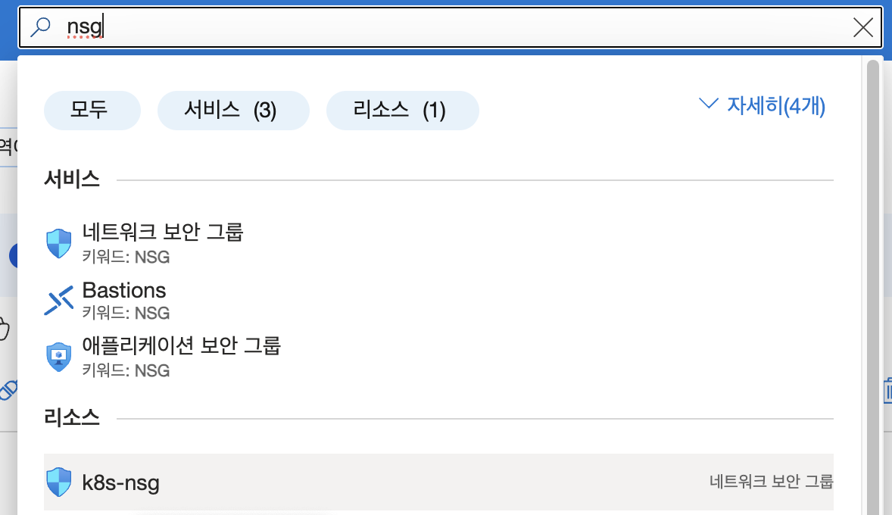
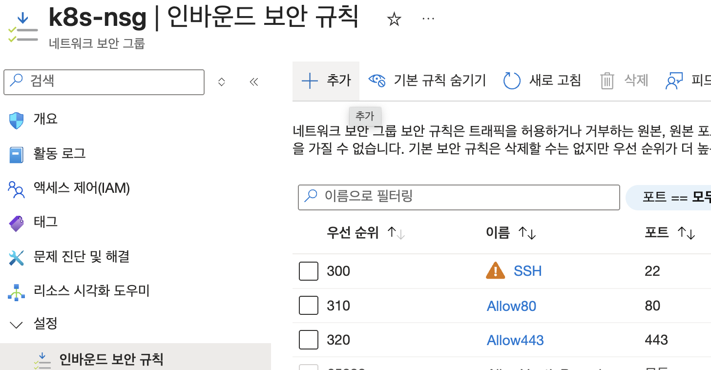
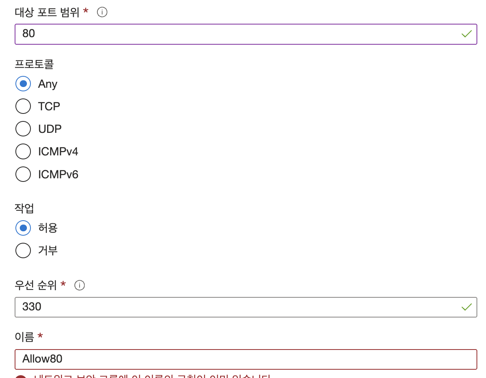

아래 가이드는 예제 프로그램 phonebill 을 minikube에서 학습하기 위한 환경설정입니다.    
프로젝트 소스는 아래에 있습니다.   
- 백엔드: https://github.com/cna-bootcamp/phonebill.git
- 프론트엔드: https://github.com/cna-bootcamp/phonebill-front.git

---
**목차**   

- [사전 작업](#사전-작업)
  - [Azure 구독](#azure-구독)
  - [VM 생성](#vm-생성)
  - [필수 프로그램 설치](#필수-프로그램-설치)
- [Ubuntu 서버에 Minikube 설치 및 접속](#ubuntu-서버에-minikube-설치-및-접속)
  - [1. 서버에서 Minikube 시작](#1-서버에서-minikube-시작)
    - [minikube 설치](#minikube-설치)
    - [외부 접근 가능하도록 minikube 시작](#외부-접근-가능하도록-minikube-시작)
    - [Ingress 활성화](#ingress-활성화)
    - [외부에서 Nginx Ingress Controller POD 접속 설정](#외부에서-nginx-ingress-controller-pod-접속-설정)
    - [Port forward를 System Daemon으로 등록하기](#port-forward를-system-daemon으로-등록하기)
    - [방화벽 오픈](#방화벽-오픈)
  - [2. 서버에서 인증서 파일 확인](#2-서버에서-인증서-파일-확인)
  - [3. 서버에서 로컬로 파일 복사 (로컬에서 실행)](#3-서버에서-로컬로-파일-복사-로컬에서-실행)
  - [4. SSH 터널 생성 (로컬에서 실행)](#4-ssh-터널-생성-로컬에서-실행)
  - [5. 로컬의 kubeconfig 업데이트 (로컬에서 최초 1번 실행)](#5-로컬의-kubeconfig-업데이트-로컬에서-최초-1번-실행)
  - [6. 연결 테스트](#6-연결-테스트)
  - [7. SSH 터널 관리](#7-ssh-터널-관리)
- [Backing Service 설치](#backing-service-설치)
  - [Database 설치](#database-설치)
    - [PostgresSQL 설정 파일 작성](#postgressql-설정-파일-작성)
    - [PostgresSQL 설치](#postgressql-설치)
  - [Redis 설치](#redis-설치)
    - [설정파일 작성](#설정파일-작성)
    - [Redis 설치](#redis-설치-1)
  - [로컬에서 port forward](#로컬에서-port-forward)
    - [Port Forward](#port-forward)
    - [port forward 중지](#port-forward-중지)
- [minikube에 CI/CD 툴 설치](#minikube에-cicd-툴-설치)
  - [minikube에 Jenkins 설치](#minikube에-jenkins-설치)
    - [Ingress 생성](#ingress-생성)
    - [환경설정](#환경설정)
  - [minikube에 ArgoCD 설치](#minikube에-argocd-설치)

---

# 사전 작업

## Azure 구독   
Azure 상에서 환경 구성하기 위한 가이드를 참고하여 아래 작업만 하십시오.

- Azure 구독: 'Pay as you Go'를 선택하여 유료 플랜으로 구매   
- 리소스 프로바이더 등록
- 리소스그룹 생성

https://github.com/cna-bootcamp/handson-azure/blob/main/prepare/setup-server.md

(중요) Azure 구독 시 유료플랜이 아니면 4core이상의 VM을 만들수 없으므로 반드시 유료플랜으로 구독    

## VM 생성 
VM을 생성하십시오.    
https://github.com/cna-bootcamp/clauding-guide/blob/main/references/create-vm.md

다운로드한 파일의 권한을 변경해야 사용할 수 있습니다.   
즉 최소 권한인, 현재 OS유저에게 읽은 권한만 부여합니다.   
```
chmod 400 {private key file}
```

## 필수 프로그램 설치
- kubectl 설치 
  ```
  sudo snap install kubectl --classic
  ```

  만약 잘 안되면 아래 명령으로 설치합니다.  
  ```
  sudo apt-get update
  sudo apt-get install -y apt-transport-https ca-certificates curl
  curl -fsSL https://packages.cloud.google.com/apt/doc/apt-key.gpg | sudo gpg --dearmor -o /etc/apt/keyrings/kubernetes-archive-keyring.gpg
  echo "deb [signed-by=/etc/apt/keyrings/kubernetes-archive-keyring.gpg] https://apt.kubernetes.io/ kubernetes-xenial main" | sudo tee /etc/apt/sources.list.d/kubernetes.list
  sudo apt-get update
  sudo apt-get install -y kubectl
  ```
  
  Alias등록 
  ```
  vi ~/.bashrc
  ```

  맨 끝에 alias k=kubectl 추가 

- kubens/kubectx 설치   
  kubens는 Kubernetes namespace 변경을 쉽게 해주는 유틸리티입니다.    
  kubectx는 Kubernetes Cluster 변경을 쉽게 해주는 유틸리티입니다.  

  설치      
  ```
  # Git 클론 방식
  git clone https://github.com/ahmetb/kubectx.git ~/.kubectx
  sudo ln -sf ~/.kubectx/kubectx /usr/local/bin/kubectx
  sudo ln -sf ~/.kubectx/kubens /usr/local/bin/kubens
  ```

  ```
  vi ~/.bashrc
  ```
  아래 내용 추가  
  ```
  export PATH=$PATH:~/.kubectx 
  ```

  아래 명령어로 적용합니다.  
  ```
  source ~/.bashrc
  ```

- Docker설치   
  필요한 패키지 설치
  ```
  sudo apt-get update
  sudo apt-get install -y \
      ca-certificates \
      curl \
      gnupg \
      lsb-release
  ```

  Docker GPG key 추가
  ```
  sudo mkdir -p /etc/apt/keyrings
  curl -fsSL https://download.docker.com/linux/ubuntu/gpg | sudo gpg --dearmor -o /etc/apt/keyrings/docker.gpg
  ```

  Docker repository 설정
  ```
  echo \
    "deb [arch=$(dpkg --print-architecture) signed-by=/etc/apt/keyrings/docker.gpg] https://download.docker.com/linux/ubuntu \
    $(lsb_release -cs) stable" | sudo tee /etc/apt/sources.list.d/docker.list > /dev/null
  ```

  Docker 엔진 설치
  ```
  sudo apt-get update
  sudo apt-get install -y docker-ce docker-ce-cli containerd.io docker-compose-plugin
  ```

  현재 사용자를 docker 그룹에 추가 (sudo 없이 docker 명령어 사용 가능)
  ```
  sudo usermod -aG docker $USER
  ```

  Docker 서비스 시작
  ```
  sudo service docker start
  ```

  터미널을 닫고 새 터미널에서 version확인 
  ```
  docker version 
  ```

- buildx 설치   
  buildx는 Docker CLI의 플러그인으로, 컨테이너 이미지 빌드 기능을 확장합니다.  
  설치 안해도 되지만 안하면 Image build 시 경고 메시지가 나와 설치하는게 좋습니다.  

  ```
  wget https://github.com/docker/buildx/releases/download/v0.12.1/buildx-v0.12.1.linux-amd64
  ```

  plugins 디렉토리 생성 및 buildx 설치
  ```bash
  mkdir -p ~/.docker/cli-plugins
  mv buildx-v0.12.1.linux-* ~/.docker/cli-plugins/docker-buildx
  chmod +x ~/.docker/cli-plugins/docker-buildx
  ```

  설치 확인
  ```bash
  docker buildx version
  ```

- helm 설치  
  ```
  mkdir -p ~/install/helm && cd ~/install/helm
  wget https://get.helm.sh/helm-v3.16.4-linux-amd64.tar.gz
  
  tar xvf helm-v3.16.4-linux-amd64.tar.gz
  cd linux-amd64
  sudo cp helm /usr/local/bin

  helm version
  ```

- openjdk 설치  
  ```
  sudo apt-get install -u openjdk-21-jdk

  readlink -f /usr/bin/javac/usr/lib/jvm/java-21-openjdk-amd64/bin/javac
  ```

  profile 오픈 후 맨 끝에 환경변수 추가 
  ```
  sudo vi /etc/profile 
  ```
  
  커서를 맨 아래로 내립니다.   
  ESC 누르고 'i'를 누릅니다.
  아래 내용을 복사하고 우측 마우스 버튼을 눌러 붙여넣기 합니다.   
  ESC를 누르고 ':'을 입력 합니다. 그리고 wq를 누른 후 닫기를 누릅니다.  
   
  ```
  JAVA_HOME=/usr/lib/jvm/java-21-openjdk-amd64
  PATH=$PATH:$JAVA_HOME/bin
  CLASSPATH=$JAVA_HOME/jre/lib:$JAVA_HOME/lib/tools.jar

  export JAVA_HOME PATH CLASSPATH
  ```
  > Tip: vi 사용이 힘들면 기본 에디터로 열어 수정 하십시오.    

  profile 적용 
  ```
  source /etc/profile
  ```

---

# Ubuntu 서버에 Minikube 설치 및 접속

## 1. 서버에서 Minikube 시작

환경변수 선언(Local에서 수행).   
VM_KEY, VM_IP는 본인 것으로 변경해야 함    
```
export VM_KEY=~/home/k8s_key.pem
export VM_USER=azureuser
export VM_IP=72.155.72.236
```

```bash
# 서버 접속
ssh -i ${VM_KEY} ${VM_USER}@${VM_IP}
```
팁) ~/.ssh/config 파일을 만들고 아래와 같이 설정하면 지정한 Host로 접근할 수 있음   

```
Host k8s
    HostName 72.155.72.236
    User azureuser
    Port 22
    IdentityFile ~/home/k8s_key.pem
```
접속: ssh k8s 

### minikube 설치
```
# 시스템 업데이트
sudo apt update && sudo apt upgrade -y

# 필수 패키지 설치
sudo apt install -y curl wget apt-transport-https

# Minikube 바이너리 다운로드
curl -LO https://storage.googleapis.com/minikube/releases/latest/minikube-linux-amd64

# 설치
sudo install minikube-linux-amd64 /usr/local/bin/minikube

# 설치 확인
minikube version
```

### 외부 접근 가능하도록 minikube 시작
VM_IP값은 본인것에 맞게 수정  
```
export VM_IP=72.155.72.236

# 7core, 12GB
minikube start \
  --driver=docker \
  --apiserver-ips=${VM_IP} \
  --cpus=7 \
  --memory=14336

# minikube 내부 IP 확인 (메모해 둘 것)
minikube ip
# 예: 192.168.49.2

```

### Ingress 활성화  
```
minikube addons enable ingress  
```
ingress-nginx 네임스페이스에 nginx Pod 확인   
```
k get po -n ingress-nginx  
```

### 외부에서 Nginx Ingress Controller POD 접속 설정   
이미 port forward 되어 있는지 확인
```
ps aux | grep port-forward
```

```
# HTTP (80)
sudo kubectl --kubeconfig=$HOME/.kube/config port-forward svc/ingress-nginx-controller 80:80 -n ingress-nginx --address 0.0.0.0 &

# HTTPS (443)
sudo kubectl --kubeconfig=$HOME/.kube/config port-forward svc/ingress-nginx-controller 443:443 -n ingress-nginx --address 0.0.0.0 &
```

### Port forward를 System Daemon으로 등록하기    
위 port forward는 터미널을 닫으면 끊깁니다.   
아래와 같이 System daemon으로 등록하여 계속 실행되게 할 수 있습니다.    

System Daemon 파일 생성하기:   
아래 명령을 터미널에서 수행하세요.       
```
# HTTP용 서비스 생성
sudo tee /etc/systemd/system/forward-http.service << 'EOF'
[Unit]
Description=Kubernetes Ingress Port Forward HTTP
After=network.target

[Service]
Type=simple
ExecStart=/snap/bin/kubectl --kubeconfig=/home/azureuser/.kube/config port-forward svc/ingress-nginx-controller 80:80 -n ingress-nginx --address 0.0.0.0
Restart=always
RestartSec=10

[Install]
WantedBy=multi-user.target
EOF

# HTTPS용 서비스 생성
sudo tee /etc/systemd/system/forward-https.service << 'EOF'
[Unit]
Description=Kubernetes Ingress Port Forward HTTP
After=network.target

[Service]
Type=simple
ExecStart=/snap/bin/kubectl --kubeconfig=/home/azureuser/.kube/config port-forward svc/ingress-nginx-controller 443:443 -n ingress-nginx --address 0.0.0.0
Restart=always
RestartSec=10

[Install]
WantedBy=multi-user.target
EOF
```

서비스를 갱신합니다. 한번만 수행하면 됩니다.   
```
$ sudo systemctl daemon-reload
```

서비스를 시작합니다.    
```
$ sudo systemctl start forward-http
$ sudo systemctl start forward-https
```

상태를 확인합니다.   
```
$ sudo systemctl status forward-http

$ sudo systemctl status forward-https
```

### 방화벽 오픈   
(중요) VM의 방화벽(Azure의 경우는 NSG)에서 80,443 포트 오픈   





웹브라우저에서 http://{VM IP}로 접근하였을 때 '404 Not Found'라는 페이지가 연결되면 성공임.    


## 2. 서버에서 인증서 파일 확인

```bash
# 필요한 파일 위치 확인
ls ~/.minikube/ca.crt
ls ~/.minikube/profiles/minikube/client.crt
ls ~/.minikube/profiles/minikube/client.key
```

## 3. 서버에서 로컬로 파일 복사 (로컬에서 실행)

아래 값은 본인것에 맞게 수정해야 함  

```bash
export VM_IP=72.155.72.236
export VM_USER=azureuser
export VM_KEY=~/home/k8s_key.pem
```

```bash
# 로컬에 디렉토리 생성
mkdir -p ~/.kube/minikube-certs

# scp로 파일 복사
scp -i ${VM_KEY} ${VM_USER}@${VM_IP}:~/.minikube/ca.crt ~/.kube/minikube-certs/
scp -i ${VM_KEY} ${VM_USER}@${VM_IP}:~/.minikube/profiles/minikube/client.crt ~/.kube/minikube-certs/
scp -i ${VM_KEY} ${VM_USER}@${VM_IP}:~/.minikube/profiles/minikube/client.key ~/.kube/minikube-certs/
```

## 4. SSH 터널 생성 (로컬에서 실행)

```bash
# MINIKUBE_IP는 2단계에서 확인한 minikube ip 결과값
export MINIKUBE_IP=192.168.49.2

# SSH 터널 생성 (백그라운드 실행)
ssh -i ${VM_KEY} -L 8443:${MINIKUBE_IP}:8443 ${VM_USER}@${VM_IP} -N &

# 터널 프로세스 확인
ps aux | grep ssh
```

## 5. 로컬의 kubeconfig 업데이트 (로컬에서 최초 1번 실행)

```bash
KUBE_CERTS_DIR="${HOME}/.kube/minikube-certs"

# 클러스터 추가 (localhost로 설정 - SSH 터널 사용)
kubectl config set-cluster minikube-remote \
  --server=https://127.0.0.1:8443 \
  --certificate-authority=${KUBE_CERTS_DIR}/ca.crt

# 사용자 추가
kubectl config set-credentials minikube-remote \
  --client-certificate=${KUBE_CERTS_DIR}/client.crt \
  --client-key=${KUBE_CERTS_DIR}/client.key

# 컨텍스트 추가
kubectl config set-context minikube-remote \
  --cluster=minikube-remote \
  --user=minikube-remote

# 컨텍스트 사용
kubectl config use-context minikube-remote
```

## 6. 연결 테스트

```bash
# 클러스터 정보 확인
kubectl cluster-info

# 노드 확인
kubectl get nodes

# 파드 확인
kubectl get pods -A
```

## 7. SSH 터널 관리

```bash
# 터널 종료
pkill -f "ssh -i ${VM_KEY} -L 8443"

# 터널 재시작
ssh -i ${VM_KEY} -L 8443:${MINIKUBE_IP}:8443 ${VM_USER}@${VM_IP} -N &
```
만약 ~/.ssh/config디렉토리에 VM 연결 설정을 했다면 아래와 같이 할 수 있습니다. 'k8s'는 본인의 연결이름으로 바꾸세요.    
```
ssh -L 8443:192.168.49.2:8443 k8s -N &
```

---

# Backing Service 설치
아래 작업을 로컬 PC에서 수행하세요.    

작업 디렉토리 작성
```
mkdir ~/install/phonebill && cd ~/install/phonebill
```

namespace 작성/변경
```
k create ns phonebill  
kubens phonebill
```

## Database 설치

### PostgresSQL 설정 파일 작성  

아래와 같이 SVC변수를 auth, inquiry, change로 변경하여 각 서비스별 설정 파일 생성      
```
export SVC=auth
```

```
cat > values-${SVC}.yaml << EOF
architecture: standalone

# 글로벌 설정
global:
  postgresql:
    auth:
      postgresPassword: "Hi5Jessica!"
      replicationPassword: "Hi5Jessica!"
      database: "${SVC}db"
      username: "unicorn"
      password: "P@ssw0rd$"
  storageClass: "standard"

# Primary 설정
primary:
  persistence:
    enabled: true
    storageClass: "standard"
    size: 10Gi

  resources:
    limits:
      memory: "4Gi"
      cpu: "1"
    requests:
      memory: "2Gi"
      cpu: "0.5"

  # 성능 최적화 설정
  extraEnvVars:
    - name: POSTGRESQL_SHARED_BUFFERS
      value: "1GB"
    - name: POSTGRESQL_EFFECTIVE_CACHE_SIZE
      value: "3GB"
    - name: POSTGRESQL_MAX_CONNECTIONS
      value: "200"
    - name: POSTGRESQL_WORK_MEM
      value: "16MB"
    - name: POSTGRESQL_MAINTENANCE_WORK_MEM
      value: "256MB"

  # 고가용성 설정
  podAntiAffinityPreset: soft

# 네트워크 설정
service:
  type: ClusterIP
  ports:
    postgresql: 5432

# 보안 설정
securityContext:
  enabled: true
  fsGroup: 1001
  runAsUser: 1001

# image: organization이 bitnami -> bitnamilegacy로 변경
image:
  registry: docker.io
  repository: bitnamilegacy/postgresql

EOF
```

### PostgresSQL 설치  
```
helm upgrade -i auth -f values-auth.yaml bitnami/postgresql --version 12.12.10
helm upgrade -i inquiry -f values-inquiry.yaml bitnami/postgresql --version 12.12.10
helm upgrade -i change -f values-change.yaml bitnami/postgresql --version 12.12.10
```

---

## Redis 설치

### 설정파일 작성

```
cat > values-cache.yaml << EOF
architecture: standalone

auth:
  enabled: true
  password: "P@ssw0rd$"

master:
  persistence:
    enabled: true
    storageClass: "standard"
    size: 10Gi

  configuration: |
    maxmemory 1610612736
    maxmemory-policy allkeys-lru
    appendonly yes
    appendfsync everysec
    save 900 1 300 10 60 10000

  resources:
    limits:
      memory: "2Gi"
      cpu: "1"
    requests:
      memory: "1Gi"
      cpu: "0.5"

sentinel:
  enabled: false

service:
  type: ClusterIP
  ports:
    redis: 6379

podAntiAffinityPreset: soft

securityContext:
  enabled: true
  fsGroup: 1001
  runAsUser: 1001


# image: organization이 bitnami -> bitnamilegacy로 변경   
image:
  registry: registry-1.docker.io
  repository: bitnamilegacy/redis

EOF
```

### Redis 설치
```
helm upgrade -i cache -f values-cache.yaml bitnami/redis
```

---

## 로컬에서 port forward
이 작업은 로컬에서 백그라운드 서비스를 실행하기 위해서만 필요합니다.     

### Port Forward
새로운 터미널을 열어 수행하세요.  
```
k port-forward svc/auth-postgresql 15432:5432 &
k port-forward svc/inquiry-postgresql 25432:5432 &
k port-forward svc/change-postgresql 35432:5432 &
k port-forward svc/cache-redis-master 16379:6379 &
```

### port forward 중지
프로세스 ID 확인   
```
ps -ef | grep port-forward
```
예시) 두번째 있는 Process ID를 확인
```
> ps -ef | grep port-forward
501 84369 78584   0  4:42AM ttys024    0:00.05 kubectl port-forward svc/auth-postgresql 15432:5432
501 84370 78584   0  4:42AM ttys024    0:00.05 kubectl port-forward svc/inquiry-postgresql 25432:5432

> kill 84369 84370
```

---

# minikube에 CI/CD 툴 설치

## minikube에 Jenkins 설치

**1.Helm registry추가**    
```
helm repo add bitnami https://charts.bitnami.com/bitnami 
helm repo update
```

**2.Jenkins Helm chart 다운로드**     
```
mkdir -p ~/install && cd ~/install

helm search repo jenkins 

helm pull bitnami/jenkins --version 13.6.17
```

압축해제
```
tar xvf {helm chart 압축파일명명}

cd jenkins
```

**3.설치 매니페스트 작성**    

```
cat > jenkins.yaml << EOF
global:
  storageClass: "standard"

jenkinsUser: admin
jenkinsPassword: "P@ssw0rd$"
jenkinsHost: "http://myjenkins.io"
jenkinsHome: /bitnami/jenkins/home

javaOpts:
  - -Dfile.encoding=UTF-8

containerPorts:
  http: 8080
  https: 8443
  agentListener: 50000

agentListenerService:
  enabled: true
  type: ClusterIP
  ports:
    agentListener: 50000

persistence:
  enabled: true
  storageClass: "standard"
  accessModes:
    - ReadWriteOnce
  size: 8Gi

image:
  registry: docker.io
  repository: bitnamilegacy/jenkins
  tag: 2.516.2-debian-12-r0

agent:
  enabled: true
  image:
    registry: docker.io
    repository: bitnamilegacy/jenkins-agent
    tag: 0.3327.0-debian-12-r1

serviceAccount:
  create: true
  automountServiceAccountToken: true
EOF
```

**4.설치**     
```
kubectl create ns jenkins

kubens jenkins

helm upgrade -i jenkins -f jenkins.yaml . --dry-run

helm upgrade -i jenkins -f jenkins.yaml .
```

Pod가 정상 실행될때까지 기다립니다.  
```
k get po -w
```

**5.hosts파일에 등록**   
1)Window에서 hosts파일 열기        
'Window키 + d'를 눌러 바탕화면으로 이동합니다.  
아래와 같이 바로가기를 만듭니다.  이름은 'hosts'로 합니다.  
```
notepad "c:\windows\system32\drivers\etc\hosts"
```
우측마우스 버튼 메뉴에서 '관리자 권한으로 실행하기'를 선택하여 엽니다.  

2)Linux/Mac에서 hosts 파일 열기         
```
sudo vi /etc/hosts
```

3)등록    
VM ip로 'myjenkins.io'을 등록합니다.  
예시)
```
# Jenkins
20.214.195.168	myjenkins.io
```

### Ingress 생성
yaml 작성  
```
cat > jenkins-ingress.yaml << EOF
apiVersion: networking.k8s.io/v1
kind: Ingress
metadata:
  name: jenkins-ingress
  namespace: jenkins
  annotations:
    nginx.ingress.kubernetes.io/proxy-body-size: "50m"
    nginx.ingress.kubernetes.io/proxy-read-timeout: "60"
    nginx.ingress.kubernetes.io/proxy-send-timeout: "60"
spec:
  ingressClassName: nginx
  rules:
    - host: myjenkins.io
      http:
        paths:
          - path: /
            pathType: Prefix
            backend:
              service:
                name: jenkins
                port:
                  number: 80
EOF
```

ingress 생성
```
k apply -f jenkins-ingress.yaml  
```


### 환경설정   
브라우저에서 myjenkins.io로 접근한 후 id: admin, pw: P@ssw0rd$로 로그인합니다.    
아래 링크를 오픈하고 6,7,8,13번을 수행합니다.        
- 6.플러그인 설치
- 7.Kubernetes 연결 설정
- 8.Jenkins tunnel 포트 설정
- 13.DockerHub Credentials 생성

https://github.com/cna-bootcamp/clauding-guide/blob/882cabb67d64150513f1c580b00a5b377e23109d/guides/setup/05.setup-cicd-tools.md#jenkins%EC%84%A4%EC%B9%98

---

## minikube에 ArgoCD 설치

**1.install 디렉토리로 이동**    
```
cd ~/install
```

**2.Helm registry 추가**    
```
helm repo add argo https://argoproj.github.io/argo-helm
helm repo update
```

**3.Helm chart 다운로드**     
```
mkdir -p ~/install && cd ~/install
```

```
helm search repo argocd

NAME                            CHART VERSION   APP VERSION 
argo/argocd-applicationset      1.12.1          v0.4.1       
argo/argocd-apps                2.0.2                        
argo/argocd-image-updater       0.12.0          v0.15.2      
argo/argocd-notifications       1.8.1           v1.2.1      
argo/argo-cd                    3.35.4          v2.2.5 
```

```
helm pull argo/argo-cd
```

```
tar xvf {helm chart 압축파일명}

cd argo-cd
```

**4.설치 manifest 파일 작성**     

minikube가 설치된 VM IP로 환경변수 생성   
```
export ING_IP=72.155.72.236
```

```
cat > argocd.yaml << EOF
global:
  domain: argo.$ING_IP.nip.io

server:
  ingress:
    enabled: true
    https: true
    annotations:
      kubernetes.io/ingress.class: nginx
    tls:
      - secretName: argocd-tls-secret
  extraArgs:
    - --insecure  # ArgoCD 서버가 TLS 종료를 Ingress에 위임

configs:
  params:
    server.insecure: true  # Ingress에서 TLS를 처리하므로 ArgoCD 서버는 HTTP로 통신
certificate:
  enabled: false  # 자체 서명 인증서 사용 비활성화 (외부 인증서 사용 시)
EOF
```

**5.namespace 작성**    

```
k create ns argocd
kubens argocd
```


**6.TLS 인증서 작성 및 Secret 객체 작성**      
```
openssl req -x509 -nodes -days 365 -newkey rsa:2048 -keyout tls.key -out tls.crt -subj "/CN=argo.$ING_IP.nip.io"

kubectl create secret tls argocd-tls-secret \
  --namespace argocd \
  --key tls.key \
  --cert tls.crt
```

**7.설치하기**    
```
helm upgrade -i argocd -f argocd.yaml .
```

**8.접속하기**     
위 manifest에서 지정한 host name으로 접속합니다.   
예) https://argo.20.249.128.1.nip.io  

ID는 admin이고 초기 암호는 아래와 같이 구합니다.   
```
kubectl -n argocd get secret argocd-initial-admin-secret -o jsonpath="{.data.password}" | base64 -d; echo
```

비밀번호는 로그인 후 'User Info'에서 변경할 수 있습니다. 

---


