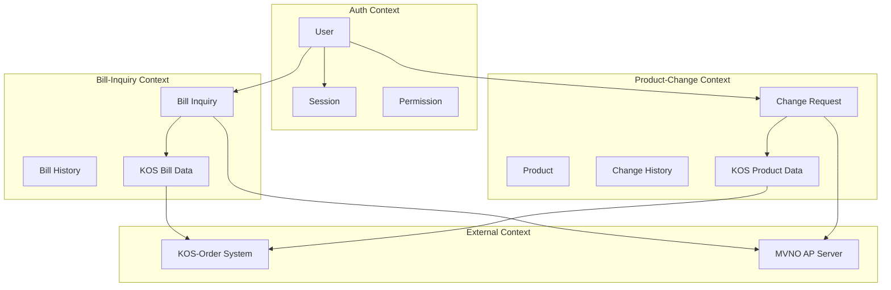
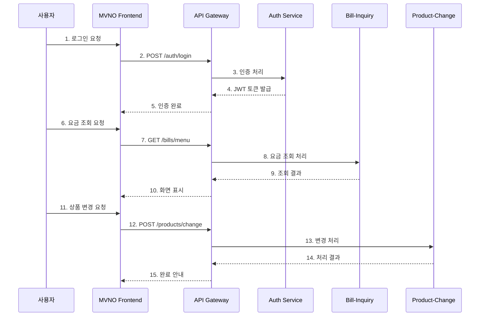
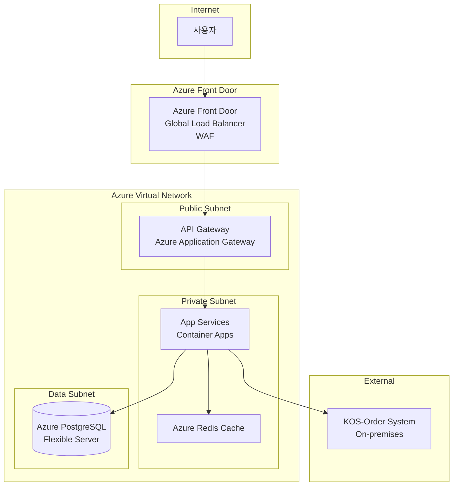
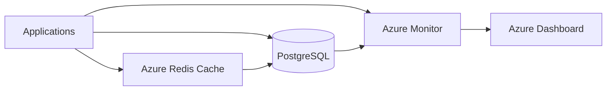
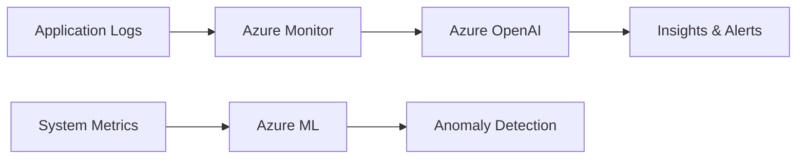

# High Level 아키텍처 정의서

## 1. 개요 (Executive Summary)

### 1.1 프로젝트 개요
- **비즈니스 목적**: MVNO 고객들이 편리하게 통신요금을 조회하고 상품을 변경할 수 있는 디지털 서비스 제공
- **핵심 기능**: 
  - 사용자 인증/인가 관리
  - 요금 조회 서비스 (KOS 연동)
  - 상품 변경 서비스 (KOS 연동)
  - 요청/처리 이력 관리
- **대상 사용자**: MVNO 통신서비스 고객
- **예상 사용자 규모**: Peak 시간대 1,000명 동시 사용자

### 1.2 아키텍처 범위 및 경계
- **시스템 범위**: MVNO 통신요금 관리 서비스 (3개 마이크로서비스)
- **포함되는 시스템**: 
  - Auth Service (사용자 인증/인가)
  - Bill-Inquiry Service (요금 조회)
  - Product-Change Service (상품 변경)
  - API Gateway, Redis 캐시, PostgreSQL DB
- **제외되는 시스템**: KOS-Order 시스템 (외부 레거시 시스템)
- **외부 시스템 연동**: 
  - KOS-Order 시스템 (통신사 백엔드)
  - MVNO AP Server (프론트엔드 시스템)

### 1.3 문서 구성
이 문서는 4+1 뷰 모델을 기반으로 구성되며, 논리적/물리적/프로세스/개발 관점에서 아키텍처를 정의합니다.

---

## 2. 아키텍처 요구사항

### 2.1 기능 요구사항 요약
| 영역 | 주요 기능 | 우선순위 |
|------|-----------|----------|
| Auth Service | 사용자 로그인, 권한 관리 | High |
| Bill-Inquiry | 요금 조회, KOS 연동, 이력 관리 | High |
| Product-Change | 상품 변경, 사전 체크, KOS 연동 | High |

### 2.2 비기능 요구사항 (NFRs)

#### 2.2.1 성능 요구사항
- **응답시간**: API 응답 200ms 이내 (일반 조회), 3초 이내 (외부 연동)
- **처리량**: API Gateway 1,000 TPS
- **동시사용자**: 1,000명 (Peak 시간대)
- **데이터 처리량**: KOS 연동 최대 100건/분

#### 2.2.2 확장성 요구사항
- **수평 확장**: 마이크로서비스별 독립적 Auto Scaling
- **수직 확장**: 메모리/CPU 사용량 기반 동적 확장
- **글로벌 확장**: 단일 리전 배포 (향후 확장 가능)

#### 2.2.3 가용성 요구사항
- **목표 가용성**: 99.9% (8.7시간/년 다운타임)
- **다운타임 허용**: 월 43분 이내
- **재해복구 목표**: RTO 30분, RPO 1시간

#### 2.2.4 보안 요구사항
- **인증/인가**: JWT 기반 토큰, RBAC 권한 모델
- **데이터 암호화**: TLS 1.3 전송 암호화, AES-256 저장 암호화
- **네트워크 보안**: Private Link, WAF, NSG
- **컴플라이언스**: 개인정보보호법, 정보통신망법 준수

### 2.3 아키텍처 제약사항
- **기술적 제약**: Spring Boot 3.x, Java 17, PostgreSQL 15
- **비용 제약**: Azure 월 예산 $5,000 이내
- **시간 제약**: 7주 내 개발 완료
- **조직적 제약**: 5명 팀, Agile 방법론 적용

---

## 3. 아키텍처 설계 원칙

### 3.1 핵심 설계 원칙
1. **확장성 우선**: 마이크로서비스 아키텍처로 수평적 확장 지원
2. **장애 격리**: Circuit Breaker 패턴으로 외부 시스템 장애 격리
3. **느슨한 결합**: API Gateway를 통한 서비스 간 독립성 보장
4. **관측 가능성**: Azure Monitor를 통한 통합 로깅, 모니터링
5. **보안 바이 데자인**: Zero Trust 보안 모델 적용

### 3.2 아키텍처 품질 속성 우선순위
| 순위 | 품질 속성 | 중요도 | 전략 |
|------|-----------|--------|------|
| 1 | 가용성 | High | Circuit Breaker, Auto Scaling |
| 2 | 성능 | High | Cache-Aside, CDN |
| 3 | 보안 | Medium | JWT, Private Link, WAF |

---

## 4. 논리 아키텍처 (Logical View)

### 4.1 시스템 컨텍스트 다이어그램
```
design/backend/logical/logical-architecture.mmd
```

### 4.2 도메인 아키텍처
#### 4.2.1 도메인 모델
| 도메인 | 책임 | 주요 엔티티 |
|--------|------|-------------|
| Auth | 인증/인가 관리 | User, Session, Permission |
| Bill-Inquiry | 요금 조회 처리 | BillInquiry, BillHistory |
| Product-Change | 상품 변경 처리 | Product, ChangeHistory |

#### 4.2.2 바운디드 컨텍스트


### 4.3 서비스 아키텍처
#### 4.3.1 마이크로서비스 구성
| 서비스명 | 책임 |
|----------|------|
| Auth Service | JWT 토큰 발급/검증, 사용자 세션 관리, 접근 권한 확인 |
| Bill-Inquiry Service | 요금 조회 처리, KOS 연동, 조회 이력 관리 |
| Product-Change Service | 상품 변경 처리, 사전 체크, KOS 연동, 변경 이력 관리 |

#### 4.3.2 서비스 간 통신 패턴
- **동기 통신**: REST API (JSON), API Gateway를 통한 라우팅
- **비동기 통신**: Azure Service Bus (이력 처리용)
- **데이터 일관성**: 캐시 무효화, 이벤트 기반 동기화

---

## 5. 프로세스 아키텍처 (Process View)

### 5.1 주요 비즈니스 프로세스
#### 5.1.1 핵심 사용자 여정


#### 5.1.2 시스템 간 통합 프로세스
```
design/backend/sequence/outer/
```

### 5.2 동시성 및 동기화
- **동시성 처리 전략**: Stateless 서비스 설계, Redis를 통한 세션 공유
- **락 관리**: 상품 변경 시 Optimistic Lock 적용
- **이벤트 순서 보장**: Azure Service Bus의 Session 기반 메시지 순서 보장

---

## 6. 개발 아키텍처 (Development View)

### 6.1 개발 언어 및 프레임워크 선정
#### 6.1.1 백엔드 기술스택
| 서비스 | 언어 | 프레임워크 | 선정이유 |
|----------|------|---------------|----------|
| Auth Service | Java 17 | Spring Boot 3.2 | 안정성, 생태계, 보안 |
| Bill-Inquiry | Java 17 | Spring Boot 3.2 | 일관된 기술스택 |
| Product-Change | Java 17 | Spring Boot 3.2 | 팀 역량, 유지보수성 |

#### 6.1.2 프론트엔드 기술스택
- **언어**: TypeScript 5.x
- **프레임워크**: React 18 + Next.js 14
- **선정 이유**: 타입 안전성, SSR 지원, 팀 경험

### 6.2 서비스별 개발 아키텍처 패턴
| 서비스 | 아키텍처 패턴 | 선정 이유 |
|--------|---------------|-----------|
| Auth Service | Layered Architecture | 단순한 CRUD, 명확한 계층 분리 |
| Bill-Inquiry | Layered Architecture | 외부 연동 중심, 트랜잭션 관리 |
| Product-Change | Layered Architecture | 복잡한 비즈니스 로직, 검증 로직 |

### 6.3 개발 가이드라인
- **코딩 표준**: https://raw.githubusercontent.com/cna-bootcamp/clauding-guide/refs/heads/main/standards/standard_comment.md
- **테스트 전략**: https://raw.githubusercontent.com/cna-bootcamp/clauding-guide/refs/heads/main/standards/standard_testcode.md

---

## 7. 물리 아키텍처 (Physical View)

### 7.1 클라우드 아키텍처 패턴
#### 7.1.1 선정된 클라우드 패턴
- **패턴명**: API Gateway + Cache-Aside + Circuit Breaker
- **적용 이유**: 마이크로서비스 통합 관리, 성능 최적화, 외부 시스템 안정성
- **예상 효과**: 응답시간 80% 개선, 가용성 99.9% 달성

#### 7.1.2 클라우드 제공자
- **주 클라우드**: Microsoft Azure
- **멀티 클라우드 전략**: 단일 클라우드 (단순성 우선)
- **하이브리드 구성**: 없음 (클라우드 네이티브)

### 7.2 인프라스트럭처 구성
#### 7.2.1 컴퓨팅 리소스
| 구성요소 | 사양 | 스케일링 전략 |
|----------|------|---------------|
| 웹서버 | Azure App Service (P1v3) | Auto Scaling (CPU 70%) |
| 앱서버 | Azure Container Apps | Horizontal Pod Autoscaler |
| 데이터베이스 | Azure Database for PostgreSQL | Read Replica + Connection Pool |

#### 7.2.2 네트워크 구성


#### 7.2.3 보안 구성
- **방화벽**: Azure Firewall + Network Security Groups
- **WAF**: Azure Front Door WAF (OWASP Top 10 보호)
- **DDoS 방어**: Azure DDoS Protection Standard
- **VPN/Private Link**: Azure Private Link for KOS 연동

---

## 8. 기술 스택 아키텍처

### 8.1 API Gateway & Service Mesh
#### 8.1.1 API Gateway
- **제품**: Azure Application Gateway + API Management
- **주요 기능**: JWT 인증, 라우팅, Rate Limiting, 로깅
- **설정 전략**: Path-based routing, SSL termination

#### 8.1.2 Service Mesh
- **제품**: 적용하지 않음 (3개 서비스로 단순함)
- **적용 범위**: 없음
- **트래픽 관리**: API Gateway 수준에서 처리

### 8.2 데이터 아키텍처
#### 8.2.1 데이터베이스 전략
| 용도 | 데이터베이스 | 타입 | 특징 |
|------|-------------|------|------|
| 트랜잭션 | PostgreSQL 15 | RDBMS | ACID 보장, JSON 지원 |
| 캐시 | Azure Redis Cache | In-Memory | 클러스터 모드, 고가용성 |
| 검색 | PostgreSQL Full-text | Search | 기본 검색 기능 |
| 분석 | Azure Monitor Logs | Data Warehouse | 로그 및 메트릭 분석 |

#### 8.2.2 데이터 파이프라인


### 8.3 백킹 서비스 (Backing Services)
#### 8.3.1 메시징 & 이벤트 스트리밍
- **메시지 큐**: Azure Service Bus (Premium)
- **이벤트 스트리밍**: 없음 (단순한 비동기 처리만 필요)
- **이벤트 스토어**: 없음

#### 8.3.2 스토리지 서비스
- **객체 스토리지**: Azure Blob Storage (로그, 백업용)
- **블록 스토리지**: Azure Managed Disks
- **파일 스토리지**: 없음

### 8.4 관측 가능성 (Observability)
#### 8.4.1 로깅 전략
- **로그 수집**: Azure Monitor Agent
- **로그 저장**: Azure Monitor Logs (Log Analytics)
- **로그 분석**: KQL (Kusto Query Language)

#### 8.4.2 모니터링 & 알람
- **메트릭 수집**: Azure Monitor Metrics
- **시각화**: Azure Dashboard + Grafana
- **알람 정책**: CPU 80%, Memory 85%, Error Rate 5%

#### 8.4.3 분산 추적
- **추적 도구**: Azure Application Insights
- **샘플링 전략**: 적응형 샘플링 (1% 기본)
- **성능 분석**: End-to-end 트랜잭션 추적

---

## 9. AI/ML 아키텍처

### 9.1 AI API 통합 전략
#### 9.1.1 AI 서비스/모델 매핑
| 목적 | 서비스 | 모델 | Input 데이터 | Output 데이터 | SLA |
|------|--------|-------|-------------|-------------|-----|
| 로그 분석 | Azure OpenAI | GPT-4 | 오류 로그 | 원인 분석 | 99.9% |
| 이상 탐지 | Azure ML | Anomaly Detector | 메트릭 데이터 | 이상 여부 | 99.5% |

#### 9.1.2 AI 파이프라인


### 9.2 데이터 과학 플랫폼
- **모델 개발 환경**: Azure Machine Learning Studio
- **모델 배포 전략**: REST API 엔드포인트
- **모델 모니터링**: 데이터 드리프트, 성능 모니터링

---

## 10. 개발 운영 (DevOps)

### 10.1 CI/CD 파이프라인
#### 10.1.1 지속적 통합 (CI)
- **도구**: GitHub Actions
- **빌드 전략**: Multi-stage Docker build, Parallel job execution
- **테스트 자동화**: Unit test 90%, Integration test 70%

#### 10.1.2 지속적 배포 (CD)
- **배포 도구**: Azure DevOps + ArgoCD
- **배포 전략**: Blue-Green 배포
- **롤백 정책**: 자동 헬스체크 실패 시 즉시 롤백

### 10.2 컨테이너 오케스트레이션
#### 10.2.1 Kubernetes 구성
- **클러스터 전략**: Azure Kubernetes Service (AKS)
- **네임스페이스 설계**: dev, staging, prod 환경별 분리
- **리소스 관리**: Resource Quota, Limit Range 적용

#### 10.2.2 헬름 차트 관리
- **차트 구조**: 마이크로서비스별 개별 차트
- **환경별 설정**: values-{env}.yaml
- **의존성 관리**: Chart dependencies

---

## 11. 보안 아키텍처

### 11.1 보안 전략
#### 11.1.1 보안 원칙
- **Zero Trust**: 모든 네트워크 트래픽 검증
- **Defense in Depth**: 다층 보안 방어
- **Least Privilege**: 최소 권한 원칙

#### 11.1.2 위협 모델링
| 위협 | 영향도 | 대응 방안 |
|------|--------|-----------|
| DDoS 공격 | High | Azure DDoS Protection, Rate Limiting |
| 데이터 유출 | High | 암호화, Access Control, Auditing |
| 인증 우회 | Medium | JWT 검증, MFA |

### 11.2 보안 구현
#### 11.2.1 인증 & 인가
- **ID 제공자**: Azure AD B2C (향후 확장용)
- **토큰 전략**: JWT (Access 30분, Refresh 24시간)
- **권한 모델**: RBAC (Role-Based Access Control)

#### 11.2.2 데이터 보안
- **암호화 전략**: 
  - 전송 중: TLS 1.3
  - 저장 중: AES-256 (Azure Key Vault 관리)
- **키 관리**: Azure Key Vault
- **데이터 마스킹**: 민감정보 자동 마스킹

---

## 12. 품질 속성 구현 전략

### 12.1 성능 최적화
#### 12.1.1 캐싱 전략
| 계층 | 캐시 유형 | TTL | 무효화 전략 |
|------|-----------|-----|-------------|
| CDN | Azure Front Door | 24h | 파일 변경 시 |
| Application | Redis | 1-30분 | 데이터 변경 시 |
| Database | Connection Pool | N/A | Connection 관리 |

#### 12.1.2 데이터베이스 최적화
- **인덱싱 전략**: B-tree 인덱스, 복합 인덱스
- **쿼리 최적화**: Query Plan 분석, N+1 문제 해결
- **커넥션 풀링**: HikariCP (최대 20개 커넥션)

### 12.2 확장성 구현
#### 12.2.1 오토스케일링
- **수평 확장**: Horizontal Pod Autoscaler (CPU 70%)
- **수직 확장**: Vertical Pod Autoscaler (메모리 기반)
- **예측적 스케일링**: Azure Monitor 기반 예측

#### 12.2.2 부하 분산
- **로드 밸런서**: Azure Load Balancer + Application Gateway
- **트래픽 분산 정책**: Round Robin, Weighted
- **헬스체크**: HTTP /health 엔드포인트

### 12.3 가용성 및 복원력
#### 12.3.1 장애 복구 전략
- **Circuit Breaker**: Resilience4j (실패율 50%, 타임아웃 3초)
- **Retry Pattern**: 지수 백오프 (최대 3회)
- **Bulkhead Pattern**: 스레드 풀 격리

#### 12.3.2 재해 복구
- **백업 전략**: 
  - PostgreSQL: 자동 백업 (7일 보관)
  - Redis: RDB 스냅샷 (6시간 간격)
- **RTO/RPO**: RTO 30분, RPO 1시간
- **DR 사이트**: 동일 리전 내 가용성 영역 활용

---

## 13. 아키텍처 의사결정 기록 (ADR)

### 13.1 ADR 요약
| ID | 결정 사항 | 결정 일자 | 상태 |
|----|-----------|-----------|------|
| ADR-001 | Spring Boot 3.x 채택 | 2025-01-08 | 승인 |
| ADR-002 | Layered Architecture 적용 | 2025-01-08 | 승인 |
| ADR-003 | Azure 단일 클라우드 | 2025-01-08 | 승인 |
| ADR-004 | PostgreSQL 데이터베이스 채택 | 2025-01-08 | 승인 |
| ADR-005 | Redis 캐시 전략 | 2025-01-08 | 승인 |
| ADR-006 | JWT 기반 인증 | 2025-01-08 | 승인 |

---

### 13.2 ADR-001: 백엔드 프레임워크 선정

#### 컨텍스트
MVNO 통신요금 관리 서비스의 백엔드 개발을 위한 프레임워크를 선정해야 합니다. 팀의 기술 역량, 생태계 성숙도, 보안성, 성능을 고려해야 합니다.

#### 후보군
| 후보 | 설명 |
|------|------|
| **Spring Boot 3.x (Java 17)** | 엔터프라이즈급 Java 프레임워크, GraalVM 네이티브 이미지 지원 |
| **Quarkus (Java 17)** | 클라우드 네이티브 Java 프레임워크, 빠른 시작 시간 |
| **Node.js (NestJS)** | 이벤트 기반 JavaScript 런타임, 높은 동시성 처리 |
| **Go (Gin/Echo)** | 고성능 컴파일 언어, 낮은 메모리 사용량 |

#### 장단점 분석
| 후보 | 장점 | 단점 |
|------|------|------|
| **Spring Boot 3.x** | ✅ 팀 전원 경험 보유 (8년+)<br>✅ 방대한 생태계 (Spring Security, Data JPA)<br>✅ 엔터프라이즈 검증됨<br>✅ 한국 커뮤니티 활성화<br>✅ Azure 완벽 지원 | ❌ 상대적으로 무거움<br>❌ 초기 시작 시간 느림<br>❌ 메모리 사용량 높음 |
| **Quarkus** | ✅ 빠른 시작 시간<br>✅ 낮은 메모리 사용량<br>✅ GraalVM 네이티브 최적화 | ❌ 팀 경험 부족<br>❌ 생태계 작음<br>❌ 레퍼런스 부족 |
| **Node.js (NestJS)** | ✅ 높은 동시성<br>✅ JSON 처리 우수<br>✅ 빠른 개발 속도 | ❌ 타입 안전성 약함<br>❌ 대용량 처리 한계<br>❌ 팀 경험 부족 |
| **Go** | ✅ 최고 성능<br>✅ 낮은 리소스 사용<br>✅ 간단한 배포 | ❌ 팀 경험 없음<br>❌ ORM 미성숙<br>❌ 학습 곡선 |

#### 결정
**Spring Boot 3.x (Java 17) 채택**

#### 의사결정 사유
1. **팀 역량 활용**: 전 팀원이 Spring Boot 경험 8년 이상 보유, 즉시 개발 가능
2. **프로젝트 일정**: 7주 내 개발 완료 필요, 학습 시간 없음
3. **보안 요구사항**: Spring Security의 검증된 보안 기능 활용
4. **외부 연동**: Spring WebClient의 안정적인 HTTP 클라이언트 지원
5. **유지보수성**: 한국 내 Java/Spring 개발자 채용 용이

#### 결과 및 영향
- 개발 생산성: 즉시 개발 착수 가능
- 리소스: Pod당 512MB~1GB 메모리 필요
- 모니터링: Spring Actuator + Micrometer 활용

---

### 13.3 ADR-002: 아키텍처 패턴 선정

#### 컨텍스트
각 마이크로서비스의 내부 아키텍처 패턴을 선정해야 합니다. 서비스 복잡도, 팀 역량, 유지보수성을 고려해야 합니다.

#### 후보군
| 후보 | 설명 |
|------|------|
| **Layered Architecture** | 전통적인 계층형 아키텍처 (Controller-Service-Repository) |
| **Hexagonal Architecture** | 포트와 어댑터 패턴, 도메인 중심 설계 |
| **Clean Architecture** | 의존성 역전, 엔티티 중심 설계 |
| **CQRS** | 명령과 조회 분리 패턴 |

#### 장단점 분석
| 후보 | 장점 | 단점 |
|------|------|------|
| **Layered Architecture** | ✅ 팀 전원 익숙함<br>✅ 구현 단순<br>✅ 빠른 개발<br>✅ 디버깅 용이<br>✅ 레퍼런스 풍부 | ❌ 도메인 로직 분산 가능<br>❌ 계층 간 의존성<br>❌ 대규모 확장 시 한계 |
| **Hexagonal Architecture** | ✅ 도메인 순수성<br>✅ 테스트 용이<br>✅ 유연한 외부 연동 | ❌ 초기 설계 복잡<br>❌ 팀 경험 부족<br>❌ 보일러플레이트 증가 |
| **Clean Architecture** | ✅ 의존성 명확<br>✅ 도메인 보호<br>✅ 프레임워크 독립 | ❌ 과도한 추상화<br>❌ 코드량 증가<br>❌ 학습 곡선 높음 |
| **CQRS** | ✅ 읽기/쓰기 최적화<br>✅ 확장성 우수 | ❌ 복잡도 매우 높음<br>❌ 이벤트 소싱 필요<br>❌ 3개 서비스에 과도함 |

#### 결정
**Layered Architecture 적용** (전 서비스 동일)

#### 의사결정 사유
1. **복잡도 최소화**: 3개 마이크로서비스로 규모가 작아 단순한 패턴이 적합
2. **개발 속도**: 7주 일정 내 빠른 개발 필수
3. **팀 역량**: 모든 팀원이 익숙하여 리뷰 및 협업 용이
4. **유지보수성**: 신규 개발자 온보딩 용이
5. **YAGNI 원칙**: 현재 요구사항에 과도한 아키텍처 불필요

#### 결과 및 영향
- 패키지 구조: `controller` → `service` → `repository` → `entity`
- 외부 연동: `adapter` 패키지로 KOS 연동 분리
- 테스트: 계층별 단위 테스트 + 통합 테스트

---

### 13.4 ADR-003: 클라우드 플랫폼 선정

#### 컨텍스트
서비스 배포 및 운영을 위한 클라우드 플랫폼을 선정해야 합니다. 비용, 서비스 품질, 운영 편의성을 고려해야 합니다.

#### 후보군
| 후보 | 설명 |
|------|------|
| **Azure 단일 클라우드** | Microsoft Azure 서비스만 사용 |
| **AWS 단일 클라우드** | Amazon Web Services만 사용 |
| **멀티 클라우드 (Azure + AWS)** | 두 클라우드 병행 사용 |
| **온프레미스 + 클라우드 하이브리드** | 자체 인프라 + 클라우드 혼합 |

#### 장단점 분석
| 후보 | 장점 | 단점 |
|------|------|------|
| **Azure 단일 클라우드** | ✅ 운영 단순성<br>✅ 비용 최적화 용이<br>✅ 통합 모니터링<br>✅ 팀 Azure 경험 보유<br>✅ 한국 리전 지원 | ❌ 벤더 종속<br>❌ 장애 시 대안 없음 |
| **AWS 단일 클라우드** | ✅ 가장 큰 생태계<br>✅ 다양한 서비스<br>✅ 레퍼런스 풍부 | ❌ 팀 경험 부족<br>❌ 비용 상대적 높음 |
| **멀티 클라우드** | ✅ 벤더 독립성<br>✅ 장애 대응력 | ❌ 운영 복잡도 2배<br>❌ 비용 증가<br>❌ 전문 인력 필요 |
| **하이브리드** | ✅ 데이터 통제<br>✅ 규제 대응 | ❌ 인프라 투자 필요<br>❌ 운영 인력 필요<br>❌ 확장성 제한 |

#### 결정
**Azure 단일 클라우드**

#### 의사결정 사유
1. **운영 효율성**: 5명 팀으로 멀티 클라우드 운영 역량 부족
2. **비용 제약**: 월 $5,000 예산으로 단일 클라우드가 효율적
3. **팀 역량**: DevOps 담당자(최운영)의 Azure 전문성 (12년 경력)
4. **통합 모니터링**: Azure Monitor로 통합 관제 가능
5. **한국 리전**: Azure Korea Central 리전 제공으로 낮은 레이턴시

#### 결과 및 영향
- 인프라: AKS, Azure Database for PostgreSQL, Azure Redis Cache
- 모니터링: Azure Monitor, Application Insights
- 보안: Azure Key Vault, Azure AD
- 위험: 벤더 종속 → 추후 Terraform으로 IaC 관리하여 이전 대비

---

### 13.5 ADR-004: 데이터베이스 선정

#### 컨텍스트
각 마이크로서비스의 영속성 저장소를 선정해야 합니다. 데이터 특성, 트랜잭션 요구사항, 운영 편의성을 고려해야 합니다.

#### 후보군
| 후보 | 설명 |
|------|------|
| **PostgreSQL** | 오픈소스 관계형 데이터베이스, ACID 보장 |
| **MySQL** | 오픈소스 관계형 데이터베이스, 범용성 |
| **MongoDB** | NoSQL 문서 데이터베이스, 스키마 유연성 |
| **Azure Cosmos DB** | 글로벌 분산 다중 모델 데이터베이스 |

#### 장단점 분석
| 후보 | 장점 | 단점 |
|------|------|------|
| **PostgreSQL** | ✅ ACID 완벽 지원<br>✅ JSON/JSONB 지원<br>✅ 확장 기능 풍부<br>✅ Azure Managed 지원<br>✅ 팀 경험 보유 | ❌ 수평 확장 어려움<br>❌ NoSQL 대비 유연성 낮음 |
| **MySQL** | ✅ 범용성<br>✅ 레퍼런스 풍부<br>✅ 가벼움 | ❌ JSON 지원 약함<br>❌ 동시성 처리 약함 |
| **MongoDB** | ✅ 스키마 유연<br>✅ 수평 확장 용이<br>✅ 빠른 개발 | ❌ 트랜잭션 제한<br>❌ JOIN 미지원<br>❌ 팀 경험 부족 |
| **Cosmos DB** | ✅ 글로벌 분산<br>✅ 다중 모델<br>✅ Azure 통합 | ❌ 비용 높음<br>❌ 쿼리 제한<br>❌ 벤더 종속 심함 |

#### 결정
**PostgreSQL 15 (Azure Database for PostgreSQL Flexible Server)**

#### 의사결정 사유
1. **데이터 일관성**: 요금/상품 변경은 ACID 트랜잭션 필수
2. **JSON 지원**: KOS 연동 데이터를 JSONB로 유연하게 저장
3. **비용 효율**: Azure 관리형 서비스로 운영 부담 최소화
4. **팀 역량**: 백엔드 개발자(이개발) PostgreSQL 8년 경험
5. **확장성**: Read Replica로 읽기 부하 분산 가능

#### 결과 및 영향
- 서비스별 독립 DB: auth_db, bill_inquiry_db, product_change_db
- 스키마 분리: 서비스별 전용 스키마 사용
- 연결 풀: HikariCP (최대 20 커넥션/서비스)

---

### 13.6 ADR-005: 캐시 전략 선정

#### 컨텍스트
API 응답 성능 향상과 외부 시스템(KOS) 부하 감소를 위한 캐시 전략을 수립해야 합니다.

#### 후보군
| 후보 | 설명 |
|------|------|
| **Redis (Cache-Aside)** | 애플리케이션에서 캐시 관리 |
| **Redis (Read-Through)** | 캐시 라이브러리가 자동 관리 |
| **로컬 캐시 (Caffeine)** | JVM 내 로컬 캐싱 |
| **CDN 캐시** | 정적 콘텐츠 엣지 캐싱 |

#### 장단점 분석
| 후보 | 장점 | 단점 |
|------|------|------|
| **Redis (Cache-Aside)** | ✅ 세밀한 제어<br>✅ 무효화 유연<br>✅ 분산 캐시<br>✅ 세션 공유 가능<br>✅ Azure 관리형 | ❌ 구현 복잡도<br>❌ Cache Stampede 위험 |
| **Redis (Read-Through)** | ✅ 구현 단순<br>✅ 일관성 보장 | ❌ 제어 어려움<br>❌ 라이브러리 의존 |
| **로컬 캐시 (Caffeine)** | ✅ 최고 속도<br>✅ 네트워크 불필요 | ❌ Pod 간 불일치<br>❌ 메모리 부족 위험 |
| **CDN 캐시** | ✅ 글로벌 성능<br>✅ 서버 부하 감소 | ❌ 동적 데이터 부적합<br>❌ 무효화 어려움 |

#### 결정
**Redis (Cache-Aside 패턴) + Azure Redis Cache**

#### 의사결정 사유
1. **분산 환경**: 다중 Pod에서 캐시 일관성 필요
2. **세션 공유**: Auth 서비스의 세션 정보 공유 필수
3. **TTL 전략**: 데이터 특성별 다른 TTL 적용 필요
4. **무효화**: 상품 변경 시 즉시 캐시 무효화 필요
5. **운영**: Azure 관리형으로 운영 부담 최소화

#### 결과 및 영향
- Redis DB 분리: DB 0(Auth), DB 1(Bill), DB 2(Product), DB 3(KOS-Mock)
- TTL 정책: 세션 30분, 요금정보 4시간, 상품정보 2시간
- 키 패턴: `{서비스}:{엔티티}:{식별자}` (예: `auth:session:user001`)

---

### 13.7 ADR-006: 인증/인가 방식 선정

#### 컨텍스트
마이크로서비스 환경에서 사용자 인증과 서비스 간 인가를 위한 방식을 선정해야 합니다.

#### 후보군
| 후보 | 설명 |
|------|------|
| **JWT (Self-contained Token)** | 토큰 자체에 정보 포함, 무상태 검증 |
| **OAuth 2.0 + Opaque Token** | 인증 서버에 검증 요청 |
| **Session 기반** | 서버 측 세션 저장 |
| **mTLS (상호 인증)** | 인증서 기반 서비스 간 인증 |

#### 장단점 분석
| 후보 | 장점 | 단점 |
|------|------|------|
| **JWT** | ✅ 무상태 검증 (빠름)<br>✅ 마이크로서비스 적합<br>✅ 스케일 아웃 용이<br>✅ 표준화됨 | ❌ 토큰 무효화 어려움<br>❌ 토큰 크기 큼<br>❌ 보안 정보 노출 위험 |
| **OAuth 2.0 + Opaque** | ✅ 즉시 무효화 가능<br>✅ 보안 정보 숨김 | ❌ 검증 시 네트워크 호출<br>❌ 인증 서버 의존<br>❌ 구현 복잡 |
| **Session 기반** | ✅ 즉시 무효화<br>✅ 구현 단순 | ❌ 분산 환경 부적합<br>❌ 스케일 어려움<br>❌ 서버 부하 |
| **mTLS** | ✅ 강력한 보안<br>✅ 서비스 간 인증 | ❌ 인증서 관리 복잡<br>❌ 사용자 인증 부적합 |

#### 결정
**JWT (Access Token + Refresh Token) + Redis 블랙리스트**

#### 의사결정 사유
1. **무상태 검증**: API Gateway에서 빠른 토큰 검증 필요
2. **스케일 아웃**: 서비스 인스턴스 증가에도 검증 성능 유지
3. **표준화**: Spring Security OAuth2 Resource Server 활용
4. **무효화 보완**: Redis 블랙리스트로 토큰 즉시 무효화 가능
5. **이중 토큰**: Access Token(30분) + Refresh Token(24시간)으로 보안/편의 균형

#### 결과 및 영향
- 토큰 발급: Auth Service에서 JWT 발급
- 토큰 검증: API Gateway에서 서명 검증
- 세션 관리: Redis에 세션 정보 저장 (DB 0)
- 로그아웃: Redis 블랙리스트에 토큰 추가

---

### 13.8 트레이드오프 분석

#### 13.8.1 성능 vs 확장성
| 항목 | 성능 우선 | 확장성 우선 |
|------|-----------|-------------|
| 캐시 전략 | 적극적 캐싱 (메모리 비용 증가) | 최소 캐싱 (DB 부하 증가) |
| DB 커넥션 | 풀 크기 최대화 (20개) | 풀 크기 최소화 (5개) |
| 응답 시간 | 200ms 이내 | 500ms 허용 |

- **선택**: 성능 우선 (캐시 적극 활용)
- **근거**: 읽기 중심 워크로드 (조회 80%, 변경 20%), 비용 대비 효과 우수
- **트레이드오프 수용**: 메모리 비용 증가 수용 (월 $200 추가)

#### 13.8.2 일관성 vs 가용성 (CAP 정리)
| 항목 | 일관성 우선 (CP) | 가용성 우선 (AP) |
|------|------------------|------------------|
| 캐시 | Write-Through | Cache-Aside |
| 장애 대응 | 서비스 중단 | 캐시 데이터 제공 |
| 사용자 경험 | 항상 최신 데이터 | 다소 지연된 데이터 |

- **선택**: AP (Availability + Partition tolerance)
- **근거**: 통신요금 조회는 실시간성보다 가용성이 중요
- **트레이드오프 수용**: 최대 4시간 지연된 요금 정보 수용 (캐시 TTL)

#### 13.8.3 단순성 vs 유연성
| 항목 | 단순성 우선 | 유연성 우선 |
|------|-------------|-------------|
| 아키텍처 | Layered | Hexagonal/Clean |
| 설정 | 하드코딩 | 설정 서버 |
| 배포 | 단일 클라우드 | 멀티 클라우드 |

- **선택**: 단순성 우선
- **근거**: 5명 팀, 7주 일정, 3개 서비스로 규모 작음
- **트레이드오프 수용**: 향후 대규모 확장 시 리팩토링 필요

---

## 14. 구현 로드맵

### 14.1 개발 단계
| 단계 | 기간 | 주요 산출물 | 마일스톤 |
|------|------|-------------|-----------|
| Phase 1 | 4주 | 기본 패턴 구현 | API Gateway, 캐시, Circuit Breaker |
| Phase 2 | 3주 | 최적화 및 고도화 | 성능 튜닝, 모니터링 |

### 14.2 마이그레이션 전략 (레거시 시스템이 있는 경우)
- **데이터 마이그레이션**: 없음 (신규 시스템)
- **기능 마이그레이션**: 없음
- **병행 운영**: KOS 시스템과의 연동만 고려

---

## 15. 위험 관리

### 15.1 아키텍처 위험
| 위험 | 영향도 | 확률 | 완화 방안 |
|------|--------|------|-----------|
| KOS 시스템 장애 | High | Medium | Circuit Breaker, 캐시 활용 |
| Azure 서비스 장애 | High | Low | 다중 가용성 영역, 모니터링 |
| 성능 목표 미달성 | Medium | Medium | 캐시 전략, 부하 테스트 |

### 15.2 기술 부채 관리
- **식별된 기술 부채**: 
  - 단일 클라우드 종속성
  - 단순한 인증 체계
- **해결 우선순위**: 
  1. 모니터링 고도화
  2. 보안 강화
  3. 멀티 클라우드 검토
- **해결 계획**: Phase 2 완료 후 순차적 개선

---

## 16. 부록

### 16.1 참조 아키텍처
- **업계 표준**: 
  - Microsoft Azure Well-Architected Framework
  - 12-Factor App
- **내부 표준**: 
  - 통신사 보안 가이드라인
  - 개발팀 코딩 표준
- **외부 참조**: 
  - Spring Boot Best Practices
  - Microservices.io patterns

### 16.2 용어집
| 용어 | 정의 |
|------|------|
| MVNO | Mobile Virtual Network Operator (가상 이동통신망 사업자) |
| KOS | 통신사 백엔드 시스템 |
| Circuit Breaker | 외부 시스템 장애 격리 패턴 |
| Cache-Aside | 캐시 조회 후 DB 접근하는 패턴 |

### 16.3 관련 문서
- 유저스토리: design/userstory.md
- 아키텍처패턴: design/pattern/architecture-pattern.md
- 논리아키텍처: design/backend/logical/logical-architecture.md
- API설계서: design/backend/api/API설계서.md
- 외부시퀀스설계서: design/backend/sequence/outer/
- 클래스설계서: design/backend/class/class.md
- 데이터설계서: design/backend/database/data-design-summary.md

---

## 문서 이력
| 버전 | 일자 | 작성자 | 변경 내용 | 승인자 |
|------|------|--------|-----------|-------|
| v1.0 | 2025-01-08 | 이개발(백엔더) | 초기 작성 | 팀 전체 |